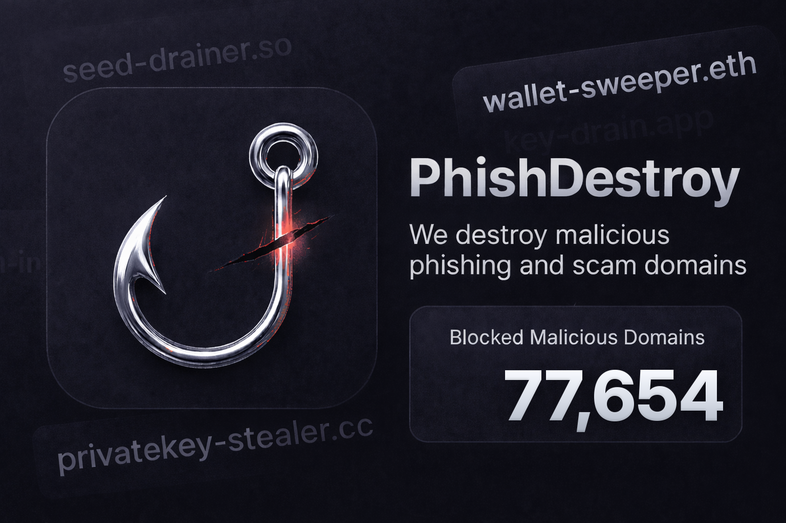
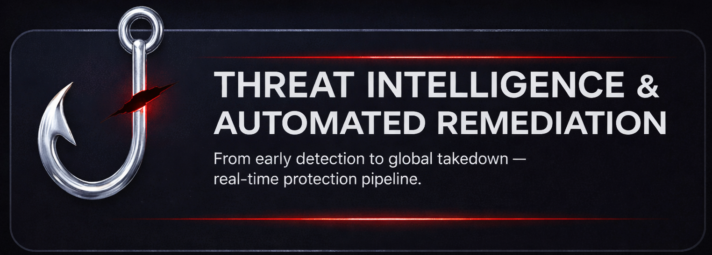
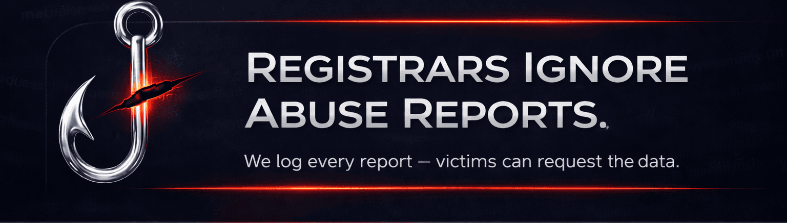
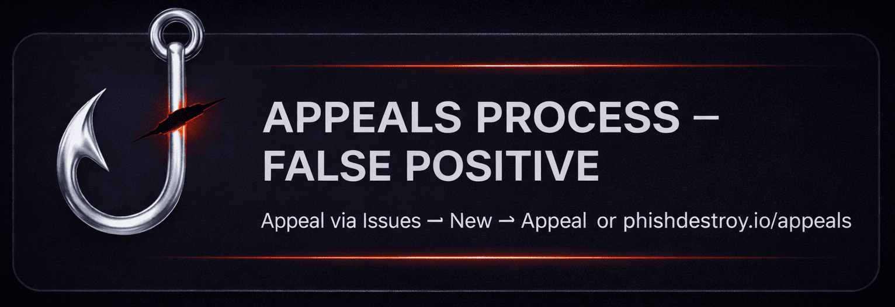

#  Destroylist: Phishing & Scam Domain Blacklist



<p align="center">
  <a href="https://github.com/phishdestroy/destroylist">
    
  </a>
</p>

<p align="center">
  
  
  
  
  
  
</p>


##  Quick Access

### Live Statistics

| Primary | Primary Live | Community | Community Live |
|:-------:|:------------:|:---------:|:--------------:|
|  |  |  |  |

| | Today | Week | Month |
|:--|:-----:|:----:|:-----:|
| **Primary** |  |  |  |
| **Community** |  |  |  |

###  Data Feeds

| Feed | Description | Update | Download |
|:-----|:------------|:------:|:--------:|
| **Primary** | Curated phishing domains | ⚡ Real-time | [](https://raw.githubusercontent.com/phishdestroy/destroylist/main/list.json) [](https://raw.githubusercontent.com/phishdestroy/destroylist/main/list.txt) |
| **Primary Live** | DNS verified active | 🕐 24h | [](https://raw.githubusercontent.com/phishdestroy/destroylist/main/dns/active_domains.json) |
| **Community** | Aggregated from 35+ sources | 🕐 2h | [](https://raw.githubusercontent.com/phishdestroy/destroylist/main/community/blocklist.json) |
| **Community Live** | Community DNS verified | 🕐 24h | [](https://raw.githubusercontent.com/phishdestroy/destroylist/main/community/live_blocklist.json) |
| **Allowlist** | False positive protection | ✋ Manual | [](https://raw.githubusercontent.com/phishdestroy/destroylist/main/allow/allowlist.json) |

> [!TIP]
> **Production:** `list.json` or `active_domains.json` · **Max coverage:** `blocklist.json` · **Firewall/DNS:** root lists

<details>
<summary>📁 <b>All Download Formats</b> (TXT, Hosts, AdBlock, Dnsmasq)</summary>
<br>

| Format | Primary | Primary Live | Community | Community Live |
|:------:|:-------:|:------------:|:---------:|:--------------:|
| **TXT** | [⬇️](https://raw.githubusercontent.com/phishdestroy/destroylist/main/rootlist/formats/primary/domains.txt) | [⬇️](https://raw.githubusercontent.com/phishdestroy/destroylist/main/rootlist/formats/primary_active/domains.txt) | [⬇️](https://raw.githubusercontent.com/phishdestroy/destroylist/main/rootlist/formats/community/domains.txt) | [⬇️](https://raw.githubusercontent.com/phishdestroy/destroylist/main/rootlist/formats/community_active/domains.txt) |
| **Hosts** | [⬇️](https://raw.githubusercontent.com/phishdestroy/destroylist/main/rootlist/formats/primary/hosts.txt) | [⬇️](https://raw.githubusercontent.com/phishdestroy/destroylist/main/rootlist/formats/primary_active/hosts.txt) | [⬇️](https://raw.githubusercontent.com/phishdestroy/destroylist/main/rootlist/formats/community/hosts.txt) | [⬇️](https://raw.githubusercontent.com/phishdestroy/destroylist/main/rootlist/formats/community_active/hosts.txt) |
| **AdBlock** | [⬇️](https://raw.githubusercontent.com/phishdestroy/destroylist/main/rootlist/formats/primary/adblock.txt) | [⬇️](https://raw.githubusercontent.com/phishdestroy/destroylist/main/rootlist/formats/primary_active/adblock.txt) | [⬇️](https://raw.githubusercontent.com/phishdestroy/destroylist/main/rootlist/formats/community/adblock.txt) | [⬇️](https://raw.githubusercontent.com/phishdestroy/destroylist/main/rootlist/formats/community_active/adblock.txt) |
| **Dnsmasq** | [⬇️](https://raw.githubusercontent.com/phishdestroy/destroylist/main/rootlist/formats/primary/dnsmasq.conf) | [⬇️](https://raw.githubusercontent.com/phishdestroy/destroylist/main/rootlist/formats/primary_active/dnsmasq.conf) | [⬇️](https://raw.githubusercontent.com/phishdestroy/destroylist/main/rootlist/formats/community/dnsmasq.conf) | [⬇️](https://raw.githubusercontent.com/phishdestroy/destroylist/main/rootlist/formats/community_active/dnsmasq.conf) |

> **Hosts** → Pi-hole, /etc/hosts, Windows · **AdBlock** → uBlock Origin, AdGuard · **Dnsmasq** → DNS server

</details>

###  Root Lists

> [!TIP]
> **Root domains only** — no subdomains, hosting providers excluded

| | All Roots | Live Only |
|:--|:-:|:-:|
| 🔴 **Primary** | [`active_root_domains.json`](https://raw.githubusercontent.com/phishdestroy/destroylist/main/rootlist/active_root_domains.json) | [`online_root_domains.json`](https://raw.githubusercontent.com/phishdestroy/destroylist/main/rootlist/online_root_domains.json) |
| ⚫ **Community** | [`community_root_domains.json`](https://raw.githubusercontent.com/phishdestroy/destroylist/main/rootlist/community_root_domains.json) | [`community_online_root_domains.json`](https://raw.githubusercontent.com/phishdestroy/destroylist/main/rootlist/community_online_root_domains.json) |


##  About Destroylist

> [!NOTE]
> Live data collection began on July 1, 2025

Destroylist is a powerful tool against phishing and scams, powered by **PhishDestroy**. It provides reliable intel for:

- ✔️ Firewalls
- ✔️ DNS resolvers
- ✔️ Threat platforms
- ✔️ Security research

Protect the web, one domain at a time!

<details>
<summary>🔧 <b>Quick Integration Examples</b> (Python · Bash · DNS)</summary>
<br>

### Python
```python
import requests
blocklist = requests.get('https://raw.githubusercontent.com/phishdestroy/destroylist/main/list.json').json()
is_malicious = "suspicious-domain.com" in blocklist
```

### Bash
```bash
curl -s https://raw.githubusercontent.com/phishdestroy/destroylist/main/list.txt | grep -q "suspicious-domain.com" && echo "BLOCKED"
```

### DNS Blocklist (Pi-hole/AdGuard)
```
https://raw.githubusercontent.com/phishdestroy/destroylist/main/dns/active_domains.json
```

</details>


##  Threat Intelligence & Automated Remediation Workflow

<p align="center">
  
</p>

<div align="center">

| 🔍 **DISCOVER** | 📤 **REPORT** | ⚖️ **LEGAL** | 📡 **PUBLISH** |
|:---:|:---:|:---:|:---:|
| 30+ parsers | 50+ vendors | ICANN compliance | Real-time |
| CT logs, DNS | Google, Microsoft | Abuse notifications | GitHub, Telegram |
| Social media | VirusTotal, Cloudflare | Evidence packages | Twitter, Mastodon |

</div>

<details>
<summary>📖 <b>Read Full Workflow Details</b></summary>
<br>

### Phase 1: Pre-emptive Discovery & Ingestion

🔎 We utilize a distributed network of **30+ proprietary parsers** to identify malicious domains at their earliest stage:

- **Advanced Heuristics:** Continuous monitoring of Google Ads (Malvertising), SEO-manipulated search results, and trending social media campaigns on Twitter (X), YouTube, and Telegram
- **Infrastructure Analysis:** Leveraging *dnstwist* and typosquatting detection to catch look-alike domains targeting established brands
- **Community Intelligence:** Real-time ingestion of community-reported threats via our Telegram Bot and partner intelligence feeds

---

### 📤 Phase 2: Global Ecosystem Contribution

Once a threat is confirmed, we submit data to over **50 industry-leading vendors**:

```
Cloudflare        Google Safe Browsing      Microsoft Security      VirusTotal
Netcraft          ESET                      Bitdefender             Norton Safe Web
Avira             PhishTank                 Dr.Web                  Yandex Safe Browsing
URLScan.io        PolySwarm                 SiteReview              Urlquery
PhishStats        PhishReport               IsItPhish               ThreatCenter
```

---

### 📝 Phase 3: Legal Notifications & Investigation Support

- **Abuse Notifications:** Formal alerts to domain registrars and hosting providers
- **Forensic Evidence Disclosure:** Complete evidence packages including metadata, screenshots, and PDF reports
- **ICANN Compliance Support:** Reports aligned with ICANN standards
- **Conditional Re-Detection Logic:** Follow-up alerts only if threat remains active beyond 24 hours

---

### 📢 Phase 4: Public Transparency & Community Alerts

- **Open Database:** Real-time commits to this GitHub repository
- **Live Monitoring:** Visual intelligence at [phishdestroy.io/live](https://phishdestroy.io/live/)
- **Social Broadcasting:** Automated alerts on Twitter, Telegram, and Mastodon

</details>


##  Key Info for Online Fraud Victims

<p align="center">
  
</p>

<details>
<summary><b>Show details about complaints and transparency</b></summary>
<br>

💼 DestroyList aims to disable malicious domains: scams, phishing, and other illicit sites to enhance internet safety.

Before a domain is added, we:

🔍 Scan it across cybersecurity platforms for threat intelligence.

📥 Send an official complaint to the registrar and the hosting provider (via WHOIS), including scan results, screenshots, and a request for client investigation. The complaint also notifies them about inclusion in our public database.

🚔 According to ICANN rules, registrars must review such complaints within 24 hours.

---

🦖 We work hard to eliminate threats quickly. Every malicious domain is analyzed, documented, reported, and published transparently.

However, when a domain receives 10–30+ abuse reports and a registrar still ignores them for months, the situation changes: the registrar is no longer a passive party. It effectively provides infrastructure for illegal activity.

Some registrars behave as if their internal policies somehow override ICANN requirements and national laws — as if phishing and fraud are "allowed" as long as they personally decide not to act.

👮 We document this publicly so that anyone can see: threats persist not because they were unnoticed, but because the responsible providers simply chose to do nothing.

---

**Requests from private individuals:**

DestroyList is an open-source, non-commercial volunteer project.

Private individuals may request the number of abuse reports we have sent for a specific domain, but only through public channels:
- via GitHub issues
- via commit history: https://github.com/phishdestroy/destroylist/commits/main/

❗ We do not respond to private e-mail requests from individuals about report counts.

✔️ This is a legal requirement for transparency and equal access to information.

Official government or law-enforcement requests may be answered privately.

---

💔 If you were defrauded by a domain already listed here, check its addition date using the commit history or via our Telegram/Mastodon channels.

💬 If the fraud happened after the domain was already listed, the registrar's or host's delay may indicate they share responsibility for the loss. Future potential victims can also see this negligence documented publicly.

🔞 Registrars and hosts that tolerate scam operations may reasonably be expected to assist victims or their legal representatives.

</details>


##  Goals, Usage & Historical Vault

<div align="center">

| ✔️ Network security | ✔️ Automation | ✔️ Threat research | ✔️ ML training |
|:---:|:---:|:---:|:---:|

</div>

<div align="center">

| 🤖 | 🔬 | 📈 |
|:---:|:---:|:---:|
| **AI Training** | **Research** | **Trend Analysis** |

</div>

> [!IMPORTANT]
> **Open collaboration = Stronger security. Let's team up!**

> [!TIP]
> 📩 **Historical Vault** (500K+ domains, 5+ years archived): [contact@phishdestroy.io](mailto:contact@phishdestroy.io)


##  Appeals Process

<p align="center">
  
</p>

Wrongly listed? Fix it fast:

| [](https://phishdestroy.io/appeals/) | [](https://github.com/phishdestroy/destroylist/issues/new) |
|:---:|:---:|

- ✔️ [Appeals Form](https://phishdestroy.io/appeals/) — fastest option
- ✔️ GitHub Issue with proof

Accuracy first! 🔭


##  Connect With Us

<p align="center">
  <a href="https://phishdestroy.io"></a>
  <a href="https://phishdestroy.medium.com"></a>
  <a href="https://t.me/destroy_phish"></a>
  <a href="https://t.me/PhishDestroy_bot"></a>
  <a href="https://x.com/Phish_Destroy"></a>
  <a href="https://mastodon.social/@phishdestroy"></a>
</p>

<p align="center">
  <a href="https://ban.destroy.tools"></a>
  <a href="mailto:contact@phishdestroy.io"></a>
</p>


## 📄 License


**MIT** — Free, open, yours to use!


##  Join the Fight!

Got ideas, sources, or improvements? We welcome:

- 💡 Detection algorithm tweaks
- 📢 Integration tips
- 🔍 Fresh threat intelligence

**Drop an Issue or PR — let's crush phishing together!** 💪


<p align="center">
  
</p>