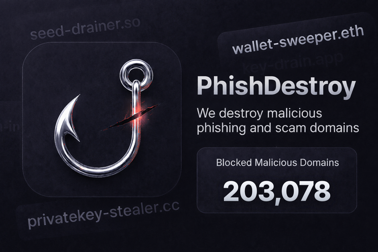
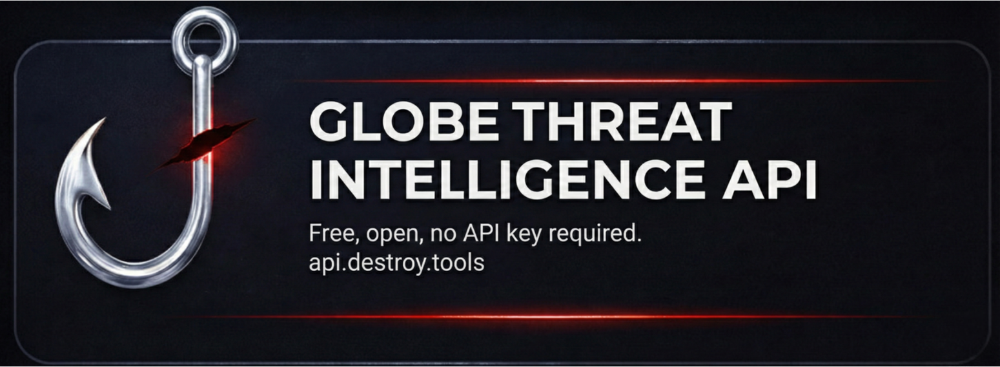
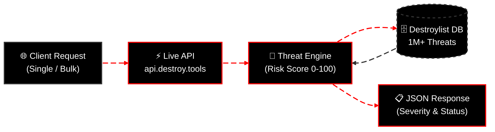
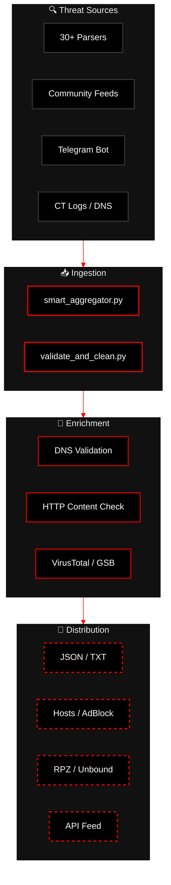
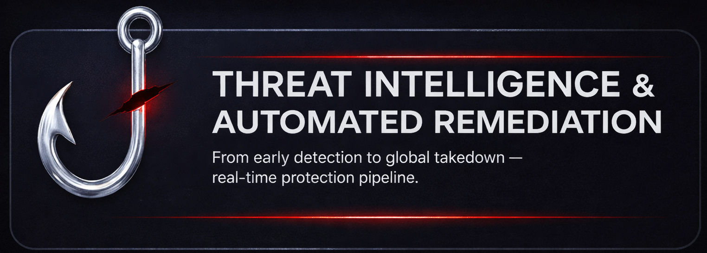
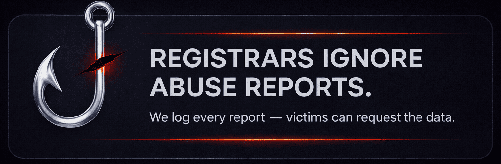
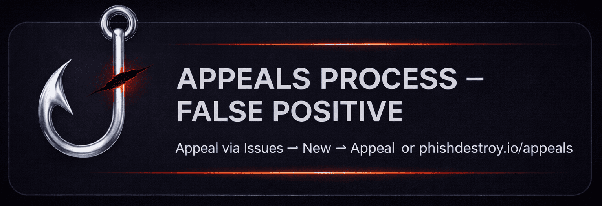

#  Destroylist: Phishing & Scam Domain Blacklist

<p align="center">
  
</p>

<p align="center">
  <a href="https://github.com/phishdestroy/destroylist">

  </a>
</p>

<p align="center">
  
  
  
  
</p>

<p align="center">
  
  
  
  
  
  
</p>


##  Quick Start

Add to **Pi-hole** or **AdGuard Home** in one click — paste this URL into your blocklist settings:

```
https://raw.githubusercontent.com/phishdestroy/destroylist/main/rootlist/formats/primary_active/hosts.txt
```

> More formats: [Hosts](#-data-feeds) · [AdBlock](#-data-feeds) · [Dnsmasq](#-data-feeds) · [Unbound](#-data-feeds) · [RPZ](#-data-feeds) · [API](#-threat-intelligence-api)


##  Quick Access

<details>
<summary><b>Table of Contents</b></summary>

- [Quick Start](#-quick-start)
- [Live Statistics](#live-statistics)
- [Data Feeds](#-data-feeds)
- [Root Lists](#-root-lists)
- [Content-Verified Feeds](#-content-verified-feeds-)
- [Threat Intelligence API](#-threat-intelligence-api)
- [About Destroylist](#-about-destroylist)
- [Workflow & Remediation](#-threat-intelligence--automated-remediation-workflow)
- [Fraud Victims Info](#-key-info-for-online-fraud-victims)
- [Appeals Process](#-appeals-process)
- [Connect With Us](#-connect-with-us)
- [Join the Fight](#-join-the-fight)

</details>

### Live Statistics

| Primary | Primary Live | Community | Community Live |
|:-------:|:------------:|:---------:|:--------------:|
|  |  |  |  |

| Primary Content | Community Content |
|:---------------:|:-----------------:|
|  |  |

| | Today | Week | Month |
|:--|:-----:|:----:|:-----:|
| **Primary** |  |  |  |
| **Community** |  |  |  |

###  Data Feeds

| Feed | Description | Update | Download |
|:-----|:------------|:------:|:--------:|
| **Primary** | Curated phishing domains | ⚡ Real-time | [](https://raw.githubusercontent.com/phishdestroy/destroylist/main/list.json) [](https://raw.githubusercontent.com/phishdestroy/destroylist/main/list.txt) |
| **Primary Live** | DNS verified active | 🕐 24h | [](https://raw.githubusercontent.com/phishdestroy/destroylist/main/dns/active_domains.json) [](https://raw.githubusercontent.com/phishdestroy/destroylist/main/dns/active_domains.txt) |
| **Community** | Aggregated from 13+ sources | 🕐 2h | [](https://raw.githubusercontent.com/phishdestroy/destroylist/main/community/blocklist.json) [](https://raw.githubusercontent.com/phishdestroy/destroylist/main/community/blocklist.txt) |
| **Community Live** | Community DNS verified | 🕐 24h | [](https://raw.githubusercontent.com/phishdestroy/destroylist/main/community/live_blocklist.json) [](https://raw.githubusercontent.com/phishdestroy/destroylist/main/community/live_blocklist.txt) |
| **Primary Content** | Curated + HTTP content verified | 🕐 12h | [](https://raw.githubusercontent.com/phishdestroy/destroylist/main/dns/content_active.json) [](https://raw.githubusercontent.com/phishdestroy/destroylist/main/dns/content_active.txt) |
| **Community Content** | Aggregated + HTTP content verified | 🕐 24h | [](https://raw.githubusercontent.com/phishdestroy/destroylist/main/community/content_live.json) [](https://raw.githubusercontent.com/phishdestroy/destroylist/main/community/content_live.txt) |
| **Allowlist** | False positive protection | ✋ Manual | [](https://raw.githubusercontent.com/phishdestroy/destroylist/main/allow/allowlist.json) |

> [!TIP]
> **Production:** `list.json` or `active_domains.json` · **Max coverage:** `blocklist.json` · **Firewall/DNS:** root lists


<details>
<summary>📁 <b>All Download Formats</b> (TXT, Hosts, AdBlock, Dnsmasq, Unbound, RPZ)</summary>
<br>

| Format | Primary | Primary Live | Community | Community Live |
|:------:|:-------:|:------------:|:---------:|:--------------:|
| **TXT** | [⬇️](https://raw.githubusercontent.com/phishdestroy/destroylist/main/rootlist/formats/primary/domains.txt) | [⬇️](https://raw.githubusercontent.com/phishdestroy/destroylist/main/rootlist/formats/primary_active/domains.txt) | [⬇️](https://raw.githubusercontent.com/phishdestroy/destroylist/main/rootlist/formats/community/domains.txt) | [⬇️](https://raw.githubusercontent.com/phishdestroy/destroylist/main/rootlist/formats/community_active/domains.txt) |
| **Hosts** | [⬇️](https://raw.githubusercontent.com/phishdestroy/destroylist/main/rootlist/formats/primary/hosts.txt) | [⬇️](https://raw.githubusercontent.com/phishdestroy/destroylist/main/rootlist/formats/primary_active/hosts.txt) | [⬇️](https://raw.githubusercontent.com/phishdestroy/destroylist/main/rootlist/formats/community/hosts.txt) | [⬇️](https://raw.githubusercontent.com/phishdestroy/destroylist/main/rootlist/formats/community_active/hosts.txt) |
| **AdBlock** | [⬇️](https://raw.githubusercontent.com/phishdestroy/destroylist/main/rootlist/formats/primary/adblock.txt) | [⬇️](https://raw.githubusercontent.com/phishdestroy/destroylist/main/rootlist/formats/primary_active/adblock.txt) | [⬇️](https://raw.githubusercontent.com/phishdestroy/destroylist/main/rootlist/formats/community/adblock.txt) | [⬇️](https://raw.githubusercontent.com/phishdestroy/destroylist/main/rootlist/formats/community_active/adblock.txt) |
| **Dnsmasq** | [⬇️](https://raw.githubusercontent.com/phishdestroy/destroylist/main/rootlist/formats/primary/dnsmasq.conf) | [⬇️](https://raw.githubusercontent.com/phishdestroy/destroylist/main/rootlist/formats/primary_active/dnsmasq.conf) | [⬇️](https://raw.githubusercontent.com/phishdestroy/destroylist/main/rootlist/formats/community/dnsmasq.conf) | [⬇️](https://raw.githubusercontent.com/phishdestroy/destroylist/main/rootlist/formats/community_active/dnsmasq.conf) |
| **Unbound** | [⬇️](https://raw.githubusercontent.com/phishdestroy/destroylist/main/rootlist/formats/primary/unbound.conf) | [⬇️](https://raw.githubusercontent.com/phishdestroy/destroylist/main/rootlist/formats/primary_active/unbound.conf) | [⬇️](https://raw.githubusercontent.com/phishdestroy/destroylist/main/rootlist/formats/community/unbound.conf) | [⬇️](https://raw.githubusercontent.com/phishdestroy/destroylist/main/rootlist/formats/community_active/unbound.conf) |
| **RPZ** | [⬇️](https://raw.githubusercontent.com/phishdestroy/destroylist/main/rootlist/formats/primary/rpz.zone) | [⬇️](https://raw.githubusercontent.com/phishdestroy/destroylist/main/rootlist/formats/primary_active/rpz.zone) | [⬇️](https://raw.githubusercontent.com/phishdestroy/destroylist/main/rootlist/formats/community/rpz.zone) | [⬇️](https://raw.githubusercontent.com/phishdestroy/destroylist/main/rootlist/formats/community_active/rpz.zone) |

> **Hosts** → Pi-hole, /etc/hosts, Windows · **AdBlock** → uBlock Origin, AdGuard · **Dnsmasq** → dnsmasq DNS · **Unbound** → pfSense, OPNsense · **RPZ** → BIND, Knot DNS

</details>

###  Root Lists

> [!TIP]
> **Root domains only** — no subdomains, hosting providers excluded

| | All Roots | Live Only | Services Only |
|:--|:-:|:-:|:-:|
| 🔴 **Primary** | [JSON](https://raw.githubusercontent.com/phishdestroy/destroylist/main/rootlist/active_root_domains.json) · [TXT](https://raw.githubusercontent.com/phishdestroy/destroylist/main/rootlist/active_root_domains.txt) | [JSON](https://raw.githubusercontent.com/phishdestroy/destroylist/main/rootlist/online_root_domains.json) · [TXT](https://raw.githubusercontent.com/phishdestroy/destroylist/main/rootlist/online_root_domains.txt) | [JSON](https://raw.githubusercontent.com/phishdestroy/destroylist/main/rootlist/services_domains.json) · [TXT](https://raw.githubusercontent.com/phishdestroy/destroylist/main/rootlist/services_domains.txt) |
| ⚫ **Community** | [JSON](https://raw.githubusercontent.com/phishdestroy/destroylist/main/rootlist/community_root_domains.json) · [TXT](https://raw.githubusercontent.com/phishdestroy/destroylist/main/rootlist/community_root_domains.txt) | [JSON](https://raw.githubusercontent.com/phishdestroy/destroylist/main/rootlist/community_online_root_domains.json) · [TXT](https://raw.githubusercontent.com/phishdestroy/destroylist/main/rootlist/community_online_root_domains.txt) | [JSON](https://raw.githubusercontent.com/phishdestroy/destroylist/main/rootlist/community_services_domains.json) · [TXT](https://raw.githubusercontent.com/phishdestroy/destroylist/main/rootlist/community_services_domains.txt) |

> **All Roots** — clean root domains (no infra) · **Live Only** — DNS-verified active · **Services Only** — hosting platform subdomains (Vercel, Pages.dev, Netlify, etc.)


##  Content-Verified Feeds 

> [!NOTE]
> **Real HTTP content verification** — not just DNS, but actual phishing page detection

[](https://github.com/phishdestroy/destroylist/raw/main/dns/content_active.json)
[](https://github.com/phishdestroy/destroylist/raw/main/community/content_live.json)

| Feed | Update | Description |
|:-----|:------:|:------------|
| **Primary Content** | `12h` (06:00 / 18:00 UTC) | Curated phishing with verified active content |
| **Community Content** | `24h` (03:00 UTC) | Aggregated feeds with verified active content |

> Download links: see [Data Feeds](#-data-feeds) above

> [!WARNING]
> **Cloaking Alert:** Scammers use cloaking to hide phishing from bots — showing blank/fake pages to scanners. Domain **NOT** in content list ≠ safe! Use **Primary** or **Community** full lists for complete protection.


##  Threat Intelligence API

<p align="center">
  
</p>


```mermaid
%%{init: {"theme":"base", "themeVariables": { "background": "transparent", "mainBkg": "#000000", "primaryColor": "#000000", "primaryTextColor": "#FFFFFF", "primaryBorderColor": "#FF0000", "lineColor": "#FF0000", "secondaryColor": "#111111", "tertiaryColor": "#111111", "fontFamily": "Inter, system-ui, sans-serif"}, "flowchart": {"curve": "basis", "htmlLabels": true}}}%%
flowchart LR
  Request["🌐 Client Request<br/>(Single / Bulk)"] e1@--> API["⚡ Live API<br/>api.destroy.tools"]
  API e2@--> Engine["🧠 Threat Engine<br/>(Risk Score 0-100)"]
  Engine e3@--> DB[("🗄️ Destroylist DB<br/>1M+ Threats")]
  DB e4@--> Engine
  Engine e5@--> Response["📋 JSON Response<br/>(Severity & Status)"]

  classDef client fill:#000000,stroke:#333333,stroke-width:2px,color:#FFFFFF;
  classDef api fill:#000000,stroke:#FF0000,stroke-width:2px,color:#FFFFFF;
  classDef db fill:#000000,stroke:#333333,stroke-width:2px,stroke-dasharray: 5 5,color:#FFFFFF;
  classDef animate stroke:#FF0000,stroke-width:2px,stroke-dasharray:10 5,stroke-dashoffset:900,animation:dash 22s linear infinite;
  classDef animateDark stroke:#333333,stroke-width:2px,stroke-dasharray:10 5,stroke-dashoffset:900,animation:dash 22s linear infinite;

  class Request client;
  class API,Engine,Response api;
  class DB db;
  class e1,e2,e3,e5 animate;
  class e4 animateDark;
```

<p align="center">
  <a href="https://api.destroy.tools"></a>
  <a href="https://api.destroy.tools/v1/stats"></a>
</p>

> **Free, open, no API key.** Real-time domain risk scoring (0-100) across 888K+ threats · 2h sync · Single & bulk check (500/req) · Keyword search · Full feeds

<details>
<summary>📖 <b>API Endpoints, Scoring & Integration Examples</b></summary>
<br>

### Endpoints

| Method | Endpoint | Description |
|:------:|:---------|:------------|
| `GET` | [`/v1/check?domain=`](https://api.destroy.tools/v1/check?domain=example-phish.xyz) | Single domain check with risk score & severity |
| `POST` | `/v1/check/bulk` | Bulk check up to **500 domains** per request |
| `GET` | [`/v1/search?q=`](https://api.destroy.tools/v1/search?q=metamask) | Search blocklisted domains by keyword |
| `GET` | [`/v1/feed/{list}`](https://api.destroy.tools/v1/feed/primary) | Download full domain feeds (primary, community, active) |
| `GET` | [`/v1/stats`](https://api.destroy.tools/v1/stats) | Live statistics & domain counts |

### Threat Scoring

Every domain gets a **risk score (0-100)** based on multiple signals:

| Signal | Points | Description |
|:-------|:------:|:------------|
| Curated blocklist | **+40** | In primary destroylist |
| Community reported | **+20** | Reported by community sources |
| DNS active | **+30** | Domain currently resolves |
| Multi-source | **+10** | Confirmed by multiple feeds |
| Suspicious keywords | **+5 each** | metamask, wallet, airdrop, etc. |
| Risky TLD | **+5** | .xyz, .top, .club, .icu, etc. |

> 🔴 **Critical** 70-100 · 🟠 **High** 40-69 · 🟡 **Medium** 20-39 · 🟢 **Low** 1-19

### Quick Integration

**cURL**
```bash
curl "https://api.destroy.tools/v1/check?domain=suspicious-site.xyz"
```

**Python**
```python
import requests
r = requests.get(f"https://api.destroy.tools/v1/check?domain={domain}")
if r.json()["threat"]:
    print(f"BLOCKED: {r.json()['severity']} (score: {r.json()['risk_score']})")
```

**JavaScript**
```javascript
const r = await fetch(`https://api.destroy.tools/v1/check?domain=${domain}`);
const data = await r.json();
if (data.threat) console.warn("PHISHING:", data.severity, data.risk_score);
```

**Bulk Check**
```bash
curl -X POST "https://api.destroy.tools/v1/check/bulk" \
  -H "Content-Type: application/json" \
  -d '{"domains":["site1.com","site2.xyz","site3.top"]}'
```

</details>


##  About Destroylist

> [!NOTE]
> Live data collection began on July 1, 2025

<div align="center">

**888K+ domains tracked** · **13+ threat sources** · **50+ vendor reports** · **6 output formats** · **Free API**

</div>

Destroylist is a real-time threat intelligence platform by **PhishDestroy** — protecting firewalls, DNS resolvers, browser extensions, and security teams worldwide. Every domain is discovered, verified, reported to registrars, and published transparently.

### Data Pipeline


```mermaid
%%{init: {"theme":"base", "themeVariables": { "background": "transparent", "mainBkg": "#000000", "primaryColor": "#000000", "primaryTextColor": "#FFFFFF", "primaryBorderColor": "#FF0000", "lineColor": "#FF0000", "secondaryColor": "#111111", "tertiaryColor": "#111111", "fontFamily": "Inter, system-ui, sans-serif"}, "flowchart": {"curve": "basis", "htmlLabels": true}}}%%
flowchart TB
  subgraph Sources["🔍 Threat Sources"]
    S1[30+ Parsers]
    S2[Community Feeds]
    S3[Telegram Bot]
    S4[CT Logs / DNS]
  end

  subgraph Ingestion["📥 Ingestion"]
    I1[smart_aggregator.py]
    I2[validate_and_clean.py]
  end

  subgraph Enrichment["🧠 Enrichment"]
    E1[DNS Validation]
    E2[HTTP Content Check]
    E3[VirusTotal / GSB]
  end

  subgraph Distribution["📡 Distribution"]
    D1[JSON / TXT]
    D2[Hosts / AdBlock]
    D3[RPZ / Unbound]
    D4[API Feed]
  end

  Sources --> Ingestion
  Ingestion --> Enrichment
  Enrichment --> Distribution

  classDef source fill:#000000,stroke:#333333,stroke-width:2px,color:#FFFFFF;
  classDef ingest fill:#000000,stroke:#FF0000,stroke-width:2px,color:#FFFFFF;
  classDef enrich fill:#000000,stroke:#CC0000,stroke-width:2px,color:#FFFFFF;
  classDef dist fill:#000000,stroke:#FF0000,stroke-width:2px,stroke-dasharray: 5 5,color:#FFFFFF;

  class S1,S2,S3,S4 source;
  class I1,I2 ingest;
  class E1,E2,E3 enrich;
  class D1,D2,D3,D4 dist;
```

<details>
<summary>🔧 <b>Quick Integration Examples</b> (Subscribe URLs · curl · Python · Bash)</summary>
<br>

### One-Click Subscribe URLs

| Tool | Format | URL |
|:-----|:------:|:----|
| **Pi-hole** | Hosts | `https://raw.githubusercontent.com/phishdestroy/destroylist/main/rootlist/formats/primary_active/hosts.txt` |
| **AdGuard Home** | AdBlock | `https://raw.githubusercontent.com/phishdestroy/destroylist/main/rootlist/formats/primary_active/adblock.txt` |
| **uBlock Origin** | AdBlock | `https://raw.githubusercontent.com/phishdestroy/destroylist/main/rootlist/formats/primary_active/adblock.txt` |
| **pfSense / OPNsense (Unbound)** | Unbound | `https://raw.githubusercontent.com/phishdestroy/destroylist/main/rootlist/formats/primary_active/unbound.conf` |
| **BIND / Knot DNS (RPZ)** | RPZ | `https://raw.githubusercontent.com/phishdestroy/destroylist/main/rootlist/formats/primary_active/rpz.zone` |
| **Dnsmasq** | Dnsmasq | `https://raw.githubusercontent.com/phishdestroy/destroylist/main/rootlist/formats/primary_active/dnsmasq.conf` |

> **Pi-hole** — Settings > Blocklists > paste the Hosts URL<br>
> **AdGuard Home** — Filters > DNS Blocklists > Add blocklist > paste the AdBlock URL<br>
> **uBlock Origin** — Settings > Filter lists > Import > paste the AdBlock URL<br>
> **pfSense** — Services > DNS Resolver > paste the Unbound URL<br>
> **BIND/Knot** — Add the RPZ URL as a response-policy zone

### curl One-Liners

```bash
# Plain domain list
curl -fsSL https://raw.githubusercontent.com/phishdestroy/destroylist/main/rootlist/formats/primary_active/domains.txt -o domains.txt

# Hosts format (Pi-hole, /etc/hosts)
curl -fsSL https://raw.githubusercontent.com/phishdestroy/destroylist/main/rootlist/formats/primary_active/hosts.txt -o hosts_blocklist.txt

# AdBlock format (uBlock Origin, AdGuard)
curl -fsSL https://raw.githubusercontent.com/phishdestroy/destroylist/main/rootlist/formats/primary_active/adblock.txt -o adblock.txt

# Dnsmasq
curl -fsSL https://raw.githubusercontent.com/phishdestroy/destroylist/main/rootlist/formats/primary_active/dnsmasq.conf -o dnsmasq_blocklist.conf

# Unbound (pfSense / OPNsense)
curl -fsSL https://raw.githubusercontent.com/phishdestroy/destroylist/main/rootlist/formats/primary_active/unbound.conf -o unbound_blocklist.conf

# RPZ (BIND / Knot)
curl -fsSL https://raw.githubusercontent.com/phishdestroy/destroylist/main/rootlist/formats/primary_active/rpz.zone -o rpz_blocklist.zone
```

### Python
```python
import requests
blocklist = requests.get('https://raw.githubusercontent.com/phishdestroy/destroylist/main/list.json').json()
is_malicious = "suspicious-domain.com" in blocklist
```

### Bash
```bash
curl -s https://raw.githubusercontent.com/phishdestroy/destroylist/main/list.txt | grep -q "suspicious-domain.com" && echo "BLOCKED"
```

</details>


##  Threat Intelligence & Automated Remediation Workflow


```mermaid
%%{init: {"theme":"base", "themeVariables": { "background": "transparent", "mainBkg": "#000000", "primaryColor": "#000000", "primaryTextColor": "#FFFFFF", "primaryBorderColor": "#FF0000", "lineColor": "#FF0000", "secondaryColor": "#111111", "tertiaryColor": "#111111", "fontFamily": "Inter, system-ui, sans-serif"}, "flowchart": {"curve": "basis", "htmlLabels": true}}}%%
flowchart LR
  Discover["🔍 DISCOVER<br/>30+ Parsers"] e1@--> Report["📤 REPORT<br/>50+ Vendors"]
  Report e2@--> Legal["⚖️ LEGAL<br/>ICANN Compliance"]
  Legal e3@--> Publish["📡 PUBLISH<br/>Real-time Feed"]

  classDef box fill:#000000,stroke:#333333,stroke-width:2px,color:#FFFFFF;
  classDef animate stroke:#FF0000,stroke-width:2px,stroke-dasharray:10 5,stroke-dashoffset:900,animation:dash 22s linear infinite;

  class Discover,Report,Legal,Publish box;
  
  class e1,e2,e3 animate;
```

<p align="center">
  
</p>

<div align="center">

| 🔍 **DISCOVER** | 📤 **REPORT** | ⚖️ **LEGAL** | 📡 **PUBLISH** |
|:---:|:---:|:---:|:---:|
| 30+ parsers | 50+ vendors | ICANN compliance | Real-time |
| CT logs, DNS | Google, Microsoft | Abuse notifications | GitHub, Telegram |
| Social media | VirusTotal, Cloudflare | Evidence packages | Twitter, Mastodon |

</div>

<details>
<summary>📖 <b>Read Full Workflow Details</b></summary>
<br>

### 🔍 Phase 1: Pre-emptive Discovery & Ingestion

🔎 We utilize a distributed network of **30+ proprietary parsers** to identify malicious domains at their earliest stage:

- **Advanced Heuristics:** Continuous monitoring of Google Ads (Malvertising), SEO-manipulated search results, and trending social media campaigns on Twitter (X), YouTube, and Telegram
- **Infrastructure Analysis:** Leveraging *dnstwist* and typosquatting detection to catch look-alike domains targeting established brands
- **Community Intelligence:** Real-time ingestion of community-reported threats via our Telegram Bot and partner intelligence feeds

---

### 📤 Phase 2: Global Ecosystem Contribution

Once a threat is confirmed, we submit data to over **50 industry-leading vendors**:

```
Cloudflare        Google Safe Browsing      Microsoft Security      VirusTotal
Netcraft          ESET                      Bitdefender             Norton Safe Web
Avira             PhishTank                 Dr.Web                  Yandex Safe Browsing
URLScan.io        PolySwarm                 SiteReview              Urlquery
PhishStats        PhishReport               IsItPhish               ThreatCenter
```

---

### 📝 Phase 3: Legal Notifications & Investigation Support

- **Abuse Notifications:** Formal alerts to domain registrars and hosting providers
- **Forensic Evidence Disclosure:** Complete evidence packages including metadata, screenshots, and PDF reports
- **ICANN Compliance Support:** Reports aligned with ICANN standards
- **Conditional Re-Detection Logic:** Follow-up alerts only if threat remains active beyond 24 hours

---

### 📢 Phase 4: Public Transparency & Community Alerts

- **Open Database:** Real-time commits to this GitHub repository
- **Live Monitoring:** Visual intelligence at [phishdestroy.io/live](https://phishdestroy.io/live/)
- **Social Broadcasting:** Automated alerts on Twitter, Telegram, and Mastodon

</details>


##  Key Info for Online Fraud Victims

<p align="center">
  
</p>

<details>
<summary><b>Show details about complaints and transparency</b></summary>
<br>

💼 DestroyList aims to disable malicious domains: scams, phishing, and other illicit sites to enhance internet safety.

Before a domain is added, we:

🔍 Scan it across cybersecurity platforms for threat intelligence.

📥 Send an official complaint to the registrar and the hosting provider (via WHOIS), including scan results, screenshots, and a request for client investigation. The complaint also notifies them about inclusion in our public database.

🚔 According to ICANN rules, registrars must review such complaints within 24 hours.

---

🦖 We work hard to eliminate threats quickly. Every malicious domain is analyzed, documented, reported, and published transparently.

However, when a domain receives 10–30+ abuse reports and a registrar still ignores them for months, the situation changes: the registrar is no longer a passive party. It effectively provides infrastructure for illegal activity.

Some registrars behave as if their internal policies somehow override ICANN requirements and national laws — as if phishing and fraud are "allowed" as long as they personally decide not to act.

👮 We document this publicly so that anyone can see: threats persist not because they were unnoticed, but because the responsible providers simply chose to do nothing.

---

**Requests from private individuals:**

DestroyList is an open-source, non-commercial volunteer project.

Private individuals may request the number of abuse reports we have sent for a specific domain, but only through public channels:
- via GitHub issues
- via commit history: https://github.com/phishdestroy/destroylist/commits/main/

❗ We do not respond to private e-mail requests from individuals about report counts.

✔️ This is a legal requirement for transparency and equal access to information.

Official government or law-enforcement requests may be answered privately.

---

💔 If you were defrauded by a domain already listed here, check its addition date using the commit history or via our Telegram/Mastodon channels.

💬 If the fraud happened after the domain was already listed, the registrar's or host's delay may indicate they share responsibility for the loss. Future potential victims can also see this negligence documented publicly.

🔞 Registrars and hosts that tolerate scam operations may reasonably be expected to assist victims or their legal representatives.

</details>


##  Use Cases & Historical Vault

Network security · Threat research · AI/ML training · Trend analysis · Automation

> [!TIP]
> 📩 **Historical Vault** (500K+ domains, 5+ years archived): [contact@phishdestroy.io](mailto:contact@phishdestroy.io)


##  Appeals Process

<p align="center">
  
</p>

Wrongly listed? Fix it fast:

| [](https://phishdestroy.io/appeals/) | [](https://github.com/phishdestroy/destroylist/issues/new) |
|:---:|:---:|

- ✔️ [Appeals Form](https://phishdestroy.io/appeals/) — fastest option
- ✔️ GitHub Issue with proof

Accuracy first! 🔭


##  Connect With Us

<p align="center">
  <a href="https://phishdestroy.io"></a>
  <a href="https://phishdestroy.medium.com"></a>
  <a href="https://t.me/destroy_phish"></a>
  <a href="https://t.me/PhishDestroy_bot"></a>
  <a href="https://x.com/Phish_Destroy"></a>
  <a href="https://mastodon.social/@phishdestroy"></a>
</p>

<p align="center">
  <a href="https://api.destroy.tools"></a>
  <a href="https://ban.destroy.tools"></a>
  <a href="mailto:contact@phishdestroy.io"></a>
</p>


## 👾 Pac-Man Contribution Graph

<picture>
  <source media="(prefers-color-scheme: dark)" srcset="https://raw.githubusercontent.com/phishdestroy/destroylist/output/pacman-contribution-graph-dark.svg" />
  <source media="(prefers-color-scheme: light)" srcset="https://raw.githubusercontent.com/phishdestroy/destroylist/output/pacman-contribution-graph.svg" />
  
</picture>


## 🔗 Related Investigations & Repositories

| Repository | Description |
|:-----------|:------------|
| [**namesilo-evidence**](https://github.com/phishdestroy/namesilo-evidence) | Evidence archive — NameSilo registrar abuse investigation |
| [**nicenic-evidence**](https://github.com/phishdestroy/nicenic-evidence) | Evidence archive — NiceNIC registrar abuse investigation |
| [**trustname-evidence**](https://github.com/phishdestroy/trustname-evidence) | Evidence archive — TrustName registrar abuse investigation |
| [**ScamIntelLogs**](https://github.com/phishdestroy/ScamIntelLogs) | Raw scam intelligence logs and IOC data |
| [**DestroyScammers**](https://github.com/phishdestroy/DestroyScammers) | Scammer exposure and disruption operations |


## 📄 License


**MIT** — Free, open, yours to use!


##  Join the Fight!

<div align="center">

**Every star helps this project reach more security teams and protect more users.**

[](https://github.com/phishdestroy/destroylist)
[](https://github.com/phishdestroy/destroylist/issues/new)
[](https://github.com/phishdestroy/destroylist/pulls)

</div>

We welcome contributions:

- 🔍 Fresh threat intelligence & new blocklist sources
- 💡 Detection algorithm improvements
- 📢 Integration guides for new platforms
- 🌐 Translations & documentation

**Drop an Issue or PR — let's crush phishing together!** 💪

