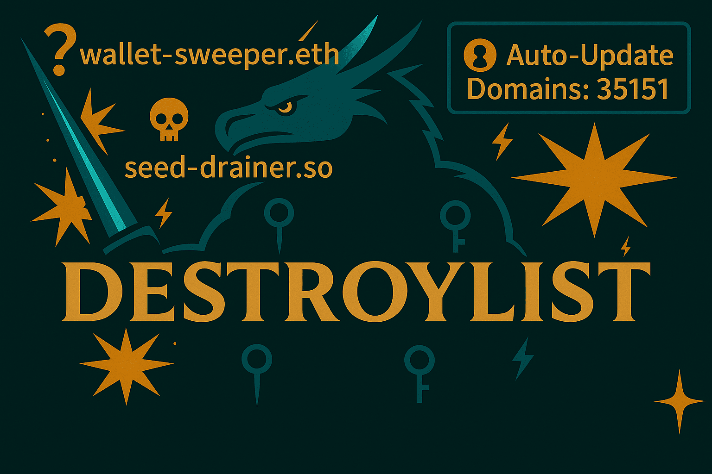

#  Destroylist: Phishing & Scam Domain Blacklist  


##  Quick Overview & Access 

### Project Status


### Daily Statistics 

| Metric | Today | This Week |
|--------|-------|-----------|
| **New Domains Added** |  |  |
| **Community Feed** |  |  |

### Domain Counters 

&color=purple&style=flat-square)
&color=blue&style=flat-square)

### Data Feeds 

| Feed | Description | Update | Link |
|------|-------------|--------|------|
| **Primary List** | Core curated phishing/scam domains | Real-time | [list.json](https://github.com/phishdestroy/destroylist/raw/main/list.json) · [list.txt](https://github.com/phishdestroy/destroylist/raw/main/list.txt) |
| **DNS Active** | Live domains (DNS verified) | Every 24h | [active_domains.json](https://github.com/phishdestroy/destroylist/raw/main/dns/active_domains.json) |
| **Root List** | Root domains only (no subdomains) | Every 2h | [list.json](https://raw.githubusercontent.com/phishdestroy/destroylist/refs/heads/main/rootlist/active_root_domains.json) |
| **Community** | Aggregated from external sources | Every 12h | [blocklist.json](https://github.com/phishdestroy/destroylist/raw/main/community/blocklist.json) |
| **Community Live** | Community + DNS verified | Every 72h | [live_blocklist.json](https://github.com/phishdestroy/destroylist/raw/main/community/live_blocklist.json) |
| **Allow List** | False positive protection | Manual | [allowlist.json](https://raw.githubusercontent.com/phishdestroy/destroylist/refs/heads/main/allow/allowlist.json) |

> **Important:**  
> **Primary List** recommended for production blocking  
> **Community feeds** auto-aggregated, report false positives to original sources  
> **Allow List** overrides all blocklists for verified legitimate domains

### Connect With Us 
| Platform | Link |
|----------|------|
| Website | [phishdestroy.io](https://phishdestroy.io) |
| Telegram Alerts | [t.me/destroy_phish](https://t.me/destroy_phish) |
| Telegram Bot | [t.me/PhishDestroy_bot](https://t.me/PhishDestroy_bot) |
| Twitter / X | [x.com/Phish_Destroy](https://x.com/Phish_Destroy) |
| Mastodon | [@phishdestroy@mastodon.social](https://mastodon.social/@phishdestroy) |
| Ban Service | [ban.destroy.tools](https://ban.destroy.tools) |

---

[](https://git.io/typing-svg)

##  About Destroylist 
> Live data collection began on July 1, 2025

Destroylist is a powerful tool against phishing and scams, powered by **PhishDestroy**. It provides reliable intel for:
-  Firewalls
-  DNS resolvers
-  Threat platforms
-  Security research

Protect the web, one domain at a time!

 Quick Integration

### Python
```python
import requests
blocklist = requests.get('https://raw.githubusercontent.com/phishdestroy/destroylist/main/list.json').json()
is_malicious = "suspicious-domain.com" in blocklist
```

### Bash
```bash
curl -s https://raw.githubusercontent.com/phishdestroy/destroylist/main/list.txt | grep -q "suspicious-domain.com" && echo "BLOCKED"
```

### DNS Blocklist (Pi-hole/AdGuard)
```
https://raw.githubusercontent.com/phishdestroy/destroylist/main/dns/active_domains.json
```

##    Key Info for Online Fraud Victims 

[](https://git.io/typing-svg)


DestroyList aims to disable malicious domains: scams, phishing, and other illicit sites to enhance internet safety.

Before a domain is added, we:

 Scan it across cybersecurity platforms for threat intelligence.

 Send an official complaint to the registrar and the hosting provider (via WHOIS), including scan results, screenshots, and a request for client investigation. The complaint also notifies them about inclusion in our public database.

 According to ICANN rules, registrars must review such complaints within 24 hours.

--------------------------------------------------------------------
[](https://git.io/typing-svg)

 We work hard to eliminate threats quickly. Every malicious domain is analyzed, documented, reported, and published transparently.  
However, when a domain receives 10–30+ abuse reports and a registrar still ignores them for months, the situation changes: the registrar is no longer a passive party. It effectively provides infrastructure for illegal activity.  
Some registrars behave as if their internal policies somehow override ICANN requirements and national laws — as if phishing and fraud are "allowed" as long as they personally decide not to act.

 We document this publicly so that anyone can see: threats persist not because they were unnoticed, but because the responsible providers simply chose to do nothing.

--------------------------------------------------------------------
[](https://git.io/typing-svg)

**Requests from private individuals:**

DestroyList is an open-source, non-commercial volunteer project.

Private individuals may request the number of abuse reports we have sent for a specific domain, but only through public channels:
- via GitHub issues
- via commit history: https://github.com/phishdestroy/destroylist/commits/main/

 We do not respond to private e-mail requests from individuals about report counts.  
 This is a legal requirement for transparency and equal access to information.

Official government or law-enforcement requests may be answered privately.

--------------------------------------------------------------------

If you were defrauded by a domain already listed here, check its addition date using the commit history or via our Telegram/Mastodon channels.

 If the fraud happened after the domain was already listed, the registrar's or host's delay may indicate they share responsibility for the loss.  
Future potential victims can also see this negligence documented publicly.

 Registrars and hosts that tolerate scam operations may reasonably be expected to assist victims or their legal representatives.

[](https://git.io/typing-svg)

##  Update Process 
-  **Gather:** Continuous phishing domain collection via PhishDestroy system
-  **Verify:** Cross-check with trusted threat intelligence sources
-  **Publish:** Real-time push to GitHub + multi-channel alerts
-  **Clean:** DNS checks, deduplication, remove expired domains

**Automation:**
-  DNS verification every hour
-  Daily statistics tracking
-  Root domain extraction every 2 hours

##  Goals & Usage 
[](https://git.io/typing-svg)

Use Destroylist for:
-  Network security systems
-  Automation & monitoring
-  Threat intelligence research
-  Machine learning training

Open collaboration = Stronger security. Let's team up!

##  Historical Vault 
[](https://git.io/typing-svg)

Archive of **500,000+** domains over 5+ years. Ideal for:
-  AI training
-  Research
-  Trend analysis

>  Contact us at [phishdestroy.io](https://phishdestroy.io) for access!

##  Appeals Process 
Wrongly listed? Fix it fast:
-  [Appeals Form](https://phishdestroy.io/appeals/)
-  GitHub Issue with proof

Accuracy first! 

##  License 


**MIT** – Free, open, yours to hack!

---


##  Join the Fight! 
Got ideas, sources, or improvements?
-  Detection tweaks
-  Integration tips
-  Fresh intel

Drop Issues/PRs – let's crush phishing together! 
