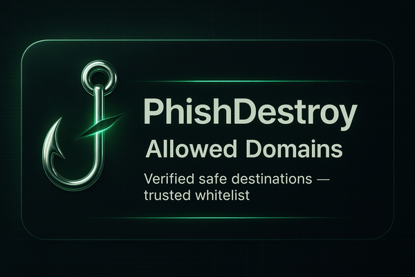

# 📋 Allowlist



Curated allowlist of **legitimate** crypto/Web3 project domains to prevent false positives in security filters.

---

## ⚠️ Format Rules

- **Apex domains only** (e.g., `example.org`)
- No subdomains
- No paths
- Lowercase only

---

## 📂 Contents

| File | Description |
|:-----|:------------|
| `allowlist.json` | Array of verified apex domains |

**Example:**

```json
[
  "binance.com",
  "kraken.com",
  "uniswap.org"
]
```

---

## ➕ Request Addition

Open an issue: [github.com/phishdestroy/destroylist/issues](https://github.com/phishdestroy/destroylist/issues)

Include:
- Project name
- Homepage URL
- Apex domain(s)
- Brief rationale

---

## 🙏 Credits

This dataset includes entries from [SEAL (Security Alliance)](https://github.com/security-alliance/allowlists) allowlists.
