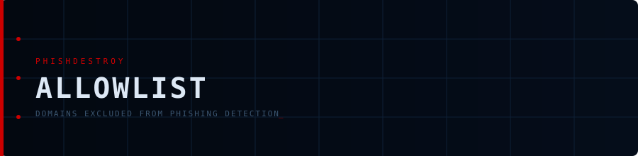

<div align="center">



# Allowlist

**Curated legitimate domains — false-positive protection for crypto & Web3**

<br>


<br>

[](https://github.com/phishdestroy/destroylist)
[](https://api.destroy.tools)
[](https://phishdestroy.io/appeals/)

</div>

---

## Overview

This directory contains a curated allowlist of **legitimate** crypto/Web3 project domains to prevent false positives in security filters.

> [!TIP]
> Being on this list guarantees the domain will **never** appear in any Destroylist output.

## ⚠️ Format Rules

- **Apex domains only** (e.g., `example.org`)
- No subdomains
- No paths
- Lowercase only

## 📂 Contents

| File | Description |
|:-----|:------------|
| `allowlist.json` | Array of verified apex domains |

**Example:**

```json
[
  "binance.com",
  "kraken.com",
  "uniswap.org"
]
```

## ➕ Request Addition

Open an issue: [github.com/phishdestroy/destroylist/issues](https://github.com/phishdestroy/destroylist/issues)

Include:
- Project name
- Homepage URL
- Apex domain(s)
- Brief rationale

## 🙏 Credits

This dataset includes entries from [SEAL (Security Alliance)](https://github.com/security-alliance/allowlists) allowlists.

---

<div align="center">

[](https://github.com/phishdestroy/destroylist)

</div>
