<div align="center">



**Historical snapshots of the blocklist for research and analysis**

<br>


<br>

[](https://github.com/phishdestroy/destroylist)
[](https://api.destroy.tools)

</div>

---

## 📂 Structure

```
archives/
├── weekly/
│   ├── 2025-W49.json
│   ├── 2025-W50.json
│   ├── 2025-W51.json
│   └── ...
└── monthly/
    ├── 2026-01.json
    ├── 2026-02.json
    └── ...
```

| Directory | Schedule | Pattern | Details |
|:----------|:---------|:--------|:--------|
| [`weekly/`](weekly/) | Every Monday at 01:00 UTC | `YYYY-WXX.json` | ISO 8601 week number |
| [`monthly/`](monthly/) | End of each month | `YYYY-MM.json` | Monthly snapshot |

## 📋 Format

Each snapshot contains the full `list.json` state at the end of that period.

## 📊 Use Cases

- Track blocklist growth over time
- Analyze domain lifecycle
- Research phishing trends
- Train ML models on historical data

## 📩 Full Archive

For access to the complete historical archive (500K+ domains, 5+ years):

📧 **[contact@phishdestroy.io](mailto:contact@phishdestroy.io)**

---

<div align="center">

[](https://github.com/phishdestroy/destroylist)

</div>
