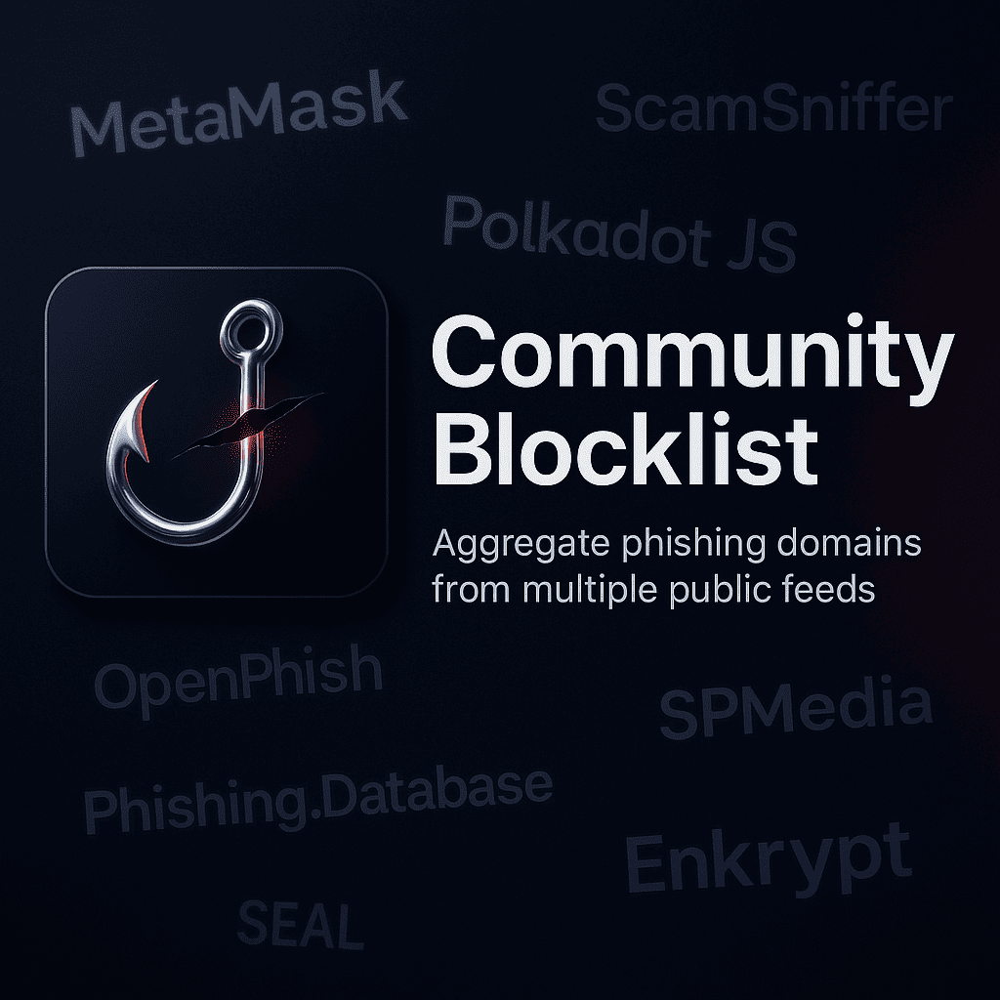

# 🌐 Community Blocklist

<p align="center">
  
</p>

---

## ⚠️ Research Dataset — Not for Direct Production Blocking

Auto-aggregated collection of phishing/scam domains from **13+ public threat intelligence sources**. 

Intended for **research**, pattern analysis, and ML model training.

---

## 📌 Purpose

- Aggregate domains from multiple community feeds
- Analyze domain abuse and phishing patterns at scale
- Train AI/ML models and heuristic detection systems
- **No operational impact** — being listed here doesn't block anything

---

## 📂 Files

| File | Description |
|:-----|:------------|
| `blocklist.json` | Merged & normalized domains |
| `blocklist.txt` | Plain text version |
| `live_blocklist.json` | DNS-verified (resolvable) |
| `live_blocklist.txt` | Plain text version |
| `content_live.json` | HTTP content-verified domains |
| `content_live.txt` | Plain text version |
| `dead_blocklist.json` | Non-resolving domains (research) |
| `state.json` | Per-source hash & counts |
| `count.json` | Total count badge |
| `live_count.json` | Live domain count badge |
| `content_active_count.json` | Content-verified count badge |
| `dns_cache.json` | Cached DNS lookups |

---

## 🚦 Policy

- **No manual removals** — fully automated, edits get overwritten
- To remove a domain → report to the **original source feed**
- For production use → prefer the curated `list.json` instead

---

## 🛠️ How It's Built

Generated by `smart_aggregator.py`:

1. Fetches from all source feeds
2. Normalizes and deduplicates
3. Outputs `blocklist.json` + metadata

DNS validation runs separately on the server via `dns/active_domains.py`:

```powershell
py smart_aggregator.py
py dns\active_domains.py --force
```

---

## 📡 Sources

| Source | URL |
|:-------|:----|
| MetaMask | [eth-phishing-detect](https://github.com/MetaMask/eth-phishing-detect) |
| ScamSniffer | [scam-database](https://github.com/scamsniffer/scam-database) |
| Polkadot JS | [phishing](https://github.com/polkadot-js/phishing) |
| OpenPhish | [public_feed](https://github.com/openphish/public_feed) |
| Security Alliance | [blocklists](https://github.com/security-alliance/blocklists) |
| Crypto Firewall | [crypto-firewall](https://github.com/chartingshow/crypto-firewall) |
| Phishing.Database | [Ultimate-Hosts-Blacklist](https://github.com/Ultimate-Hosts-Blacklist/Phishing.Database) |
| Enkrypt | [phishing-detect](https://github.com/enkryptcom/phishing-detect) |
| SPMedia | [Crypto-Scam-Threat-Intel](https://github.com/spmedia/Crypto-Scam-and-Crypto-Phishing-Threat-Intel-Feed) |
| Codeesura | [Anti-phishing-extension](https://github.com/codeesura/Anti-phishing-extension) |

*...and more*
