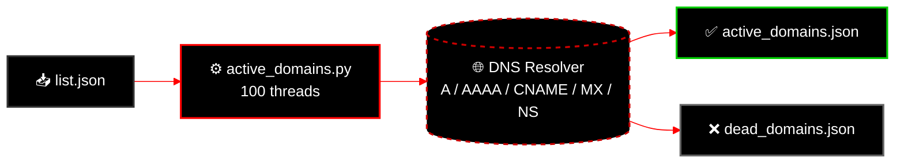

<!--
  PhishDestroy DNS Intelligence
  Real-time DNS validation and active domain tracking
  https://github.com/phishdestroy/destroylist/tree/main/dns
-->

**Real-time DNS validation & active domain tracking**

 

 

---

## How It Works

Multithreaded DNS resolver validates every domain in the blocklist against live DNS records (A, AAAA, CNAME, MX, NS). Only domains with active infrastructure are flagged as live threats.

## 📂 Data Files

| File | Description | Format |
|:-----|:------------|:------:|
| [`active_domains.json`](https://raw.githubusercontent.com/phishdestroy/destroylist/main/dns/active_domains.json) | All DNS-validated live domains | JSON |
| [`active_domains.txt`](https://raw.githubusercontent.com/phishdestroy/destroylist/main/dns/active_domains.txt) | Same as above, plain text | TXT |
| [`active_count.json`](https://raw.githubusercontent.com/phishdestroy/destroylist/main/dns/active_count.json) | Current active domain count | JSON |
| [`dead_domains.json`](https://raw.githubusercontent.com/phishdestroy/destroylist/main/dns/dead_domains.json) | Domains with no DNS records | JSON |
| [`content_active.json`](https://raw.githubusercontent.com/phishdestroy/destroylist/main/dns/content_active.json) | Active domains with HTTP content | JSON |
| [`content_active.txt`](https://raw.githubusercontent.com/phishdestroy/destroylist/main/dns/content_active.txt) | Same as above, plain text | TXT |

## ⏱️ Time-Based Feeds

| File | Description |
|:-----|:------------|
| [`today_added.json`](https://raw.githubusercontent.com/phishdestroy/destroylist/main/dns/today_added.json) | Domains added today |
| [`today_community.json`](https://raw.githubusercontent.com/phishdestroy/destroylist/main/dns/today_community.json) | Community domains added today |
| [`week_added.json`](https://raw.githubusercontent.com/phishdestroy/destroylist/main/dns/week_added.json) | Domains added this week |
| [`week_community.json`](https://raw.githubusercontent.com/phishdestroy/destroylist/main/dns/week_community.json) | Community domains this week |
| [`month_added.json`](https://raw.githubusercontent.com/phishdestroy/destroylist/main/dns/month_added.json) | Domains added this month |
| [`month_community.json`](https://raw.githubusercontent.com/phishdestroy/destroylist/main/dns/month_community.json) | Community domains this month |

## ⚙️ Script

[`active_domains.py`](active_domains.py) — Multithreaded DNS validator

- Resolves A, AAAA, CNAME, MX, NS records
- 100 concurrent threads for fast scanning
- Outputs JSON + TXT with deduplication
- Runs automatically via GitHub Actions

---

