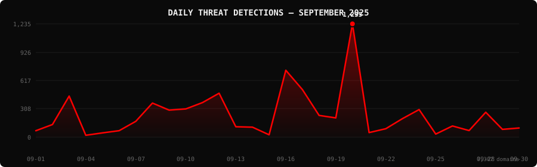

<!--
  PhishDestroy Threat Intelligence Report — September 2025
  7,307 phishing & scam domains detected · Kill rate: 67.8%
  Keywords: phishing report, threat intelligence, 2025-09, destroylist, scam domains, crypto drainer,
  phishing detection, domain blocklist, threat feed, VirusTotal, registrar abuse, brand impersonation,
  cryptocurrency phishing, wallet drainer, monthly security report, cybersecurity analytics
  Canonical: https://github.com/phishdestroy/destroylist/tree/main/reports/2025-09.md
  Previous: https://github.com/phishdestroy/destroylist/tree/main/reports/2025-08.md
  Next: https://github.com/phishdestroy/destroylist/tree/main/reports/2025-10.md
  Data: https://github.com/phishdestroy/destroylist/tree/main/reports/2025-09-threats.json
-->

<div align="center">

[**← Aug 2025**](2025-08.md) &nbsp;·&nbsp; 📅 **September 2025** &nbsp;·&nbsp; [**Oct 2025 →**](2025-10.md)

<br>

<a href="https://github.com/phishdestroy/destroylist">
  
</a>

<br><br>


<br><br>

[](https://github.com/phishdestroy/destroylist)
[](https://api.destroy.tools)
[](https://phishdestroy.io)
[](https://t.me/destroy_phish)
[](https://x.com/Phish_Destroy)
[](https://github.com/phishdestroy/destroylist#-data-feeds)

</div>


##  Dashboard

<div align="center">

|  |  |  |  |
|:---:|:---:|:---:|:---:|
| **7,307** | **2,343** | **4,955** | **9** |

|  |  |  |  |
|:---:|:---:|:---:|:---:|
| **6,342** (86.8%) | **297** | **3827.1h** | **3952.0h** |

</div>

<div align="center">

</div>

> `  ▂   ▁▂▁▁▂▃   ▄▃▁▁█  ▁▁   ▁  ` &nbsp; Peak: **2025-09-20** (1,235) &nbsp;·&nbsp; Low: **2025-09-04** (21) &nbsp;·&nbsp; Active days: **30**

<details>
<summary>📊 <b>Daily breakdown</b></summary>
<br>

| Date | Domains | Activity |
|:-----|--------:|:---------|
| `2025-09-01` | **70** | `█░░░░░░░░░░░░░░░░░░░` |
| `2025-09-02` | **138** | `██░░░░░░░░░░░░░░░░░░` |
| `2025-09-03` | **448** | `███████░░░░░░░░░░░░░` |
| `2025-09-04` | **21** | `░░░░░░░░░░░░░░░░░░░░` |
| `2025-09-05` | **47** | `█░░░░░░░░░░░░░░░░░░░` |
| `2025-09-06` | **71** | `█░░░░░░░░░░░░░░░░░░░` |
| `2025-09-07` | **173** | `███░░░░░░░░░░░░░░░░░` |
| `2025-09-08` | **372** | `██████░░░░░░░░░░░░░░` |
| `2025-09-09` | **295** | `█████░░░░░░░░░░░░░░░` |
| `2025-09-10` | **308** | `█████░░░░░░░░░░░░░░░` |
| `2025-09-11` | **377** | `██████░░░░░░░░░░░░░░` |
| `2025-09-12` | **479** | `████████░░░░░░░░░░░░` |
| `2025-09-13` | **114** | `██░░░░░░░░░░░░░░░░░░` |
| `2025-09-14` | **109** | `██░░░░░░░░░░░░░░░░░░` |
| `2025-09-15` | **26** | `░░░░░░░░░░░░░░░░░░░░` |
| `2025-09-16` | **729** | `████████████░░░░░░░░` |
| `2025-09-17` | **518** | `████████░░░░░░░░░░░░` |
| `2025-09-18` | **237** | `████░░░░░░░░░░░░░░░░` |
| `2025-09-19` | **210** | `███░░░░░░░░░░░░░░░░░` |
| `2025-09-20` | **1,235** | `████████████████████` |
| `2025-09-21` | **50** | `█░░░░░░░░░░░░░░░░░░░` |
| `2025-09-22` | **92** | `█░░░░░░░░░░░░░░░░░░░` |
| `2025-09-23` | **202** | `███░░░░░░░░░░░░░░░░░` |
| `2025-09-24` | **301** | `█████░░░░░░░░░░░░░░░` |
| `2025-09-25` | **34** | `█░░░░░░░░░░░░░░░░░░░` |
| `2025-09-26` | **122** | `██░░░░░░░░░░░░░░░░░░` |
| `2025-09-27` | **72** | `█░░░░░░░░░░░░░░░░░░░` |
| `2025-09-28` | **272** | `████░░░░░░░░░░░░░░░░` |
| `2025-09-29` | **85** | `█░░░░░░░░░░░░░░░░░░░` |
| `2025-09-30` | **100** | `██░░░░░░░░░░░░░░░░░░` |

</details>


##  Intelligence Analysis

### Executive Summary

In September 2025, PhishDestroy identified a total of 7,307 phishing domains, marking a significant 92.9% increase from the previous month's count of 3,788. Of these, 2,343 remained active while 4,955 were neutralized, achieving a kill rate of 67.8%. The most notable finding was the surge in crypto-related phishing, particularly targeting platforms like SushiSwap and Ledger. The average response time for takedowns was 3,827.1 hours, indicating room for improvement in response efficiency.

### Key Trends

- **Crypto/Drainer Landscape** — The month saw a sharp increase in crypto-targeted phishing with Generic Crypto being the most targeted brand at 517 instances, and Angel Drainer leading drainer types with 1,120 instances.
- **Brand Targeting Shifts** — SushiSwap and Ledger were prominently targeted with 398 and 180 instances, respectively, highlighting a shift towards crypto platforms.
- **Geographic Hotspots** — The USA accounted for 3,049 phishing domains, a significant concentration compared to other regions like Hong Kong (747) and Malaysia (675).
- **TLD Abuse Patterns** — The ".com" TLD was the most abused with 2,561 instances, followed by ".xyz" at 748, indicating a preference for recognizable domains.
- **Registrar Abuse Concentration** — Registrars like NICENIC INTERNATIONAL GROUP CO., LIMITED and PDR Ltd. were heavily abused with 721 and 527 domains, respectively.
- **Detection/Response Metrics** — VirusTotal flagged 6,342 domains, with Google Safe Browsing identifying 297, suggesting potential detection gaps.

### Threat Actor Tactics

Threat actors continue to exploit infrastructure and hosting patterns such as fast-flux techniques and bulletproof hosting to enhance the resilience of their phishing operations. Nameserver clustering was particularly evident, complicating takedown efforts.

Drainer and phishing kit evolution revealed increased sophistication, with specific focus on crypto wallets. Notably, Angel Drainer and Solana Drainer were prevalent, targeting decentralized finance platforms with advanced techniques, including wallet connect abuse.

Evasion and obfuscation tactics showed a diverse spread across VirusTotal detections, with certain engines like alphaMountain.ai and Fortinet leading in identification. However, gaps remain in coverage, as actors employ obfuscation techniques to evade specific engines, necessitating improvements in detection algorithms.

### Registrar Accountability

The top five registrars with the highest number of phishing domains were NICENIC INTERNATIONAL GROUP CO., LIMITED (721), PDR Ltd. (527), NameSilo, LLC (481), WEBCC (387), and an unspecified registrar (726). These registrars accounted for a significant proportion of the phishing domains, highlighting the need for tighter controls and accountability.

Compared to the previous month, NICENIC INTERNATIONAL GROUP CO., LIMITED and PDR Ltd. saw increases in phishing domain registrations, while NameSilo, LLC showed a slight improvement. WEBCC emerged as a new entrant in the top five, indicating a shift in registrar abuse patterns.

### Detection Landscape

Analysis of VirusTotal vendor data shows that alphaMountain.ai and Fortinet are leading in detection, flagging over 2,900 instances each. However, the spread indicates gaps in detection, particularly in identifying newly evolved phishing tactics. This highlights the need for continuous updates and enhancements in detection capabilities to keep pace with threat actor innovations.

### Recommendations

- **For Security Teams** — Enhance monitoring of crypto-related phishing activities, particularly targeting emerging platforms like SushiSwap and Ledger.
- **For SOC Analysts** — Prioritize investigations involving fast-flux and bulletproof hosting patterns to disrupt phishing infrastructure effectively.
- **For Registrars** — Implement stricter domain vetting processes to mitigate abuse and collaborate with cybersecurity firms for quicker takedown actions.
- **For Browser Vendors** — Improve integration with threat intelligence feeds to enhance phishing site detection and user protection.
- **For Crypto Projects** — Educate users on recognizing phishing attempts and securing their wallets against drainer attacks.
- **For End Users** — Stay vigilant against unsolicited communications and verify URLs before engaging with crypto platforms or entering sensitive information.


##  Top Registrars

| # | Registrar | Domains | Share | Trend |
|:--:|:---|------:|:---|:---:|
| **1** | N/A | **726** | `█░░░░░░░░░░░░░░` 9.9% | 🔺 |
| **2** | NICENIC INTERNATIONAL GROUP CO., LIMITED | **721** | `█░░░░░░░░░░░░░░` 9.9% | 🔺 |
| **3** | PDR Ltd. d/b/a PublicDomainRegistry.com | **527** | `█░░░░░░░░░░░░░░` 7.2% | 🔺 |
| **4** | NameSilo, LLC | **481** | `█░░░░░░░░░░░░░░` 6.6% | 🔺 |
| **5** | WEBCC | **387** | `█░░░░░░░░░░░░░░` 5.3% | 🔺 |
| **6** | OwnRegistrar, Inc. | **327** | `█░░░░░░░░░░░░░░` 4.5% | 🔺 |
| **7** | Cloudflare, Inc. | **312** | `█░░░░░░░░░░░░░░` 4.3% | 🆕 |
| **8** | Web Commerce Communications Limited dba WebNic.cc | **261** | `█░░░░░░░░░░░░░░` 3.6% | 🔺 |
| **9** | NAMECHEAP INC | **205** | `░░░░░░░░░░░░░░░` 2.8% | 🔺 |
| **10** | DYNADOT LLC | **197** | `░░░░░░░░░░░░░░░` 2.7% | 🔺 |

> ⚠️ Top 3 registrars = **1,974** domains (27% of all threats)


##  Domain Zones

| # | TLD | Domains | Share | vs Prev |
|:--:|:---|------:|------:|:---:|
| **1** | `.com` | **2,561** | 35.0% | 🔺 |
| **2** | `.xyz` | **748** | 10.2% | 🔺 |
| **3** | `.live` | **390** | 5.3% | 🔺 |
| **4** | `.app` | **335** | 4.6% | 🔺 |
| **5** | `.org` | **315** | 4.3% | 🔺 |
| **6** | `.net` | **190** | 2.6% | 🔺 |
| **7** | `.top` | **178** | 2.4% | 🔺 |
| **8** | `.io` | **133** | 1.8% | 🔺 |
| **9** | `.cc` | **121** | 1.7% | 🔺 |
| **10** | `.site` | **115** | 1.6% | 🔺 |


##  Registrar Geography

| # | Country | Domains | Share |
|:--:|:---|------:|------:|
| **1** | USA | **3,049** | 41.7% |
| **2** | Unknown | **884** | 12.1% |
| **3** | Hong Kong | **747** | 10.2% |
| **4** | Malaysia | **675** | 9.2% |
| **5** | India | **552** | 7.6% |
| **6** | Lithuania | **218** | 3.0% |
| **7** | Singapore | **144** | 2.0% |
| **8** | China | **122** | 1.7% |
| **9** | Canada | **116** | 1.6% |
| **10** | Netherlands | **91** | 1.2% |


##  Targeted Brands

| # | Brand | Domains | Share |
|:--:|:---|------:|------:|
| **1** | Generic Crypto | **517** | 7.1% |
| **2** | SushiSwap | **398** | 5.4% |
| **3** | Ledger | **180** | 2.5% |
| **4** | Crypto Scam | **126** | 1.7% |
| **5** | Linea | **100** | 1.4% |
| **6** | Solana | **91** | 1.2% |
| **7** | Generic Banking | **57** | 0.8% |
| **8** | Coinbase | **44** | 0.6% |
| **9** | Generic Cloudflare | **43** | 0.6% |
| **10** | Uniswap | **40** | 0.5% |


##  Crypto Drainers & Kits

| # | Type | Domains |
|:--:|:---|------:|
| **1** | Angel Drainer | **1,120** |
| **2** | Solana Drainer | **332** |
| **3** | Wallet Connect Abuse | **305** |
| **4** | Ice Phishing | **12** |
| **5** | Inferno Drainer | **5** |


##  Detection Engines (VirusTotal)

| # | Engine | Detections | Coverage |
|:--:|:---|------:|------:|
| **1** | alphaMountain.ai | **3,011** | 41.2% |
| **2** | Fortinet | **2,933** | 40.1% |
| **3** | Gridinsoft | **2,519** | 34.5% |
| **4** | CyRadar | **2,244** | 30.7% |
| **5** | G-Data | **2,127** | 29.1% |
| **6** | Forcepoint ThreatSeeker | **1,827** | 25.0% |
| **7** | Sophos | **1,597** | 21.9% |
| **8** | BitDefender | **1,505** | 20.6% |
| **9** | Seclookup | **1,313** | 18.0% |
| **10** | Lionic | **1,282** | 17.5% |
| **11** | Webroot | **1,200** | 16.4% |
| **12** | CRDF | **1,035** | 14.2% |
| **13** | ADMINUSLabs | **1,007** | 13.8% |
| **14** | SOCRadar | **896** | 12.3% |
| **15** | ESET | **867** | 11.9% |

>  &nbsp; 


##  Downloads & Data

| Format | File | Description |
|:-------|:-----|:------------|
| 📋 Report | [`2025-09.md`](2025-09.md) | This report |
| 🗃️ Threats | [`2025-09-threats.json`](2025-09-threats.json) | **7,307** threats with VT vendors, scan URLs, IPs |
| 📈 Chart | [`2025-09-activity.svg`](2025-09-activity.svg) | Daily detection activity graph |

<details>
<summary>🔍 <b>Threat JSON example</b></summary>

```json
{
  "domain": "onchainwebrecovery.com",
  "detected_at": "2025-09-01 12:29:26",
  "registrar": "Hosting Concepts B.V. d/b/a Registrar.eu",
  "registrar_country": "Netherlands",
  "tld": "com",
  "ip_address": "198.18.0.103",
  "nameservers": "ns1.rivaldns.com ns2.rivaldns.com",
  "status": "live",
  "target_brand": "",
  "drainer_type": "clean",
  "vt_detections": 5,
  "vt_vendors": [
    "alphaMountain.ai",
    "CyRadar",
    "Fortinet",
    "G-Data",
    "Gridinsoft"
  ],
  "gsb_flagged": false,
  "creation_date": "2025-08-22 09:06:12",
  "urlscan": "https://urlscan.io/result/01990540-8afb-713c-9ec1-e165990cd1e7/",
  "screenshot": "https://urlscan.io/screenshots/01990540-8afb-713c-9ec1-e165990cd1e7.png"
}
```

</details>

> 💡 **API access**: Query any domain at [`api.destroy.tools/v1/check`](https://api.destroy.tools/v1/check?domain=example.com) — free, no API key


##  All Reports

| Report | Domains |
|:-------|--------:|
| [July 2025](2025-07.md) | — |
| [August 2025](2025-08.md) | — |
| 📍 **September 2025** | **7,307** |
| [October 2025](2025-10.md) | — |
| [November 2025](2025-11.md) | — |
| [December 2025](2025-12.md) | — |
| [January 2026](2026-01.md) | — |
| [February 2026](2026-02.md) | — |
| [March 2026](2026-03.md) | — |


<div align="center">

[**← Aug 2025**](2025-08.md) &nbsp;·&nbsp; 📅 **September 2025** &nbsp;·&nbsp; [**Oct 2025 →**](2025-10.md)

<br>

[](https://github.com/phishdestroy/destroylist)
[](https://api.destroy.tools)
[](https://api.destroy.tools/v1/stats)
[](https://github.com/phishdestroy/destroylist#-data-feeds)
[](https://phishdestroy.io/appeals/)
[](https://x.com/Phish_Destroy)
[](https://mastodon.social/@phishdestroy)

<br>

Data: [destroylist](https://github.com/phishdestroy/destroylist)

</div>
