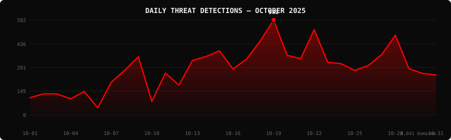

<!--
  PhishDestroy Threat Intelligence Report — October 2025
  8,841 phishing & scam domains detected · Kill rate: 67.1%
  Keywords: phishing report, threat intelligence, 2025-10, destroylist, scam domains, crypto drainer,
  phishing detection, domain blocklist, threat feed, VirusTotal, registrar abuse, brand impersonation,
  cryptocurrency phishing, wallet drainer, monthly security report, cybersecurity analytics
  Canonical: https://github.com/phishdestroy/destroylist/tree/main/reports/2025-10.md
  Previous: https://github.com/phishdestroy/destroylist/tree/main/reports/2025-09.md
  Next: https://github.com/phishdestroy/destroylist/tree/main/reports/2025-11.md
  Data: https://github.com/phishdestroy/destroylist/tree/main/reports/2025-10-threats.json
-->

<div align="center">

[**← Sep 2025**](2025-09.md) &nbsp;·&nbsp; 📅 **October 2025** &nbsp;·&nbsp; [**Nov 2025 →**](2025-11.md)

<br>

<a href="https://github.com/phishdestroy/destroylist">
  
</a>

<br><br>


<br><br>

[](https://github.com/phishdestroy/destroylist)
[](https://api.destroy.tools)
[](https://phishdestroy.io)
[](https://t.me/destroy_phish)
[](https://x.com/Phish_Destroy)
[](https://github.com/phishdestroy/destroylist#-data-feeds)

</div>


##  Dashboard

<div align="center">

|  |  |  |  |
|:---:|:---:|:---:|:---:|
| **8,841** | **2,905** | **5,934** | **2** |

|  |  |  |  |
|:---:|:---:|:---:|:---:|
| **8,696** (98.4%) | **909** | **2797.5h** | **2913.0h** |

</div>

<div align="center">

</div>

> ` ▁▁ ▁ ▂▃▄ ▃▂▄▄▅▃▄▆█▄▄▇▄▄▃▃▄▆▃▃▂` &nbsp; Peak: **2025-10-19** (582) &nbsp;·&nbsp; Low: **2025-10-06** (44) &nbsp;·&nbsp; Active days: **31**

<details>
<summary>📊 <b>Daily breakdown</b></summary>
<br>

| Date | Domains | Activity |
|:-----|--------:|:---------|
| `2025-10-01` | **106** | `████░░░░░░░░░░░░░░░░` |
| `2025-10-02` | **130** | `████░░░░░░░░░░░░░░░░` |
| `2025-10-03` | **129** | `████░░░░░░░░░░░░░░░░` |
| `2025-10-04` | **99** | `███░░░░░░░░░░░░░░░░░` |
| `2025-10-05` | **144** | `█████░░░░░░░░░░░░░░░` |
| `2025-10-06` | **44** | `██░░░░░░░░░░░░░░░░░░` |
| `2025-10-07` | **201** | `███████░░░░░░░░░░░░░` |
| `2025-10-08` | **274** | `█████████░░░░░░░░░░░` |
| `2025-10-09` | **357** | `████████████░░░░░░░░` |
| `2025-10-10` | **83** | `███░░░░░░░░░░░░░░░░░` |
| `2025-10-11` | **257** | `█████████░░░░░░░░░░░` |
| `2025-10-12` | **183** | `██████░░░░░░░░░░░░░░` |
| `2025-10-13` | **334** | `███████████░░░░░░░░░` |
| `2025-10-14` | **358** | `████████████░░░░░░░░` |
| `2025-10-15` | **393** | `██████████████░░░░░░` |
| `2025-10-16` | **282** | `██████████░░░░░░░░░░` |
| `2025-10-17` | **342** | `████████████░░░░░░░░` |
| `2025-10-18` | **452** | `████████████████░░░░` |
| `2025-10-19` | **582** | `████████████████████` |
| `2025-10-20` | **366** | `█████████████░░░░░░░` |
| `2025-10-21` | **345** | `████████████░░░░░░░░` |
| `2025-10-22` | **523** | `██████████████████░░` |
| `2025-10-23` | **323** | `███████████░░░░░░░░░` |
| `2025-10-24` | **314** | `███████████░░░░░░░░░` |
| `2025-10-25` | **273** | `█████████░░░░░░░░░░░` |
| `2025-10-26` | **303** | `██████████░░░░░░░░░░` |
| `2025-10-27` | **371** | `█████████████░░░░░░░` |
| `2025-10-28` | **489** | `█████████████████░░░` |
| `2025-10-29` | **284** | `██████████░░░░░░░░░░` |
| `2025-10-30` | **255** | `█████████░░░░░░░░░░░` |
| `2025-10-31` | **245** | `████████░░░░░░░░░░░░` |

</details>


##  Intelligence Analysis

### Executive Summary
In October 2025, PhishDestroy identified a total of 8,841 phishing domains, marking a significant 21.0% increase from the previous month’s total of 7,307. Of these, 2,905 domains remain active, while 5,934 were neutralized, achieving a kill rate of 67.1%. The most notable finding this month is the dramatic rise in phishing domains targeting the cryptocurrency sector, with "Generic Crypto" alone accounting for 681 instances. The average response time to take down these domains was 2,797.5 hours.

### Key Trends
- **Crypto/Drainer Landscape** — Angel Drainer emerged as the most prevalent drainer with 1,122 incidents, highlighting an increasing focus on cryptocurrency theft.
- **Brand Targeting Shifts** — There was a notable increase in phishing attempts targeting "Generic Crypto" brands, totaling 681, compared to other sectors.
- **Geographic Hotspots** — The USA remained the top host of phishing domains with 4,020 instances, followed by Hong Kong with 1,491. This represents a steady concentration compared to previous months.
- **TLD Abuse Patterns** — The .com TLD was most abused, with 3,256 domains, a consistent pattern from the prior month, while .xyz saw a slight uptick to 651 domains.
- **Registrar Abuse Concentration** — NICENIC INTERNATIONAL GROUP CO., LIMITED topped the list with 1,206 domains, a significant portion of the overall phishing landscape.
- **Detection/Response Metrics** — VirusTotal flagged 8,696 domains, with Google Safe Browsing identifying 909, indicating an improvement in initial detection but highlighting gaps in real-time responsiveness.

### Threat Actor Tactics
Threat actors continue to favor robust infrastructure setups, with a noticeable increase in the use of fast-flux networks and CDN abuse to distribute phishing domains. Nameserver clustering was observed, particularly among domains hosted by NICENIC INTERNATIONAL GROUP CO., LIMITED, suggesting a strategic alignment to evade detection.

The evolution of drainer kits has become more sophisticated, with a rise in Angel Drainer deployments. These kits are increasingly targeting multi-currency wallets and leveraging social engineering tactics to enhance their success rates. The emergence of Ice Phishing and Inferno Drainer, though less frequent, indicates a diversification of attack methods.

Evasion techniques have become more advanced, with threat actors employing obfuscation to bypass detection engines. The variance in VirusTotal vendor detection, with alphaMountain.ai and Fortinet leading, suggests a need for improved heuristics and machine learning models to close detection gaps. Threat actors are increasingly adept at avoiding specific engines, which underscores the necessity for a more unified approach among vendors.

### Registrar Accountability
The top five registrars facilitating the highest number of phishing domains were NICENIC INTERNATIONAL GROUP CO., LIMITED (1,206 domains, 13.6% of total), Cloudflare, Inc. (809 domains), WEBCC (593 domains), NameSilo, LLC (395 domains), and DYNADOT LLC (394 domains). These registrars account for a significant portion of the phishing landscape and need to enhance their proactive measures.

Registrars such as NameSilo, LLC have shown improvement in reducing phishing domain registrations, while NICENIC INTERNATIONAL GROUP CO., LIMITED has seen an increase, suggesting a need for stricter monitoring and compliance. New entrants in the registrar landscape have maintained a relatively lower profile but require ongoing scrutiny to prevent future abuse.

### Detection Landscape
VirusTotal data shows that alphaMountain.ai and Fortinet are at the forefront of phishing detection, each flagging over 6,000 domains. However, the variance among vendors indicates persistent detection gaps, particularly in real-time response capabilities. This highlights the necessity for continuous collaboration among vendors to enhance the accuracy and speed of threat identification.

### Recommendations
- **For Security Teams** — Implement advanced threat intelligence feeds to proactively identify and mitigate phishing threats targeting your organization.
- **For SOC Analysts** — Enhance monitoring of fast-flux and CDN abuse patterns to detect and respond to phishing domains more effectively.
- **For Registrars** — Strengthen verification processes for domain registrations to reduce the incidence of phishing domain abuse.
- **For Browser Vendors** — Integrate more comprehensive phishing domain blocklists into browsers to protect users from accessing malicious sites.
- **For Crypto Projects** — Increase awareness campaigns to educate users on recognizing phishing attempts and safeguarding against drainer kits.
- **For End Users** — Be vigilant about unsolicited communications and verify the authenticity of requests, especially those related to cryptocurrency transactions.


##  Top Registrars

| # | Registrar | Domains | Share | Trend |
|:--:|:---|------:|:---|:---:|
| **1** | NICENIC INTERNATIONAL GROUP CO., LIMITED | **1,206** | `██░░░░░░░░░░░░░` 13.6% | 🔺 |
| **2** | Cloudflare, Inc. | **809** | `█░░░░░░░░░░░░░░` 9.2% | 🔺 |
| **3** | WEBCC | **593** | `█░░░░░░░░░░░░░░` 6.7% | 🔺 |
| **4** | NameSilo, LLC | **395** | `█░░░░░░░░░░░░░░` 4.5% | 📉 |
| **5** | DYNADOT LLC | **394** | `█░░░░░░░░░░░░░░` 4.5% | 🔺 |
| **6** | Gname.com Pte. Ltd. | **389** | `█░░░░░░░░░░░░░░` 4.4% | 🔺 |
| **7** | PDR Ltd. d/b/a PublicDomainRegistry.com | **311** | `█░░░░░░░░░░░░░░` 3.5% | 🔻 |
| **8** | Dominet (HK) Limited | **285** | `░░░░░░░░░░░░░░░` 3.2% | 🆕 |
| **9** | GoDaddy.com, LLC | **268** | `░░░░░░░░░░░░░░░` 3.0% | 🔺 |
| **10** | NAMECHEAP INC | **253** | `░░░░░░░░░░░░░░░` 2.9% | 📈 |

> ⚠️ Top 3 registrars = **2,608** domains (29% of all threats)


##  Domain Zones

| # | TLD | Domains | Share | vs Prev |
|:--:|:---|------:|------:|:---:|
| **1** | `.com` | **3,256** | 36.8% | 📈 |
| **2** | `.xyz` | **651** | 7.4% | 📉 |
| **3** | `.app` | **447** | 5.1% | 🔺 |
| **4** | `.top` | **320** | 3.6% | 🔺 |
| **5** | `.org` | **289** | 3.3% | ➡️ |
| **6** | `.io` | **271** | 3.1% | 🔺 |
| **7** | `.cc` | **247** | 2.8% | 🔺 |
| **8** | `.net` | **247** | 2.8% | 📈 |
| **9** | `.live` | **154** | 1.7% | 🔻 |
| **10** | `.cfd` | **148** | 1.7% | 🔺 |


##  Registrar Geography

| # | Country | Domains | Share |
|:--:|:---|------:|------:|
| **1** | USA | **4,020** | 45.5% |
| **2** | Hong Kong | **1,491** | 16.9% |
| **3** | Malaysia | **696** | 7.9% |
| **4** | Singapore | **430** | 4.9% |
| **5** | India | **321** | 3.6% |
| **6** | Lithuania | **229** | 2.6% |
| **7** | China | **160** | 1.8% |
| **8** | Canada | **140** | 1.6% |
| **9** | Germany | **126** | 1.4% |
| **10** | Turkey | **119** | 1.3% |


##  Targeted Brands

| # | Brand | Domains | Share |
|:--:|:---|------:|------:|
| **1** | Generic Crypto | **681** | 7.7% |
| **2** | Generic Gambling | **320** | 3.6% |
| **3** | Crypto Scam | **300** | 3.4% |
| **4** | Coinbase | **253** | 2.9% |
| **5** | WhatsApp | **94** | 1.1% |
| **6** | Generic Cloudflare | **75** | 0.8% |
| **7** | Phantom | **59** | 0.7% |
| **8** | Ledger | **54** | 0.6% |
| **9** | Solana | **52** | 0.6% |
| **10** | Generic | **46** | 0.5% |


##  Crypto Drainers & Kits

| # | Type | Domains |
|:--:|:---|------:|
| **1** | Angel Drainer | **1,122** |
| **2** | Wallet Connect Abuse | **321** |
| **3** | Solana Drainer | **280** |
| **4** | Ice Phishing | **8** |
| **5** | Inferno Drainer | **1** |


##  Detection Engines (VirusTotal)

| # | Engine | Detections | Coverage |
|:--:|:---|------:|------:|
| **1** | alphaMountain.ai | **6,083** | 68.8% |
| **2** | Fortinet | **6,034** | 68.3% |
| **3** | CyRadar | **5,780** | 65.4% |
| **4** | SOCRadar | **5,035** | 57.0% |
| **5** | G-Data | **4,816** | 54.5% |
| **6** | Sophos | **4,705** | 53.2% |
| **7** | Lionic | **4,311** | 48.8% |
| **8** | BitDefender | **4,267** | 48.3% |
| **9** | Forcepoint ThreatSeeker | **3,961** | 44.8% |
| **10** | CRDF | **2,989** | 33.8% |
| **11** | Webroot | **2,871** | 32.5% |
| **12** | ADMINUSLabs | **2,848** | 32.2% |
| **13** | Seclookup | **2,844** | 32.2% |
| **14** | ESET | **2,803** | 31.7% |
| **15** | VIPRE | **2,557** | 28.9% |

>  &nbsp; 


##  Downloads & Data

| Format | File | Description |
|:-------|:-----|:------------|
| 📋 Report | [`2025-10.md`](2025-10.md) | This report |
| 🗃️ Threats | [`2025-10-threats.json`](2025-10-threats.json) | **8,841** threats with VT vendors, scan URLs, IPs |
| 📈 Chart | [`2025-10-activity.svg`](2025-10-activity.svg) | Daily detection activity graph |

<details>
<summary>🔍 <b>Threat JSON example</b></summary>

```json
{
  "domain": "onweshon.com",
  "detected_at": "2025-10-28 23:00:28",
  "registrar": "One.com A/S",
  "registrar_country": "",
  "tld": "com",
  "ip_address": "198.18.0.111",
  "nameservers": "echo.balancedserver.com pulse.balancedserver.com",
  "status": "dead",
  "target_brand": "",
  "drainer_type": "clean",
  "vt_detections": 2,
  "vt_vendors": [
    "alphaMountain.ai",
    "Webroot"
  ],
  "gsb_flagged": false,
  "creation_date": "2023-12-18 16:30:25",
  "urlscan": "https://urlscan.io/result/019a2d0c-b43d-7682-a807-057c872abc1a/",
  "screenshot": "https://urlscan.io/screenshots/019a2d0c-b43d-7682-a807-057c872abc1a.png"
}
```

</details>

> 💡 **API access**: Query any domain at [`api.destroy.tools/v1/check`](https://api.destroy.tools/v1/check?domain=example.com) — free, no API key


##  All Reports

| Report | Domains |
|:-------|--------:|
| [July 2025](2025-07.md) | — |
| [August 2025](2025-08.md) | — |
| [September 2025](2025-09.md) | — |
| 📍 **October 2025** | **8,841** |
| [November 2025](2025-11.md) | — |
| [December 2025](2025-12.md) | — |
| [January 2026](2026-01.md) | — |
| [February 2026](2026-02.md) | — |
| [March 2026](2026-03.md) | — |


<div align="center">

[**← Sep 2025**](2025-09.md) &nbsp;·&nbsp; 📅 **October 2025** &nbsp;·&nbsp; [**Nov 2025 →**](2025-11.md)

<br>

[](https://github.com/phishdestroy/destroylist)
[](https://api.destroy.tools)
[](https://api.destroy.tools/v1/stats)
[](https://github.com/phishdestroy/destroylist#-data-feeds)
[](https://phishdestroy.io/appeals/)
[](https://x.com/Phish_Destroy)
[](https://mastodon.social/@phishdestroy)

<br>

Data: [destroylist](https://github.com/phishdestroy/destroylist)

</div>
