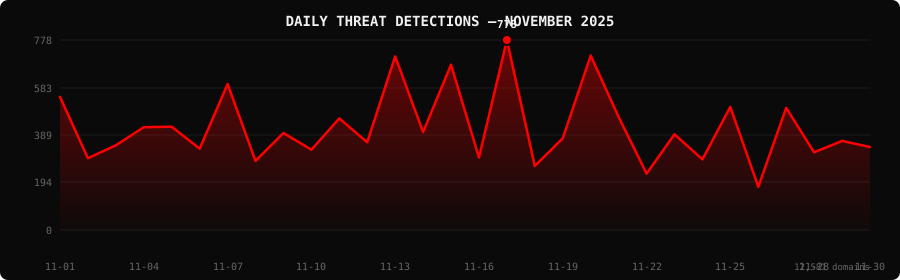

<!--
  PhishDestroy Threat Intelligence Report — November 2025
  12,581 phishing & scam domains detected · Kill rate: 58.9%
  Keywords: phishing report, threat intelligence, 2025-11, destroylist, scam domains, crypto drainer,
  phishing detection, domain blocklist, threat feed, VirusTotal, registrar abuse, brand impersonation,
  cryptocurrency phishing, wallet drainer, monthly security report, cybersecurity analytics
  Canonical: https://github.com/phishdestroy/destroylist/tree/main/reports/2025-11.md
  Previous: https://github.com/phishdestroy/destroylist/tree/main/reports/2025-10.md
  Next: https://github.com/phishdestroy/destroylist/tree/main/reports/2025-12.md
  Data: https://github.com/phishdestroy/destroylist/tree/main/reports/2025-11-threats.json
-->

<div align="center">

[**← Oct 2025**](2025-10.md) &nbsp;·&nbsp; 📅 **November 2025** &nbsp;·&nbsp; [**Dec 2025 →**](2025-12.md)

<br>

<a href="https://github.com/phishdestroy/destroylist">
  
</a>

<br><br>


<br><br>

[](https://github.com/phishdestroy/destroylist)
[](https://api.destroy.tools)
[](https://phishdestroy.io)
[](https://t.me/destroy_phish)
[](https://x.com/Phish_Destroy)
[](https://github.com/phishdestroy/destroylist#-data-feeds)

</div>


##  Dashboard

<div align="center">

|  |  |  |  |
|:---:|:---:|:---:|:---:|
| **12,581** | **5,165** | **7,416** | **0** |

|  |  |  |  |
|:---:|:---:|:---:|:---:|
| **12,215** (97.1%) | **1,442** | **2181.7h** | **2246.0h** |

</div>

<div align="center">

</div>

> `▄▁▂▃▃▂▅▁▂▂▃▂▇▂▆▁█▁▂▇▃ ▂▁▄ ▄▁▂▂` &nbsp; Peak: **2025-11-17** (778) &nbsp;·&nbsp; Low: **2025-11-26** (177) &nbsp;·&nbsp; Active days: **30**

<details>
<summary>📊 <b>Daily breakdown</b></summary>
<br>

| Date | Domains | Activity |
|:-----|--------:|:---------|
| `2025-11-01` | **545** | `██████████████░░░░░░` |
| `2025-11-02` | **294** | `████████░░░░░░░░░░░░` |
| `2025-11-03` | **347** | `█████████░░░░░░░░░░░` |
| `2025-11-04` | **421** | `███████████░░░░░░░░░` |
| `2025-11-05` | **423** | `███████████░░░░░░░░░` |
| `2025-11-06` | **333** | `█████████░░░░░░░░░░░` |
| `2025-11-07` | **598** | `███████████████░░░░░` |
| `2025-11-08` | **283** | `███████░░░░░░░░░░░░░` |
| `2025-11-09` | **397** | `██████████░░░░░░░░░░` |
| `2025-11-10` | **329** | `████████░░░░░░░░░░░░` |
| `2025-11-11` | **457** | `████████████░░░░░░░░` |
| `2025-11-12` | **359** | `█████████░░░░░░░░░░░` |
| `2025-11-13` | **711** | `██████████████████░░` |
| `2025-11-14` | **401** | `██████████░░░░░░░░░░` |
| `2025-11-15` | **677** | `█████████████████░░░` |
| `2025-11-16` | **297** | `████████░░░░░░░░░░░░` |
| `2025-11-17` | **778** | `████████████████████` |
| `2025-11-18` | **262** | `███████░░░░░░░░░░░░░` |
| `2025-11-19` | **376** | `██████████░░░░░░░░░░` |
| `2025-11-20` | **714** | `██████████████████░░` |
| `2025-11-21` | **463** | `████████████░░░░░░░░` |
| `2025-11-22` | **231** | `██████░░░░░░░░░░░░░░` |
| `2025-11-23` | **392** | `██████████░░░░░░░░░░` |
| `2025-11-24` | **289** | `███████░░░░░░░░░░░░░` |
| `2025-11-25` | **504** | `█████████████░░░░░░░` |
| `2025-11-26` | **177** | `█████░░░░░░░░░░░░░░░` |
| `2025-11-27` | **500** | `█████████████░░░░░░░` |
| `2025-11-28` | **318** | `████████░░░░░░░░░░░░` |
| `2025-11-29` | **365** | `█████████░░░░░░░░░░░` |
| `2025-11-30` | **340** | `█████████░░░░░░░░░░░` |

</details>


##  Intelligence Analysis

### Executive Summary
In November 2025, PhishDestroy observed a significant increase in phishing domain activity, with a total of 12,581 domains detected, marking a 42.3% rise from the previous month's 8,841. Of these, 5,165 domains remained active, while 7,416 were neutralized, achieving a kill rate of 58.9%. The most notable finding was the surge in crypto-related scams, with "Crypto Scam" domains accounting for 991 detections. This month also saw a heightened response time, averaging 2,181.7 hours, reflecting the increased volume and complexity of threats.

### Key Trends
- **Crypto/Drainer Landscape** — Angel Drainer led with 842 detections, followed by Wallet Connect Abuse with 453. This represents a notable shift in drainer tactics focusing on wallet-specific targeting.
- **Brand Targeting Shifts** — "Crypto Scam" domains surged to 991, a significant increase compared to the previous month, indicating a focused attack on cryptocurrency platforms.
- **Geographic Hotspots** — The USA remained the top source with 6,894 domains, followed by Hong Kong with 1,533, both showing substantial increases in phishing activity.
- **TLD Abuse Patterns** — The ".com" TLD was the most abused with 3,945 instances, maintaining its lead, while ".io" and ".xyz" followed with 644 and 634 detections, respectively.
- **Registrar Abuse Concentration** — Cloudflare, Inc. was the most abused registrar with 1,421 domains, followed by Dynadot LLC with 1,086, indicating concentrated abuse in specific registrar networks.
- **Detection/Response Metrics** — 12,215 domains were flagged by VirusTotal, with a notable detection gap by Google Safe Browsing, which flagged only 1,442 domains.

### Threat Actor Tactics
Threat actors continued to exploit fast-flux hosting and CDN abuse to obfuscate phishing infrastructure. Nameserver clustering was prevalent, indicating a coordinated effort to distribute malicious domains across various networks to evade detection.

Drainer attacks evolved with the introduction of sophisticated techniques targeting specific wallets. Angel Drainer and Wallet Connect Abuse were prominent, leveraging advanced social engineering tactics to deceive users. Solana Drainer and Ice Phishing also emerged, though less frequently, indicating diversification in attack vectors.

Evasion tactics saw increased use of obfuscation techniques to avoid detection by specific antivirus engines. VirusTotal data revealed significant gaps in detection by certain vendors, with some domains avoiding detection by engines like Google Safe Browsing, suggesting a need for enhanced heuristic and behavioral analysis.

### Registrar Accountability
Cloudflare, Inc. and Dynadot LLC were the top registrars with 1,421 and 1,086 phishing domains, respectively, comprising a significant portion of the detected domains. NICENIC INTERNATIONAL GROUP CO., LIMITED followed closely with 1,083 domains. These registrars accounted for a substantial share of the phishing landscape, highlighting the need for stricter controls and monitoring.

While some registrars showed improvement in response times and domain takedowns, others, like WEBCC and DYNADOT LLC, saw an increase in abuse, indicating a need for enhanced vigilance. New entrants like NICENIC demonstrated a rapid rise in abuse, necessitating immediate attention to prevent further exploitation.

### Detection Landscape
CyRadar and Fortinet led the VirusTotal detection efforts, flagging 8,779 and 8,698 domains, respectively. However, detection gaps were evident, with several engines failing to identify emerging threats. This highlights the necessity for continuous updates and collaboration among vendors to enhance detection capabilities and minimize exposure windows for defenders.

### Recommendations
- **For Security Teams** — Implement continuous monitoring and threat intelligence feeds to stay ahead of evolving phishing tactics and enhance incident response capabilities.
- **For SOC Analysts** — Prioritize investigation of domains using fast-flux hosting and nameserver clustering, as these are indicative of coordinated phishing campaigns.
- **For Registrars** — Strengthen domain verification processes and collaborate with threat intelligence providers to swiftly identify and mitigate abuse on your platforms.
- **For Browser Vendors** — Enhance phishing detection algorithms, particularly for emerging TLDs and newly registered domains, to protect users from accessing malicious sites.
- **For Crypto Projects** — Educate users on identifying phishing attempts and enhance security protocols to safeguard wallets against advanced drainer attacks.
- **For End Users** — Exercise caution with unsolicited communications, especially those requesting wallet credentials, and utilize browser extensions that block known phishing sites.


##  Top Registrars

| # | Registrar | Domains | Share | Trend |
|:--:|:---|------:|:---|:---:|
| **1** | Cloudflare, Inc. | **1,421** | `██░░░░░░░░░░░░░` 11.3% | 🔺 |
| **2** | Dynadot LLC | **1,086** | `█░░░░░░░░░░░░░░` 8.6% | 🔺 |
| **3** | NICENIC INTERNATIONAL GROUP CO., LIMITED | **1,083** | `█░░░░░░░░░░░░░░` 8.6% | 📉 |
| **4** | WEBCC | **695** | `█░░░░░░░░░░░░░░` 5.5% | 📈 |
| **5** | DYNADOT LLC | **497** | `█░░░░░░░░░░░░░░` 4.0% | 📈 |
| **6** | MarkMonitor, Inc. | **487** | `█░░░░░░░░░░░░░░` 3.9% | 🔺 |
| **7** | Dominet (HK) Limited | **440** | `█░░░░░░░░░░░░░░` 3.5% | 🔺 |
| **8** | Gname.com Pte. Ltd. | **413** | `░░░░░░░░░░░░░░░` 3.3% | ➡️ |
| **9** | NameSilo, LLC | **410** | `░░░░░░░░░░░░░░░` 3.3% | ➡️ |
| **10** | NAMECHEAP INC | **372** | `░░░░░░░░░░░░░░░` 3.0% | 🔺 |

> ⚠️ Top 3 registrars = **3,590** domains (29% of all threats)


##  Domain Zones

| # | TLD | Domains | Share | vs Prev |
|:--:|:---|------:|------:|:---:|
| **1** | `.com` | **3,945** | 31.4% | 📈 |
| **2** | `.io` | **644** | 5.1% | 🔺 |
| **3** | `.xyz` | **634** | 5.0% | ➡️ |
| **4** | `.app` | **578** | 4.6% | 📈 |
| **5** | `.ru` | **432** | 3.4% | 🔺 |
| **6** | `.sbs` | **419** | 3.3% | 🔺 |
| **7** | `.dev` | **384** | 3.1% | 🔺 |
| **8** | `.cfd` | **363** | 2.9% | 🔺 |
| **9** | `.net` | **311** | 2.5% | 📈 |
| **10** | `.top` | **311** | 2.5% | ➡️ |


##  Registrar Geography

| # | Country | Domains | Share |
|:--:|:---|------:|------:|
| **1** | USA | **6,894** | 54.8% |
| **2** | Hong Kong | **1,533** | 12.2% |
| **3** | Malaysia | **862** | 6.9% |
| **4** | Singapore | **447** | 3.6% |
| **5** | India | **381** | 3.0% |
| **6** | Russia | **358** | 2.8% |
| **7** | Canada | **233** | 1.9% |
| **8** | Germany | **197** | 1.6% |
| **9** | Lithuania | **191** | 1.5% |
| **10** | Vietnam | **172** | 1.4% |


##  Targeted Brands

| # | Brand | Domains | Share |
|:--:|:---|------:|------:|
| **1** | Crypto Scam | **991** | 7.9% |
| **2** | Generic Gambling | **400** | 3.2% |
| **3** | Coinbase | **397** | 3.2% |
| **4** | Generic Crypto | **357** | 2.8% |
| **5** | Kraken | **321** | 2.6% |
| **6** | Generic Cloudflare | **180** | 1.4% |
| **7** | Metamask | **99** | 0.8% |
| **8** | MetaMask | **93** | 0.7% |
| **9** | Ledger | **83** | 0.7% |
| **10** | Jupiter | **76** | 0.6% |


##  Crypto Drainers & Kits

| # | Type | Domains |
|:--:|:---|------:|
| **1** | Angel Drainer | **842** |
| **2** | Wallet Connect Abuse | **453** |
| **3** | Solana Drainer | **359** |
| **4** | Ice Phishing | **6** |
| **5** | Inferno Drainer | **1** |


##  Detection Engines (VirusTotal)

| # | Engine | Detections | Coverage |
|:--:|:---|------:|------:|
| **1** | CyRadar | **8,779** | 69.8% |
| **2** | Fortinet | **8,698** | 69.1% |
| **3** | alphaMountain.ai | **8,489** | 67.5% |
| **4** | SOCRadar | **7,662** | 60.9% |
| **5** | Sophos | **7,176** | 57.0% |
| **6** | Lionic | **6,686** | 53.1% |
| **7** | G-Data | **6,614** | 52.6% |
| **8** | BitDefender | **6,408** | 50.9% |
| **9** | ADMINUSLabs | **5,115** | 40.7% |
| **10** | Webroot | **5,088** | 40.4% |
| **11** | ESET | **5,000** | 39.7% |
| **12** | Forcepoint ThreatSeeker | **4,998** | 39.7% |
| **13** | CRDF | **4,376** | 34.8% |
| **14** | VIPRE | **4,044** | 32.1% |
| **15** | ChainPatrol | **3,877** | 30.8% |

>  &nbsp; 


##  Downloads & Data

| Format | File | Description |
|:-------|:-----|:------------|
| 📋 Report | [`2025-11.md`](2025-11.md) | This report |
| 🗃️ Threats | [`2025-11-threats.json`](2025-11-threats.json) | **12,581** threats with VT vendors, scan URLs, IPs |
| 📈 Chart | [`2025-11-activity.svg`](2025-11-activity.svg) | Daily detection activity graph |

<details>
<summary>🔍 <b>Threat JSON example</b></summary>

```json
{
  "domain": "www-master.xyz",
  "detected_at": "2025-11-01 07:53:34",
  "registrar": "NameSilo, LLC",
  "registrar_country": "USA",
  "tld": "xyz",
  "ip_address": "188.114.96.3",
  "nameservers": "ezra.ns.cloudflare.com jocelyn.ns.cloudflare.com",
  "status": "dead",
  "target_brand": "",
  "drainer_type": "clean",
  "vt_detections": 8,
  "vt_vendors": [
    "alphaMountain.ai",
    "CRDF",
    "CyRadar",
    "Forcepoint ThreatSeeker",
    "Fortinet",
    "Gridinsoft",
    "SOCRadar",
    "Sophos"
  ],
  "gsb_flagged": false,
  "creation_date": "2025-10-31 17:08:12",
  "urlscan": "https://urlscan.io/result/019a3e67-f8c6-70ad-8a78-c03f1d650e24/",
  "screenshot": "https://urlscan.io/screenshots/019a3e67-f8c6-70ad-8a78-c03f1d650e24.png"
}
```

</details>

> 💡 **API access**: Query any domain at [`api.destroy.tools/v1/check`](https://api.destroy.tools/v1/check?domain=example.com) — free, no API key


##  All Reports

| Report | Domains |
|:-------|--------:|
| [July 2025](2025-07.md) | — |
| [August 2025](2025-08.md) | — |
| [September 2025](2025-09.md) | — |
| [October 2025](2025-10.md) | — |
| 📍 **November 2025** | **12,581** |
| [December 2025](2025-12.md) | — |
| [January 2026](2026-01.md) | — |
| [February 2026](2026-02.md) | — |
| [March 2026](2026-03.md) | — |


<div align="center">

[**← Oct 2025**](2025-10.md) &nbsp;·&nbsp; 📅 **November 2025** &nbsp;·&nbsp; [**Dec 2025 →**](2025-12.md)

<br>

[](https://github.com/phishdestroy/destroylist)
[](https://api.destroy.tools)
[](https://api.destroy.tools/v1/stats)
[](https://github.com/phishdestroy/destroylist#-data-feeds)
[](https://phishdestroy.io/appeals/)
[](https://x.com/Phish_Destroy)
[](https://mastodon.social/@phishdestroy)

<br>

Data: [destroylist](https://github.com/phishdestroy/destroylist)

</div>
