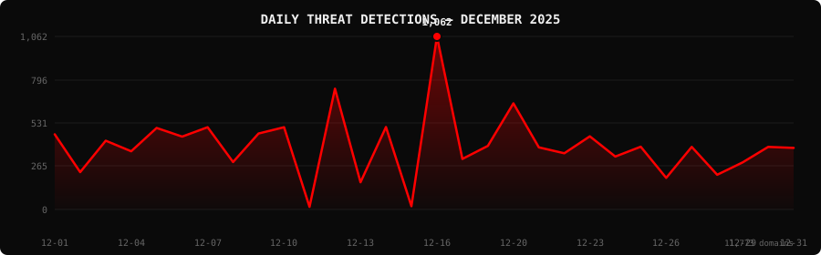

<!--
  PhishDestroy Threat Intelligence Report — December 2025
  11,773 phishing & scam domains detected · Kill rate: 39.9%
  Keywords: phishing report, threat intelligence, 2025-12, destroylist, scam domains, crypto drainer,
  phishing detection, domain blocklist, threat feed, VirusTotal, registrar abuse, brand impersonation,
  cryptocurrency phishing, wallet drainer, monthly security report, cybersecurity analytics
  Canonical: https://github.com/phishdestroy/destroylist/tree/main/reports/2025-12.md
  Previous: https://github.com/phishdestroy/destroylist/tree/main/reports/2025-11.md
  Next: https://github.com/phishdestroy/destroylist/tree/main/reports/2026-01.md
  Data: https://github.com/phishdestroy/destroylist/tree/main/reports/2025-12-threats.json
-->

<div align="center">

[**← Nov 2025**](2025-11.md) &nbsp;·&nbsp; 📅 **December 2025** &nbsp;·&nbsp; [**Jan 2026 →**](2026-01.md)

<br>

<a href="https://github.com/phishdestroy/destroylist">
  
</a>

<br><br>


<br><br>

[](https://github.com/phishdestroy/destroylist)
[](https://api.destroy.tools)
[](https://phishdestroy.io)
[](https://t.me/destroy_phish)
[](https://x.com/Phish_Destroy)
[](https://github.com/phishdestroy/destroylist#-data-feeds)

</div>


##  Dashboard

<div align="center">

|  |  |  |  |
|:---:|:---:|:---:|:---:|
| **11,773** | **7,080** | **4,693** | **0** |

|  |  |  |  |
|:---:|:---:|:---:|:---:|
| **11,557** (98.2%) | **1,963** | **1434.4h** | **1541.0h** |

</div>

<div align="center">

</div>

> `▃▁▃▂▃▃▃▂▃▃ ▅▁▃ █▂▂▄▂▂▃▂▂▁▂▁▂▂▂` &nbsp; Peak: **2025-12-16** (1,062) &nbsp;·&nbsp; Low: **2025-12-11** (16) &nbsp;·&nbsp; Active days: **30**

<details>
<summary>📊 <b>Daily breakdown</b></summary>
<br>

| Date | Domains | Activity |
|:-----|--------:|:---------|
| `2025-12-01` | **461** | `█████████░░░░░░░░░░░` |
| `2025-12-02` | **229** | `████░░░░░░░░░░░░░░░░` |
| `2025-12-03` | **422** | `████████░░░░░░░░░░░░` |
| `2025-12-04` | **357** | `███████░░░░░░░░░░░░░` |
| `2025-12-05` | **500** | `█████████░░░░░░░░░░░` |
| `2025-12-06` | **447** | `████████░░░░░░░░░░░░` |
| `2025-12-07` | **505** | `██████████░░░░░░░░░░` |
| `2025-12-08` | **291** | `█████░░░░░░░░░░░░░░░` |
| `2025-12-09` | **466** | `█████████░░░░░░░░░░░` |
| `2025-12-10` | **505** | `██████████░░░░░░░░░░` |
| `2025-12-11` | **16** | `░░░░░░░░░░░░░░░░░░░░` |
| `2025-12-12` | **741** | `██████████████░░░░░░` |
| `2025-12-13` | **167** | `███░░░░░░░░░░░░░░░░░` |
| `2025-12-14` | **506** | `██████████░░░░░░░░░░` |
| `2025-12-15` | **20** | `░░░░░░░░░░░░░░░░░░░░` |
| `2025-12-16` | **1,062** | `████████████████████` |
| `2025-12-17` | **310** | `██████░░░░░░░░░░░░░░` |
| `2025-12-18` | **390** | `███████░░░░░░░░░░░░░` |
| `2025-12-20` | **651** | `████████████░░░░░░░░` |
| `2025-12-21` | **381** | `███████░░░░░░░░░░░░░` |
| `2025-12-22` | **345** | `██████░░░░░░░░░░░░░░` |
| `2025-12-23` | **449** | `████████░░░░░░░░░░░░` |
| `2025-12-24` | **325** | `██████░░░░░░░░░░░░░░` |
| `2025-12-25` | **385** | `███████░░░░░░░░░░░░░` |
| `2025-12-26` | **194** | `████░░░░░░░░░░░░░░░░` |
| `2025-12-27` | **384** | `███████░░░░░░░░░░░░░` |
| `2025-12-28` | **213** | `████░░░░░░░░░░░░░░░░` |
| `2025-12-29` | **289** | `█████░░░░░░░░░░░░░░░` |
| `2025-12-30` | **384** | `███████░░░░░░░░░░░░░` |
| `2025-12-31` | **378** | `███████░░░░░░░░░░░░░` |

</details>


##  Intelligence Analysis

### Executive Summary
In December 2025, PhishDestroy identified a total of 11,773 phishing domains, marking a 6.4% decrease from the previous month’s 12,581. With 7,080 domains still live, the kill rate stood at 39.9%. Notably, VirusTotal flagged 11,557 domains, while Google Safe Browsing identified 1,963. The average response time for takedown efforts was 1,434.4 hours. A significant finding was the continued dominance of the USA as a hotspot, with 5,443 malicious domains hosted there.

### Key Trends
- **Crypto/Drainer Landscape** — Crypto Scam domains led with 822 incidents, while Angel Drainer was the most prevalent, with 746 occurrences. This marks a slight increase in Angel Drainer activity compared to last month.
- **Brand Targeting Shifts** — Coinbase was targeted 716 times, showing a consistent threat level, while MetaMask saw a slight increase to 200 instances, up from the previous month.
- **Geographic Hotspots** — The USA remains the primary hotspot with 5,443 domains, followed by Hong Kong with 1,526, both showing stability compared to November.
- **TLD Abuse Patterns** — The .com TLD remains the most abused with 3,816 domains, while .app and .dev saw increases to 991 and 619, respectively.
- **Registrar Abuse Concentration** — NICENIC INTERNATIONAL GROUP CO., LIMITED was the top registrar with 1,270 domains, maintaining its lead from the previous report.
- **Detection/Response Metrics** — VirusTotal flagged 11,557 domains, a slight increase in detection efficiency, yet Google Safe Browsing's flagging remained relatively low at 1,963.

### Threat Actor Tactics
Threat actors continue to exploit fast-flux techniques and bulletproof hosting, with a notable presence of CDN abuse, particularly through nameserver clustering to obfuscate domain origins. These tactics complicate traditional takedown efforts and require more sophisticated approaches.

In the realm of drainer and phishing kit evolution, Angel Drainer and Wallet Connect Abuse were prominent. These kits have increased in sophistication, targeting specific wallet infrastructures and exploiting vulnerabilities in transaction verification processes.

Evasion and obfuscation techniques remain advanced, with actors leveraging gaps in VirusTotal coverage. SOCRadar and CyRadar lead in detection, yet certain engines are consistently evaded, suggesting targeted avoidance tactics by threat actors, particularly against less robust engines.

### Registrar Accountability
Top registrars for phishing domains were NICENIC INTERNATIONAL GROUP CO., LIMITED (1,270 domains, 10.8% share), Cloudflare, Inc. (1,100 domains, 9.3%), and PDR Ltd. (554 domains, 4.7%). These entities need to enhance their monitoring and takedown processes to curb abuse.

Improvements were observed in registrars like Gname.com Pte. Ltd., which saw a reduction in abuse. Conversely, NICENIC INTERNATIONAL GROUP CO., LIMITED and Cloudflare, Inc. saw increased abuse, indicating a need for immediate action. New entrants to the list were minimal, indicating a stable landscape of registrar involvement.

### Detection Landscape
VirusTotal data shows SOCRadar and CyRadar leading in detections, with 8,774 and 8,317 flagged domains, respectively. Detection gaps persist, particularly among engines with lower detection counts, highlighting the need for improved collaboration between vendors and more comprehensive threat intelligence sharing to bolster defenses.

### Recommendations
- **For Security Teams** — Implement continuous monitoring and threat hunting to identify and mitigate phishing threats proactively.
- **For SOC Analysts** — Prioritize alert triage for domains flagged by leading VT vendors and ensure rapid response to high-risk detections.
- **For Registrars** — Strengthen verification processes for domain registrations to prevent malicious activity at the source.
- **For Browser Vendors** — Enhance integration with threat intelligence feeds to improve real-time blocking of phishing domains.
- **For Crypto Projects** — Educate users on recognizing phishing attempts, particularly those mimicking popular wallet interfaces.
- **For End Users** — Regularly update security software and remain vigilant against unsolicited requests for personal information.


##  Top Registrars

| # | Registrar | Domains | Share | Trend |
|:--:|:---|------:|:---|:---:|
| **1** | NICENIC INTERNATIONAL GROUP CO., LIMITED | **1,270** | `██░░░░░░░░░░░░░` 10.8% | 📈 |
| **2** | Cloudflare, Inc. | **1,100** | `█░░░░░░░░░░░░░░` 9.3% | 📉 |
| **3** | PDR Ltd. d/b/a PublicDomainRegistry.com | **554** | `█░░░░░░░░░░░░░░` 4.7% | 🔺 |
| **4** | CSC Corporate Domains, Inc. | **547** | `█░░░░░░░░░░░░░░` 4.6% | 🔺 |
| **5** | Gname.com Pte. Ltd. | **514** | `█░░░░░░░░░░░░░░` 4.4% | 📈 |
| **6** | GoDaddy.com, LLC | **470** | `█░░░░░░░░░░░░░░` 4.0% | 🔺 |
| **7** | TUCOWS DOMAINS, INC. | **418** | `█░░░░░░░░░░░░░░` 3.6% | 🔺 |
| **8** | REGRU-RU | **397** | `█░░░░░░░░░░░░░░` 3.4% | 🔺 |
| **9** | DYNADOT LLC | **335** | `░░░░░░░░░░░░░░░` 2.8% | 🔻 |
| **10** | NameSilo, LLC | **332** | `░░░░░░░░░░░░░░░` 2.8% | 📉 |

> ⚠️ Top 3 registrars = **2,924** domains (25% of all threats)


##  Domain Zones

| # | TLD | Domains | Share | vs Prev |
|:--:|:---|------:|------:|:---:|
| **1** | `.com` | **3,816** | 32.4% | ➡️ |
| **2** | `.app` | **991** | 8.4% | 🔺 |
| **3** | `.dev` | **619** | 5.3% | 🔺 |
| **4** | `.io` | **609** | 5.2% | ➡️ |
| **5** | `.xyz` | **483** | 4.1% | 📉 |
| **6** | `.ru` | **453** | 3.8% | ➡️ |
| **7** | `.ai` | **349** | 3.0% | 🔺 |
| **8** | `.org` | **319** | 2.7% | 📈 |
| **9** | `.net` | **294** | 2.5% | ➡️ |
| **10** | `.cc` | **265** | 2.3% | 🔺 |


##  Registrar Geography

| # | Country | Domains | Share |
|:--:|:---|------:|------:|
| **1** | USA | **5,443** | 46.2% |
| **2** | Hong Kong | **1,526** | 13.0% |
| **3** | India | **562** | 4.8% |
| **4** | Singapore | **557** | 4.7% |
| **5** | Russia | **468** | 4.0% |
| **6** | Canada | **455** | 3.9% |
| **7** | Malaysia | **398** | 3.4% |
| **8** | France | **378** | 3.2% |
| **9** | Unknown | **375** | 3.2% |
| **10** | Germany | **291** | 2.5% |


##  Targeted Brands

| # | Brand | Domains | Share |
|:--:|:---|------:|------:|
| **1** | Crypto Scam | **822** | 7.0% |
| **2** | Coinbase | **716** | 6.1% |
| **3** | Kraken | **401** | 3.4% |
| **4** | Ledger | **335** | 2.8% |
| **5** | Generic Cloudflare | **215** | 1.8% |
| **6** | MetaMask | **200** | 1.7% |
| **7** | Generic Crypto | **167** | 1.4% |
| **8** | Trezor | **144** | 1.2% |
| **9** | Bet365 | **106** | 0.9% |
| **10** | Moonshot | **100** | 0.8% |


##  Crypto Drainers & Kits

| # | Type | Domains |
|:--:|:---|------:|
| **1** | Angel Drainer | **746** |
| **2** | Wallet Connect Abuse | **418** |
| **3** | Solana Drainer | **252** |
| **4** | Inferno Drainer | **4** |
| **5** | Ice Phishing | **2** |
| **6** | MS Drainer | **1** |


##  Detection Engines (VirusTotal)

| # | Engine | Detections | Coverage |
|:--:|:---|------:|------:|
| **1** | SOCRadar | **8,774** | 74.5% |
| **2** | CyRadar | **8,317** | 70.6% |
| **3** | Fortinet | **8,020** | 68.1% |
| **4** | alphaMountain.ai | **7,990** | 67.9% |
| **5** | Gridinsoft | **7,039** | 59.8% |
| **6** | Sophos | **6,444** | 54.7% |
| **7** | Lionic | **6,407** | 54.4% |
| **8** | BitDefender | **5,628** | 47.8% |
| **9** | G-Data | **5,579** | 47.4% |
| **10** | CRDF | **5,416** | 46.0% |
| **11** | ESET | **4,895** | 41.6% |
| **12** | ADMINUSLabs | **4,844** | 41.1% |
| **13** | Webroot | **4,839** | 41.1% |
| **14** | Forcepoint ThreatSeeker | **4,511** | 38.3% |
| **15** | VIPRE | **4,287** | 36.4% |

>  &nbsp; 


##  Downloads & Data

| Format | File | Description |
|:-------|:-----|:------------|
| 📋 Report | [`2025-12.md`](2025-12.md) | This report |
| 🗃️ Threats | [`2025-12-threats.json`](2025-12-threats.json) | **11,773** threats with VT vendors, scan URLs, IPs |
| 📈 Chart | [`2025-12-activity.svg`](2025-12-activity.svg) | Daily detection activity graph |

<details>
<summary>🔍 <b>Threat JSON example</b></summary>

```json
{
  "domain": "tredix.cc",
  "detected_at": "2025-12-01 21:36:32",
  "registrar": "NICENIC INTERNATIONAL GROUP CO., LIMITED",
  "registrar_country": "Hong Kong",
  "tld": "cc",
  "ip_address": "188.114.97.3",
  "nameservers": "austin.ns.cloudflare.com stevie.ns.cloudflare.com",
  "status": "live",
  "target_brand": "Crypto Scam",
  "drainer_type": "clean",
  "vt_detections": 15,
  "vt_vendors": [
    "ADMINUSLabs",
    "alphaMountain.ai",
    "BitDefender",
    "CyRadar",
    "ESET",
    "Forcepoint ThreatSeeker",
    "Fortinet",
    "G-Data",
    "Kaspersky",
    "Lionic",
    "Netcraft",
    "Seclookup",
    "SOCRadar",
    "Sophos",
    "VIPRE"
  ],
  "gsb_flagged": false,
  "creation_date": "2025-09-12 08:47:48",
  "urlscan": "https://urlscan.io/result/019a2cff-ca67-7645-a10a-a665aa81a98e/",
  "screenshot": "https://urlscan.io/screenshots/019a2cff-ca67-7645-a10a-a665aa81a98e.png"
}
```

</details>

> 💡 **API access**: Query any domain at [`api.destroy.tools/v1/check`](https://api.destroy.tools/v1/check?domain=example.com) — free, no API key


##  All Reports

| Report | Domains |
|:-------|--------:|
| [July 2025](2025-07.md) | — |
| [August 2025](2025-08.md) | — |
| [September 2025](2025-09.md) | — |
| [October 2025](2025-10.md) | — |
| [November 2025](2025-11.md) | — |
| 📍 **December 2025** | **11,773** |
| [January 2026](2026-01.md) | — |
| [February 2026](2026-02.md) | — |
| [March 2026](2026-03.md) | — |


<div align="center">

[**← Nov 2025**](2025-11.md) &nbsp;·&nbsp; 📅 **December 2025** &nbsp;·&nbsp; [**Jan 2026 →**](2026-01.md)

<br>

[](https://github.com/phishdestroy/destroylist)
[](https://api.destroy.tools)
[](https://api.destroy.tools/v1/stats)
[](https://github.com/phishdestroy/destroylist#-data-feeds)
[](https://phishdestroy.io/appeals/)
[](https://x.com/Phish_Destroy)
[](https://mastodon.social/@phishdestroy)

<br>

Data: [destroylist](https://github.com/phishdestroy/destroylist)

</div>
