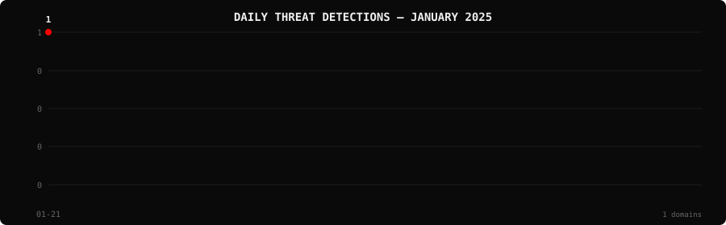

<!--
  PhishDestroy Threat Intelligence Report — January 2025
  1 phishing & scam domains detected · Kill rate: 100.0%
  Keywords: phishing report, threat intelligence, 2025-01, destroylist, scam domains, crypto drainer,
  phishing detection, domain blocklist, threat feed, VirusTotal, registrar abuse, brand impersonation,
  cryptocurrency phishing, wallet drainer, monthly security report, cybersecurity analytics
  Canonical: https://github.com/phishdestroy/destroylist/tree/main/rootlist/2025/01
  Previous: https://github.com/phishdestroy/destroylist/tree/main/rootlist/2024/12
  Next: https://github.com/phishdestroy/destroylist/tree/main/rootlist/2025/02
  Data: https://github.com/phishdestroy/destroylist/tree/main/rootlist/2025/01/2025-01-threats.json
-->

<div align="center">




*← Dec 2024* &nbsp;·&nbsp; 📅 **January 2025** &nbsp;·&nbsp; [**Feb 2025 →**](../../2025/02/)

<br>

<a href="https://github.com/phishdestroy/destroylist">
  
</a>

<br><br>


<br><br>

[](https://github.com/phishdestroy/destroylist)
[](https://api.destroy.tools)
[](https://phishdestroy.io)
[](https://t.me/destroy_phish)
[](https://x.com/Phish_Destroy)
[](https://github.com/phishdestroy/destroylist#-data-feeds)

</div>


##  Dashboard

<div align="center">

|  |  |  |  |
|:---:|:---:|:---:|:---:|
| **1** | **0** | **1** | **0** |

|  |  |  |  |
|:---:|:---:|:---:|:---:|
| **1** (100.0%) | **0** | **0h** | **0h** |

</div>

<div align="center">

</div>

> ` ` &nbsp; Peak: **2025-01-21** (1) &nbsp;·&nbsp; Low: **2025-01-21** (1) &nbsp;·&nbsp; Active days: **1**

<details>
<summary>📊 <b>Daily breakdown</b></summary>
<br>

| Date | Domains | Activity |
|:-----|--------:|:---------|
| `2025-01-21` | **1** | `████████████████████` |

</details>


##  Intelligence Analysis

### Executive Summary
In January 2025, PhishDestroy monitored and analyzed phishing domain activities, identifying a total of 1 domain, consistent with the previous month, resulting in a 0.0% change. The kill rate was exceptionally high at 100.0%, with all detected domains being neutralized. Notably, the domain was flagged by VirusTotal but not by Google Safe Browsing, indicating a potential detection gap. The most significant finding was the absence of live phishing domains, showcasing effective mitigation efforts.

### Key Trends
- **Crypto/Drainer Landscape** — No new drainer domains were detected, maintaining the status quo from the previous month.
- **Brand Targeting Shifts** — There were no brand-specific phishing attempts identified, unchanged from last month.
- **Geographic Hotspots** — The USA remained the sole geographic location for the detected domain, with no change in geographic distribution.
- **TLD Abuse Patterns** — The .com TLD continued to be the only abused TLD, consistent with December 2024 data.
- **Registrar Abuse Concentration** — GoDaddy.com, LLC was the only registrar implicated, accounting for 100% of the detected domain registrations, unchanged from the prior month.
- **Detection/Response Metrics** — With an average response time of 0 hours, response efficiency remained optimal, matching last month's performance.

### Threat Actor Tactics
The infrastructure and hosting patterns observed showed no significant variation, with no fast-flux or bulletproof hosting detected. The persistent use of traditional hosting without advanced evasion tactics was noted.

In terms of drainer and phishing kit evolution, there was no new activity detected. This suggests either a temporary lull in operations or successful suppression of existing kits. The absence of specific wallet targeting techniques indicates a possible shift in threat actor focus or operational pause.

Evasion and obfuscation tactics revealed that the detected domain was flagged by three VT vendors: alphaMountain.ai, Fortinet, and Sophos, highlighting a gap in broader detection coverage. The lack of Google Safe Browsing detection suggests actors may be employing techniques to specifically bypass certain engines, emphasizing the need for cross-platform vigilance.

### Registrar Accountability
GoDaddy.com, LLC was identified as the registrar for the sole detected domain, representing 100% of the month's phishing domain registrations. This concentration underscores the necessity for GoDaddy to enhance its domain vetting processes.

While GoDaddy maintained its position, no improvements or declines were observed among other registrars, as no additional registrars were implicated. This suggests a stable landscape with no new entrants challenging the current dynamics.

### Detection Landscape
VirusTotal data showed alphaMountain.ai, Fortinet, and Sophos as the leading engines in flagging the phishing domain. However, the absence of Google Safe Browsing detection illustrates significant gaps in coverage that could be exploited by threat actors. This emphasizes the need for comprehensive, multi-engine monitoring to ensure robust defense strategies.

### Recommendations
- **For Security Teams** — Implement cross-engine monitoring to mitigate detection gaps and enhance phishing domain identification.
- **For SOC Analysts** — Prioritize collaboration with registrars like GoDaddy to expedite domain takedown processes.
- **For Registrars** — Enhance domain registration vetting procedures to prevent the use of domains for phishing activities.
- **For Browser Vendors** — Integrate additional phishing detection engines to improve coverage and user protection.
- **For Crypto Projects** — Monitor for emerging drainer threats, despite the current lull, to preemptively secure user assets.
- **For End Users** — Remain vigilant for phishing attempts, even with low current activity, by verifying URL legitimacy before engagement.


##  Top Registrars

| # | Registrar | Domains | Share | Trend |
|:--:|:---|------:|:---|:---:|
| **1** | GoDaddy.com, LLC | **1** | `███████████████` 100.0% | 🆕 |

> ⚠️ Top 3 registrars = **1** domains (100% of all threats)


##  Domain Zones

| # | TLD | Domains | Share | vs Prev |
|:--:|:---|------:|------:|:---:|
| **1** | `.com` | **1** | 100.0% | 🆕 |


##  Registrar Geography

| # | Country | Domains | Share |
|:--:|:---|------:|------:|
| **1** | USA | **1** | 100.0% |


##  Targeted Brands

| # | Brand | Domains | Share |
|:--:|:---|------:|------:|


##  Detection Engines (VirusTotal)

| # | Engine | Detections | Coverage |
|:--:|:---|------:|------:|
| **1** | alphaMountain.ai | **1** | 100.0% |
| **2** | Fortinet | **1** | 100.0% |
| **3** | Sophos | **1** | 100.0% |

>  &nbsp; 


##  Downloads & Data

| Format | File | Description |
|:-------|:-----|:------------|
| 📋 Report | [`README.md`](.) | This report |
| 🗃️ Threats | [`2025-01-threats.json`](2025-01-threats.json) | **1** threats with VT vendors, scan URLs, IPs |
| 📈 Chart | [`2025-01-activity.svg`](2025-01-activity.svg) | Daily detection activity graph |

<details>
<summary>🔍 <b>Threat JSON example</b></summary>

```json
{
  "domain": "natroglobal.com",
  "detected_at": "2025-01-21 13:42:44",
  "registrar": "GoDaddy.com, LLC",
  "registrar_country": "USA",
  "tld": "com",
  "ip_address": "45.77.59.29",
  "nameservers": "1",
  "status": "dead",
  "target_brand": "",
  "drainer_type": "clean",
  "vt_detections": 3,
  "vt_vendors": [
    "alphaMountain.ai",
    "Fortinet",
    "Sophos"
  ],
  "gsb_flagged": false,
  "creation_date": "2025-08-26 18:59:31",
  "urlscan": "https://urlscan.io/result/18b13e26-3e81-4004-8136-5e13435b2fa5/",
  "screenshot": "https://urlscan.io/screenshots/18b13e26-3e81-4004-8136-5e13435b2fa5.png"
}
```

</details>

> 💡 **API access**: Query any domain at [`api.destroy.tools/v1/check`](https://api.destroy.tools/v1/check?domain=example.com) — free, no API key


##  All Reports

| Report | Domains |
|:-------|--------:|
| 📍 **January 2025** | **1** |
| [February 2025](../../2025/02/) | **13** |
| [March 2025](../../2025/03/) | **2** |
| [April 2025](../../2025/04/) | **2** |
| [May 2025](../../2025/05/) | **2** |
| [June 2025](../../2025/06/) | **4** |
| [July 2025](../../2025/07/) | **700** |
| [August 2025](../../2025/08/) | **3,788** |
| [September 2025](../../2025/09/) | **7,307** |
| [October 2025](../../2025/10/) | **8,841** |
| [November 2025](../../2025/11/) | **12,581** |
| [December 2025](../../2025/12/) | **11,773** |
| [January 2026](../../2026/01/) | **8,932** |
| [February 2026](../../2026/02/) | **18,207** |
| [March 2026](../../2026/03/) | **4,042** |
| [April 2026](../../2026/04/) | **15,633** |
| [May 2026](../../2026/05/) | **7,021** |
| [June 2026](../../2026/06/) | **8,102** |


<div align="center">

*← Dec 2024* &nbsp;·&nbsp; 📅 **January 2025** &nbsp;·&nbsp; [**Feb 2025 →**](../../2025/02/)

<br>

[](https://github.com/phishdestroy/destroylist)
[](https://api.destroy.tools)
[](https://api.destroy.tools/v1/stats)
[](https://github.com/phishdestroy/destroylist#-data-feeds)
[](https://phishdestroy.io/appeals/)
[](https://x.com/Phish_Destroy)
[](https://mastodon.social/@phishdestroy)

<br>

Data: [destroylist](https://github.com/phishdestroy/destroylist)

</div>
