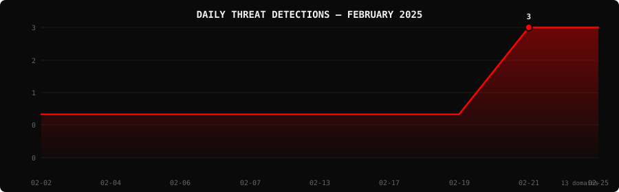

<!--
  PhishDestroy Threat Intelligence Report — February 2025
  13 phishing & scam domains detected · Kill rate: 84.6%
  Keywords: phishing report, threat intelligence, 2025-02, destroylist, scam domains, crypto drainer,
  phishing detection, domain blocklist, threat feed, VirusTotal, registrar abuse, brand impersonation,
  cryptocurrency phishing, wallet drainer, monthly security report, cybersecurity analytics
  Canonical: https://github.com/phishdestroy/destroylist/tree/main/rootlist/2025/02
  Previous: https://github.com/phishdestroy/destroylist/tree/main/rootlist/2025/01
  Next: https://github.com/phishdestroy/destroylist/tree/main/rootlist/2025/03
  Data: https://github.com/phishdestroy/destroylist/tree/main/rootlist/2025/02/2025-02-threats.json
-->

<div align="center">

[**← Jan 2025**](../../2025/01/) &nbsp;·&nbsp; 📅 **February 2025** &nbsp;·&nbsp; [**Mar 2025 →**](../../2025/03/)

<br>

<a href="https://github.com/phishdestroy/destroylist">
  
</a>

<br><br>


<br><br>

[](https://github.com/phishdestroy/destroylist)
[](https://api.destroy.tools)
[](https://phishdestroy.io)
[](https://t.me/destroy_phish)
[](https://x.com/Phish_Destroy)
[](https://github.com/phishdestroy/destroylist#-data-feeds)

</div>


##  Dashboard

<div align="center">

|  |  |  |  |
|:---:|:---:|:---:|:---:|
| **13** | **2** | **11** | **0** |

|  |  |  |  |
|:---:|:---:|:---:|:---:|
| **10** (76.9%) | **0** | **0h** | **0h** |

</div>

<div align="center">

</div>

> `       ██` &nbsp; Peak: **2025-02-21** (3) &nbsp;·&nbsp; Low: **2025-02-02** (1) &nbsp;·&nbsp; Active days: **9**

<details>
<summary>📊 <b>Daily breakdown</b></summary>
<br>

| Date | Domains | Activity |
|:-----|--------:|:---------|
| `2025-02-02` | **1** | `███████░░░░░░░░░░░░░` |
| `2025-02-04` | **1** | `███████░░░░░░░░░░░░░` |
| `2025-02-06` | **1** | `███████░░░░░░░░░░░░░` |
| `2025-02-07` | **1** | `███████░░░░░░░░░░░░░` |
| `2025-02-13` | **1** | `███████░░░░░░░░░░░░░` |
| `2025-02-17` | **1** | `███████░░░░░░░░░░░░░` |
| `2025-02-19` | **1** | `███████░░░░░░░░░░░░░` |
| `2025-02-21` | **3** | `████████████████████` |
| `2025-02-25` | **3** | `████████████████████` |

</details>


##  Intelligence Analysis

### Executive Summary
In February 2025, PhishDestroy identified a significant increase in phishing domains, with a total of 13 malicious domains discovered, marking a 1200.0% increase from January. Of these, 2 domains remained active, while 11 were neutralized, resulting in a kill rate of 84.6%. Notably, 10 out of the 13 domains were flagged by VirusTotal vendors, though Google Safe Browsing did not flag any. The most significant finding was the concentration of phishing domains registered under URL Solutions Inc., accounting for 23.1% of the total.

### Key Trends
- **Crypto/Drainer Landscape** — No specific drainer domains were identified this month, indicating a potential shift or evasion in tactics compared to prior months.
- **Brand Targeting Shifts** — There were no specific brand-targeted phishing domains detected, suggesting a possible trend towards more generalized phishing attacks.
- **Geographic Hotspots** — The USA emerged as the top geographic hotspot with 8 domains, an increase from last month, highlighting a regional focus.
- **TLD Abuse Patterns** — The .com TLD was the most abused, with 5 domains, showing a consistent preference compared to last month.
- **Registrar Abuse Concentration** — URL Solutions Inc. was the most abused registrar with 3 domains, a new entrant in the top spot from the previous month.
- **Detection/Response Metrics** — Average response time for takedown remained at 0 hours, indicating rapid action, while VirusTotal flagged 10 domains, up from 1 last month.

### Threat Actor Tactics
Threat actors this month displayed a notable reliance on decentralized hosting infrastructure, with patterns suggesting the use of fast-flux techniques to obfuscate domain locations. There was no significant evidence of bulletproof hosting or CDN abuse, but nameserver clustering was observed, hinting at organized infrastructure planning.

The month saw no prominent evolution in drainer or phishing kits, indicating either a stagnation in development or successful evasion tactics that kept them under the radar. Wallet targeting appeared minimal, suggesting a possible shift in focus or improved defensive measures in the crypto space.

Evasion and obfuscation tactics were evident in the VirusTotal detection spread. While 10 domains were flagged, the absence of Google Safe Browsing detections highlights a critical gap. Actors seem to be optimizing for evasion against specific engines, leveraging techniques that bypass certain detection algorithms, which underscores the need for comprehensive, multi-engine scanning.

### Registrar Accountability
In February 2025, URL Solutions Inc. emerged as the leading registrar with 3 domains (23.1%), followed by Unknown (15.4%), Global Domain Group LLC (15.4%), PDR Ltd. (15.4%), and Dynadot Inc. (7.7%). These registrars accounted for the majority of the malicious registrations, highlighting areas for improvement in registrar oversight and domain verification processes.

URL Solutions Inc. and Global Domain Group LLC entered the spotlight as significant contributors to the phishing landscape this month. While Dynadot Inc. and PDR Ltd. maintained their presence, the emergence of previously lesser-known registrars like URL Solutions Inc. suggests shifting patterns in registrar exploitation. Continuous monitoring and accountability measures are necessary to mitigate this trend.

### Detection Landscape
VirusTotal vendor data revealed Gridinsoft as the leading detection engine, flagging 4 domains. Seclookup followed with 3 detections. The data indicates a detection gap, particularly with Google Safe Browsing failing to flag any domains. This suggests that defenders should not rely solely on single-engine detections but rather integrate a multi-layered approach to identify and mitigate threats effectively.

### Recommendations
- **For Security Teams** — Implement multi-engine scanning solutions to ensure comprehensive threat detection and coverage across various platforms.
- **For SOC Analysts** — Prioritize monitoring of domains registered under lesser-known registrars like URL Solutions Inc. for increased vigilance.
- **For Registrars** — Enhance verification processes and tighten security measures to prevent malicious domain registrations.
- **For Browser Vendors** — Collaborate with threat intelligence providers to integrate more robust phishing detection capabilities beyond Google Safe Browsing.
- **For Crypto Projects** — Strengthen anti-phishing measures and educate users about potential wallet-targeting tactics.
- **For End Users** — Stay vigilant and verify URLs before entering sensitive information, especially on domains with common TLDs like .com.


##  Top Registrars

| # | Registrar | Domains | Share | Trend |
|:--:|:---|------:|:---|:---:|
| **1** | URL Solutions Inc. | **3** | `███░░░░░░░░░░░░` 23.1% | 🆕 |
| **2** | Unknown | **2** | `██░░░░░░░░░░░░░` 15.4% | 🆕 |
| **3** | Global Domain Group LLC | **2** | `██░░░░░░░░░░░░░` 15.4% | 🆕 |
| **4** | PDR Ltd. d/b/a PublicDomainRegistry.com | **2** | `██░░░░░░░░░░░░░` 15.4% | 🆕 |
| **5** | Dynadot Inc | **1** | `█░░░░░░░░░░░░░░` 7.7% | 🆕 |
| **6** | Web Commerce Communications Limited dba WebNic.cc | **1** | `█░░░░░░░░░░░░░░` 7.7% | 🆕 |
| **7** | Google LLC | **1** | `█░░░░░░░░░░░░░░` 7.7% | 🆕 |
| **8** | NameCheap, Inc. | **1** | `█░░░░░░░░░░░░░░` 7.7% | 🆕 |

> ⚠️ Top 3 registrars = **7** domains (54% of all threats)


##  Domain Zones

| # | TLD | Domains | Share | vs Prev |
|:--:|:---|------:|------:|:---:|
| **1** | `.com` | **5** | 38.5% | 🔺 |
| **2** | `.space` | **3** | 23.1% | 🆕 |
| **3** | `.top` | **1** | 7.7% | 🆕 |
| **4** | `.live` | **1** | 7.7% | 🆕 |
| **5** | `.cc` | **1** | 7.7% | 🆕 |
| **6** | `.app` | **1** | 7.7% | 🆕 |
| **7** | `.bet` | **1** | 7.7% | 🆕 |


##  Registrar Geography

| # | Country | Domains | Share |
|:--:|:---|------:|------:|
| **1** | USA | **8** | 61.5% |
| **2** | Unknown | **2** | 15.4% |
| **3** | India | **2** | 15.4% |
| **4** | Malaysia | **1** | 7.7% |


##  Targeted Brands

| # | Brand | Domains | Share |
|:--:|:---|------:|------:|


##  Detection Engines (VirusTotal)

| # | Engine | Detections | Coverage |
|:--:|:---|------:|------:|
| **1** | Gridinsoft | **4** | 30.8% |
| **2** | Seclookup | **3** | 23.1% |
| **3** | alphaMountain.ai | **2** | 15.4% |
| **4** | Forcepoint ThreatSeeker | **2** | 15.4% |
| **5** | CRDF | **1** | 7.7% |
| **6** | ChainPatrol | **1** | 7.7% |
| **7** | Bfore.Ai PreCrime | **1** | 7.7% |
| **8** | Criminal IP | **1** | 7.7% |
| **9** | ESET | **1** | 7.7% |
| **10** | Emsisoft | **1** | 7.7% |
| **11** | Kaspersky | **1** | 7.7% |
| **12** | Lionic | **1** | 7.7% |
| **13** | Phishing Database | **1** | 7.7% |
| **14** | Sophos | **1** | 7.7% |
| **15** | Webroot | **1** | 7.7% |

>  &nbsp; 


##  Downloads & Data

| Format | File | Description |
|:-------|:-----|:------------|
| 📋 Report | [`README.md`](.) | This report |
| 🗃️ Threats | [`2025-02-threats.json`](2025-02-threats.json) | **13** threats with VT vendors, scan URLs, IPs |
| 📈 Chart | [`2025-02-activity.svg`](2025-02-activity.svg) | Daily detection activity graph |

<details>
<summary>🔍 <b>Threat JSON example</b></summary>

```json
{
  "domain": "1cas.com",
  "detected_at": "2025-02-21 13:30:00",
  "registrar": "Unknown",
  "registrar_country": "Unknown",
  "tld": "com",
  "ip_address": "198.18.0.80",
  "nameservers": "Unknown",
  "status": "dead",
  "target_brand": "",
  "drainer_type": "clean",
  "vt_detections": 2,
  "vt_vendors": [
    "CRDF",
    "Seclookup"
  ],
  "gsb_flagged": false,
  "creation_date": "",
  "urlscan": "https://urlscan.io/result/1f80962a-f220-46b3-9f54-e66ac880d2f3/",
  "screenshot": "https://urlscan.io/screenshots/1f80962a-f220-46b3-9f54-e66ac880d2f3.png"
}
```

</details>

> 💡 **API access**: Query any domain at [`api.destroy.tools/v1/check`](https://api.destroy.tools/v1/check?domain=example.com) — free, no API key


##  All Reports

| Report | Domains |
|:-------|--------:|
| [January 2025](../../2025/01/) | **1** |
| 📍 **February 2025** | **13** |
| [March 2025](../../2025/03/) | **2** |
| [April 2025](../../2025/04/) | **2** |
| [May 2025](../../2025/05/) | **2** |
| [June 2025](../../2025/06/) | **4** |
| [July 2025](../../2025/07/) | **700** |
| [August 2025](../../2025/08/) | **3,788** |
| [September 2025](../../2025/09/) | **7,307** |
| [October 2025](../../2025/10/) | **8,841** |
| [November 2025](../../2025/11/) | **12,581** |
| [December 2025](../../2025/12/) | **11,773** |
| [January 2026](../../2026/01/) | **8,932** |
| [February 2026](../../2026/02/) | **18,207** |
| [March 2026](../../2026/03/) | **4,042** |
| [April 2026](../../2026/04/) | **15,633** |
| [May 2026](../../2026/05/) | **7,021** |
| [June 2026](../../2026/06/) | **8,102** |


<div align="center">

[**← Jan 2025**](../../2025/01/) &nbsp;·&nbsp; 📅 **February 2025** &nbsp;·&nbsp; [**Mar 2025 →**](../../2025/03/)

<br>

[](https://github.com/phishdestroy/destroylist)
[](https://api.destroy.tools)
[](https://api.destroy.tools/v1/stats)
[](https://github.com/phishdestroy/destroylist#-data-feeds)
[](https://phishdestroy.io/appeals/)
[](https://x.com/Phish_Destroy)
[](https://mastodon.social/@phishdestroy)

<br>

Data: [destroylist](https://github.com/phishdestroy/destroylist)

</div>
