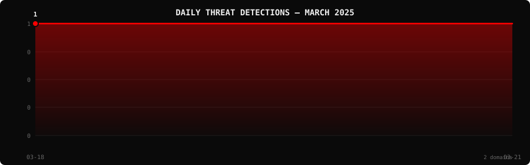

<!--
  PhishDestroy Threat Intelligence Report — March 2025
  2 phishing & scam domains detected · Kill rate: 100.0%
  Keywords: phishing report, threat intelligence, 2025-03, destroylist, scam domains, crypto drainer,
  phishing detection, domain blocklist, threat feed, VirusTotal, registrar abuse, brand impersonation,
  cryptocurrency phishing, wallet drainer, monthly security report, cybersecurity analytics
  Canonical: https://github.com/phishdestroy/destroylist/tree/main/rootlist/2025/03
  Previous: https://github.com/phishdestroy/destroylist/tree/main/rootlist/2025/02
  Next: https://github.com/phishdestroy/destroylist/tree/main/rootlist/2025/04
  Data: https://github.com/phishdestroy/destroylist/tree/main/rootlist/2025/03/2025-03-threats.json
-->

<div align="center">




[**← Feb 2025**](../../2025/02/) &nbsp;·&nbsp; 📅 **March 2025** &nbsp;·&nbsp; [**Apr 2025 →**](../../2025/04/)

<br>

<a href="https://github.com/phishdestroy/destroylist">
  
</a>

<br><br>


<br><br>

[](https://github.com/phishdestroy/destroylist)
[](https://api.destroy.tools)
[](https://phishdestroy.io)
[](https://t.me/destroy_phish)
[](https://x.com/Phish_Destroy)
[](https://github.com/phishdestroy/destroylist#-data-feeds)

</div>


##  Dashboard

<div align="center">

|  |  |  |  |
|:---:|:---:|:---:|:---:|
| **2** | **0** | **2** | **0** |

|  |  |  |  |
|:---:|:---:|:---:|:---:|
| **2** (100.0%) | **0** | **0h** | **0h** |

</div>

<div align="center">

</div>

> `  ` &nbsp; Peak: **2025-03-21** (1) &nbsp;·&nbsp; Low: **2025-03-21** (1) &nbsp;·&nbsp; Active days: **2**

<details>
<summary>📊 <b>Daily breakdown</b></summary>
<br>

| Date | Domains | Activity |
|:-----|--------:|:---------|
| `2025-03-18` | **1** | `████████████████████` |
| `2025-03-21` | **1** | `████████████████████` |

</details>


##  Intelligence Analysis

### Executive Summary
In March 2025, PhishDestroy observed a significant reduction in phishing domain activity, with only 2 new domains detected, marking an 84.6% decrease from the previous month's count of 13. Notably, all detected domains were neutralized, achieving a 100% kill rate. The complete absence of live domains underscores effective detection and response strategies. The most significant finding is the total lack of ongoing phishing campaigns during this period.

### Key Trends
- **Crypto/Drainer Landscape** — No new drainer domains were detected this month, compared to previous months where such domains were prevalent.
- **Brand Targeting Shifts** — There were no specific brand-focused phishing domains identified, suggesting a potential shift or lull in brand targeting activities.
- **Geographic Hotspots** — Domains were registered in Malaysia and India, each hosting one domain, indicating a decrease in geographic diversity compared to earlier months.
- **TLD Abuse Patterns** — The `.com` TLD was exclusively used for phishing domains, consistent with prior trends but showing reduced volume.
- **Registrar Abuse Concentration** — Two registrars were involved: Web Commerce Communications Limited and PDR Ltd., each accounting for one domain, reflecting a decrease in registrar abuse concentration.
- **Detection/Response Metrics** — All detected domains were flagged by VirusTotal, maintaining a 100% detection rate, yet none were flagged by Google Safe Browsing, indicating a potential gap in cross-platform detection.

### Threat Actor Tactics
Phishing infrastructure this month showed minimal activity, with no evidence of fast-flux techniques, bulletproof hosting, or CDN abuse. The limited scope of detected domains suggests a possible retreat or regrouping by threat actors.

No new drainer kits or phishing kits were identified, indicating either a stagnation in drainer tactics or a shift to more covert operations. Wallet targeting was not observed, which may suggest a temporary pause in cryptocurrency-related phishing activities.

Evasion techniques appeared consistent with previous months, as all domains were detected by VirusTotal. However, the lack of Google Safe Browsing detections highlights potential evasion strategies targeting specific detection engines, possibly through obfuscation or novel evasion tactics that bypass certain security layers.

### Registrar Accountability
The top registrars involved were Web Commerce Communications Limited and PDR Ltd., each with one domain, representing 50% of detected domains respectively. This marks a significant decrease in registrar involvement compared to previous months.

While no registrars showed improvement due to the low activity, both identified registrars maintained their positions. There were no new entrants this month, suggesting a stabilization or reduction in registrar exploitation.

### Detection Landscape
VirusTotal vendors such as alphaMountain.ai, Gridinsoft, and MalwareURL led in detecting the phishing domains, each flagging one domain. The absence of Google Safe Browsing detections suggests a potential area for improvement in multi-platform threat intelligence sharing and detection coverage.

### Recommendations
- **For Security Teams** — Regularly update threat intelligence feeds to ensure comprehensive coverage of emerging threats, even during periods of low activity.
- **For SOC Analysts** — Focus on cross-verifying detections with multiple sources to address potential gaps in platform-specific detections.
- **For Registrars** — Implement stricter domain registration monitoring to prevent abuse and improve early threat identification.
- **For Browser Vendors** — Enhance integration with diverse threat intelligence sources to improve detection rates beyond traditional engines.
- **For Crypto Projects** — Maintain vigilance against potential phishing threats, even when current activity appears low, to prepare for sudden surges.
- **For End Users** — Stay informed about the latest phishing tactics and ensure that browser and security tool updates are applied promptly to protect against potential threats.


##  Top Registrars

| # | Registrar | Domains | Share | Trend |
|:--:|:---|------:|:---|:---:|
| **1** | Web Commerce Communications Limited dba WebNic.cc | **1** | `████████░░░░░░░` 50.0% | ➡️ |
| **2** | PDR Ltd. d/b/a PublicDomainRegistry.com | **1** | `████████░░░░░░░` 50.0% | 🔻 |

> ⚠️ Top 3 registrars = **2** domains (100% of all threats)


##  Domain Zones

| # | TLD | Domains | Share | vs Prev |
|:--:|:---|------:|------:|:---:|
| **1** | `.com` | **2** | 100.0% | 🔻 |


##  Registrar Geography

| # | Country | Domains | Share |
|:--:|:---|------:|------:|
| **1** | Malaysia | **1** | 50.0% |
| **2** | India | **1** | 50.0% |


##  Targeted Brands

| # | Brand | Domains | Share |
|:--:|:---|------:|------:|


##  Detection Engines (VirusTotal)

| # | Engine | Detections | Coverage |
|:--:|:---|------:|------:|
| **1** | alphaMountain.ai | **1** | 50.0% |
| **2** | Gridinsoft | **1** | 50.0% |
| **3** | MalwareURL | **1** | 50.0% |

>  &nbsp; 


##  Downloads & Data

| Format | File | Description |
|:-------|:-----|:------------|
| 📋 Report | [`README.md`](.) | This report |
| 🗃️ Threats | [`2025-03-threats.json`](2025-03-threats.json) | **2** threats with VT vendors, scan URLs, IPs |
| 📈 Chart | [`2025-03-activity.svg`](2025-03-activity.svg) | Daily detection activity graph |

<details>
<summary>🔍 <b>Threat JSON example</b></summary>

```json
{
  "domain": "feenox.com",
  "detected_at": "2025-03-21 01:22:29",
  "registrar": "Web Commerce Communications Limited dba WebNic.cc",
  "registrar_country": "Malaysia",
  "tld": "com",
  "ip_address": "2606:4700:3030::6815:3001",
  "nameservers": "1",
  "status": "dead",
  "target_brand": "",
  "drainer_type": "clean",
  "vt_detections": 1,
  "vt_vendors": [
    "alphaMountain.ai"
  ],
  "gsb_flagged": false,
  "creation_date": "2024-12-14 20:50:32",
  "urlscan": "https://urlscan.io/result/0195b6f0-1f89-7eea-afa2-14dd6fa61f97/",
  "screenshot": "https://urlscan.io/screenshots/0195b6f0-1f89-7eea-afa2-14dd6fa61f97.png"
}
```

</details>

> 💡 **API access**: Query any domain at [`api.destroy.tools/v1/check`](https://api.destroy.tools/v1/check?domain=example.com) — free, no API key


##  All Reports

| Report | Domains |
|:-------|--------:|
| [January 2025](../../2025/01/) | **1** |
| [February 2025](../../2025/02/) | **13** |
| 📍 **March 2025** | **2** |
| [April 2025](../../2025/04/) | **2** |
| [May 2025](../../2025/05/) | **2** |
| [June 2025](../../2025/06/) | **4** |
| [July 2025](../../2025/07/) | **700** |
| [August 2025](../../2025/08/) | **3,788** |
| [September 2025](../../2025/09/) | **7,307** |
| [October 2025](../../2025/10/) | **8,841** |
| [November 2025](../../2025/11/) | **12,581** |
| [December 2025](../../2025/12/) | **11,773** |
| [January 2026](../../2026/01/) | **8,932** |
| [February 2026](../../2026/02/) | **18,207** |
| [March 2026](../../2026/03/) | **4,042** |
| [April 2026](../../2026/04/) | **15,633** |
| [May 2026](../../2026/05/) | **7,021** |
| [June 2026](../../2026/06/) | **8,102** |


<div align="center">

[**← Feb 2025**](../../2025/02/) &nbsp;·&nbsp; 📅 **March 2025** &nbsp;·&nbsp; [**Apr 2025 →**](../../2025/04/)

<br>

[](https://github.com/phishdestroy/destroylist)
[](https://api.destroy.tools)
[](https://api.destroy.tools/v1/stats)
[](https://github.com/phishdestroy/destroylist#-data-feeds)
[](https://phishdestroy.io/appeals/)
[](https://x.com/Phish_Destroy)
[](https://mastodon.social/@phishdestroy)

<br>

Data: [destroylist](https://github.com/phishdestroy/destroylist)

</div>
