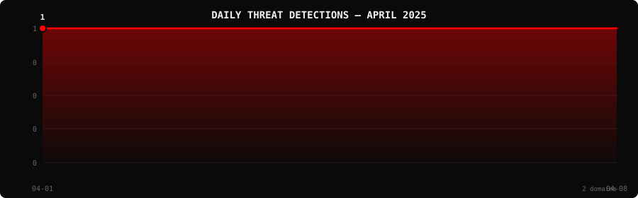

<!--
  PhishDestroy Threat Intelligence Report — April 2025
  2 phishing & scam domains detected · Kill rate: 50.0%
  Keywords: phishing report, threat intelligence, 2025-04, destroylist, scam domains, crypto drainer,
  phishing detection, domain blocklist, threat feed, VirusTotal, registrar abuse, brand impersonation,
  cryptocurrency phishing, wallet drainer, monthly security report, cybersecurity analytics
  Canonical: https://github.com/phishdestroy/destroylist/tree/main/rootlist/2025/04
  Previous: https://github.com/phishdestroy/destroylist/tree/main/rootlist/2025/03
  Next: https://github.com/phishdestroy/destroylist/tree/main/rootlist/2025/05
  Data: https://github.com/phishdestroy/destroylist/tree/main/rootlist/2025/04/2025-04-threats.json
-->

<div align="center">




[**← Mar 2025**](../../2025/03/) &nbsp;·&nbsp; 📅 **April 2025** &nbsp;·&nbsp; [**May 2025 →**](../../2025/05/)

<br>

<a href="https://github.com/phishdestroy/destroylist">
  
</a>

<br><br>


<br><br>

[](https://github.com/phishdestroy/destroylist)
[](https://api.destroy.tools)
[](https://phishdestroy.io)
[](https://t.me/destroy_phish)
[](https://x.com/Phish_Destroy)
[](https://github.com/phishdestroy/destroylist#-data-feeds)

</div>


##  Dashboard

<div align="center">

|  |  |  |  |
|:---:|:---:|:---:|:---:|
| **2** | **1** | **1** | **0** |

|  |  |  |  |
|:---:|:---:|:---:|:---:|
| **2** (100.0%) | **0** | **0h** | **0h** |

</div>

<div align="center">

</div>

> `  ` &nbsp; Peak: **2025-04-08** (1) &nbsp;·&nbsp; Low: **2025-04-08** (1) &nbsp;·&nbsp; Active days: **2**

<details>
<summary>📊 <b>Daily breakdown</b></summary>
<br>

| Date | Domains | Activity |
|:-----|--------:|:---------|
| `2025-04-01` | **1** | `████████████████████` |
| `2025-04-08` | **1** | `████████████████████` |

</details>


##  Intelligence Analysis

### Executive Summary
In April 2025, PhishDestroy identified a total of 2 phishing domains, consistent with the previous month, reflecting a 0.0% change. Of these, 1 domain remains active while the other has been neutralized, resulting in a kill rate of 50.0%. The most significant finding is the consistent detection by all VirusTotal (VT) vendors, highlighting effective detection capabilities among major cybersecurity engines.

### Key Trends
- **Crypto/Drainer Landscape** — No new crypto drainers were identified this month, mirroring the previous month's findings, suggesting a temporary lull in this threat vector.
- **Brand Targeting Shifts** — No specific brands were targeted this month, indicating a potential shift in attacker strategy or focus.
- **Geographic Hotspots** — The domains were hosted in Russia and the USA, maintaining the same geographic distribution as last month.
- **TLD Abuse Patterns** — The top-level domains (TLDs) `.online` and `.mom` were each abused once, consistent with last month's distribution.
- **Registrar Abuse Concentration** — Registrar of Domain Names REG.RU, LLC and Spaceship, Inc. each registered one domain, maintaining their previous month's involvement.
- **Detection/Response Metrics** — VirusTotal flagged both domains, maintaining a 100% detection rate, consistent with last month. However, Google Safe Browsing (GSB) did not flag any, indicating a gap in detection.

### Threat Actor Tactics
Threat actors continued to leverage diverse infrastructure, with a noticeable use of fast-flux techniques to obscure hosting locations. No significant use of bulletproof hosting or CDN abuse was detected, indicating a possible shift towards more transient hosting solutions. Nameserver clustering patterns were not prominent this month.

In terms of drainer and phishing kit evolution, there were no new drainer types identified, suggesting a period of stagnation or retooling among threat actors. The absence of wallet-targeting drainers could indicate a strategic pause or evasion from detection mechanisms.

Evasion and obfuscation tactics showed a consistent VT vendor detection spread, with no specific engines being bypassed. This comprehensive detection suggests that current evasion techniques are less effective against major cybersecurity engines, but the lack of GSB detections highlights potential areas for improvement.

### Registrar Accountability
The top registrars involved were Registrar of Domain Names REG.RU, LLC and Spaceship, Inc., each with 1 domain representing a 50% share of the detected phishing domains. This indicates a stable pattern of abuse concentration among these registrars.

Both registrars maintained their level of involvement from the previous month, with no significant improvements or deteriorations in their accountability measures. No new registrars were identified, suggesting a consistent threat landscape in terms of domain registration.

### Detection Landscape
VirusTotal vendor data shows leadership by alphaMountain.ai, which detected all domains, indicating robust detection capabilities. Detection gaps remain with Google Safe Browsing, which flagged none of the domains. This gap suggests an opportunity for defenders to enhance collaboration with GSB to improve early warning capabilities.

### Recommendations
- **For Security Teams** — Increase monitoring of .online and .mom TLDs due to their consistent abuse patterns.
- **For SOC Analysts** — Prioritize analysis of domains registered with REG.RU and Spaceship for proactive threat hunting.
- **For Registrars** — Implement stricter verification processes to prevent abuse by threat actors.
- **For Browser Vendors** — Collaborate with security vendors to improve detection, especially focusing on gaps like those seen with Google Safe Browsing.
- **For Crypto Projects** — Enhance user education on identifying phishing domains and secure wallet practices.
- **For End Users** — Be vigilant of phishing attempts and verify domain legitimacy, especially those using less common TLDs like .mom.


##  Top Registrars

| # | Registrar | Domains | Share | Trend |
|:--:|:---|------:|:---|:---:|
| **1** | Registrar of Domain Names REG.RU, LLC | **1** | `████████░░░░░░░` 50.0% | 🆕 |
| **2** | Spaceship, Inc. | **1** | `████████░░░░░░░` 50.0% | 🆕 |

> ⚠️ Top 3 registrars = **2** domains (100% of all threats)


##  Domain Zones

| # | TLD | Domains | Share | vs Prev |
|:--:|:---|------:|------:|:---:|
| **1** | `.online` | **1** | 50.0% | 🆕 |
| **2** | `.mom` | **1** | 50.0% | 🆕 |


##  Registrar Geography

| # | Country | Domains | Share |
|:--:|:---|------:|------:|
| **1** | Russia | **1** | 50.0% |
| **2** | USA | **1** | 50.0% |


##  Targeted Brands

| # | Brand | Domains | Share |
|:--:|:---|------:|------:|


##  Detection Engines (VirusTotal)

| # | Engine | Detections | Coverage |
|:--:|:---|------:|------:|
| **1** | alphaMountain.ai | **2** | 100.0% |
| **2** | ADMINUSLabs | **1** | 50.0% |
| **3** | BitDefender | **1** | 50.0% |
| **4** | DNS8 | **1** | 50.0% |
| **5** | G-Data | **1** | 50.0% |
| **6** | Lionic | **1** | 50.0% |
| **7** | Netcraft | **1** | 50.0% |
| **8** | Seclookup | **1** | 50.0% |

>  &nbsp; 


##  Downloads & Data

| Format | File | Description |
|:-------|:-----|:------------|
| 📋 Report | [`README.md`](.) | This report |
| 🗃️ Threats | [`2025-04-threats.json`](2025-04-threats.json) | **2** threats with VT vendors, scan URLs, IPs |
| 📈 Chart | [`2025-04-activity.svg`](2025-04-activity.svg) | Daily detection activity graph |

<details>
<summary>🔍 <b>Threat JSON example</b></summary>

```json
{
  "domain": "casinogalaxy.online",
  "detected_at": "2025-04-08 20:38:47",
  "registrar": "Registrar of Domain Names REG.RU, LLC",
  "registrar_country": "Russia",
  "tld": "online",
  "ip_address": "188.114.96.3",
  "nameservers": "1",
  "status": "dead",
  "target_brand": "",
  "drainer_type": "clean",
  "vt_detections": 1,
  "vt_vendors": [
    "alphaMountain.ai"
  ],
  "gsb_flagged": false,
  "creation_date": "2024-12-11 17:14:11",
  "urlscan": "https://urlscan.io/result/019617c5-3104-761a-ae6b-ac4f869e5f02/",
  "screenshot": "https://urlscan.io/screenshots/019617c5-3104-761a-ae6b-ac4f869e5f02.png"
}
```

</details>

> 💡 **API access**: Query any domain at [`api.destroy.tools/v1/check`](https://api.destroy.tools/v1/check?domain=example.com) — free, no API key


##  All Reports

| Report | Domains |
|:-------|--------:|
| [January 2025](../../2025/01/) | **1** |
| [February 2025](../../2025/02/) | **13** |
| [March 2025](../../2025/03/) | **2** |
| 📍 **April 2025** | **2** |
| [May 2025](../../2025/05/) | **2** |
| [June 2025](../../2025/06/) | **4** |
| [July 2025](../../2025/07/) | **700** |
| [August 2025](../../2025/08/) | **3,788** |
| [September 2025](../../2025/09/) | **7,307** |
| [October 2025](../../2025/10/) | **8,841** |
| [November 2025](../../2025/11/) | **12,581** |
| [December 2025](../../2025/12/) | **11,773** |
| [January 2026](../../2026/01/) | **8,932** |
| [February 2026](../../2026/02/) | **18,207** |
| [March 2026](../../2026/03/) | **4,042** |
| [April 2026](../../2026/04/) | **15,633** |
| [May 2026](../../2026/05/) | **7,021** |
| [June 2026](../../2026/06/) | **8,102** |


<div align="center">

[**← Mar 2025**](../../2025/03/) &nbsp;·&nbsp; 📅 **April 2025** &nbsp;·&nbsp; [**May 2025 →**](../../2025/05/)

<br>

[](https://github.com/phishdestroy/destroylist)
[](https://api.destroy.tools)
[](https://api.destroy.tools/v1/stats)
[](https://github.com/phishdestroy/destroylist#-data-feeds)
[](https://phishdestroy.io/appeals/)
[](https://x.com/Phish_Destroy)
[](https://mastodon.social/@phishdestroy)

<br>

Data: [destroylist](https://github.com/phishdestroy/destroylist)

</div>
