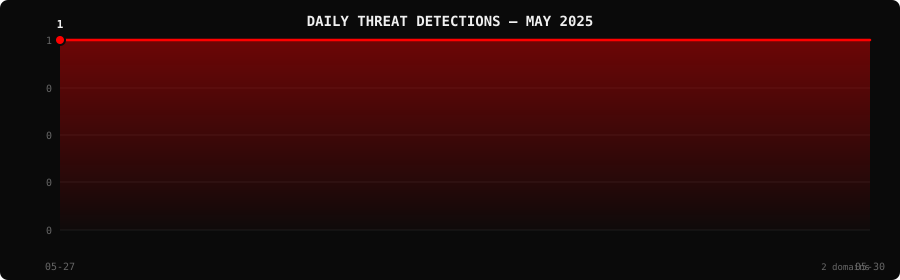

<!--
  PhishDestroy Threat Intelligence Report — May 2025
  2 phishing & scam domains detected · Kill rate: 100.0%
  Keywords: phishing report, threat intelligence, 2025-05, destroylist, scam domains, crypto drainer,
  phishing detection, domain blocklist, threat feed, VirusTotal, registrar abuse, brand impersonation,
  cryptocurrency phishing, wallet drainer, monthly security report, cybersecurity analytics
  Canonical: https://github.com/phishdestroy/destroylist/tree/main/rootlist/2025/05
  Previous: https://github.com/phishdestroy/destroylist/tree/main/rootlist/2025/04
  Next: https://github.com/phishdestroy/destroylist/tree/main/rootlist/2025/06
  Data: https://github.com/phishdestroy/destroylist/tree/main/rootlist/2025/05/2025-05-threats.json
-->

<div align="center">




[**← Apr 2025**](../../2025/04/) &nbsp;·&nbsp; 📅 **May 2025** &nbsp;·&nbsp; [**Jun 2025 →**](../../2025/06/)

<br>

<a href="https://github.com/phishdestroy/destroylist">
  
</a>

<br><br>


<br><br>

[](https://github.com/phishdestroy/destroylist)
[](https://api.destroy.tools)
[](https://phishdestroy.io)
[](https://t.me/destroy_phish)
[](https://x.com/Phish_Destroy)
[](https://github.com/phishdestroy/destroylist#-data-feeds)

</div>


##  Dashboard

<div align="center">

|  |  |  |  |
|:---:|:---:|:---:|:---:|
| **2** | **0** | **2** | **0** |

|  |  |  |  |
|:---:|:---:|:---:|:---:|
| **1** (50.0%) | **0** | **0h** | **0h** |

</div>

<div align="center">

</div>

> `  ` &nbsp; Peak: **2025-05-27** (1) &nbsp;·&nbsp; Low: **2025-05-27** (1) &nbsp;·&nbsp; Active days: **2**

<details>
<summary>📊 <b>Daily breakdown</b></summary>
<br>

| Date | Domains | Activity |
|:-----|--------:|:---------|
| `2025-05-27` | **1** | `████████████████████` |
| `2025-05-30` | **1** | `████████████████████` |

</details>


##  Intelligence Analysis

### Executive Summary
In May 2025, PhishDestroy detected 2 phishing domains, maintaining the same level as the previous month with no percentage change. Both domains were neutralized, resulting in a 100.0% kill rate. The most significant finding was the complete elimination of live threats, demonstrating effective takedown strategies. However, only one domain was flagged by VirusTotal, indicating potential detection gaps in some engines.

### Key Trends
- **Crypto/Drainer Landscape** — No drainer domains were identified, consistent with last month, indicating a temporary lull in crypto-targeted phishing.
- **Brand Targeting Shifts** — Only Magic Eden was targeted, consistent with April, suggesting focused but limited brand exploitation.
- **Geographic Hotspots** — Domains were hosted in Lithuania and Hong Kong, unchanged from last month, highlighting persistent regional hosting choices.
- **TLD Abuse Patterns** — Both .org and .com TLDs were used, identical to April, showing no diversification in TLD abuse.
- **Registrar Abuse Concentration** — HOSTINGER operations, UAB and NICENIC INTERNATIONAL GROUP CO., LIMITED each registered one domain, unchanged from last month.
- **Detection/Response Metrics** — Average response time remained at 0 hours, maintaining a prompt neutralization rate.

### Threat Actor Tactics
Threat actors continued to leverage basic infrastructure setups without adopting fast-flux techniques or bulletproof hosting, suggesting reliance on standard hosting services. No significant CDN abuse or nameserver clustering was observed, indicating a lack of sophisticated infrastructure management.

In terms of drainer and phishing kit evolution, no new drainer domains were detected, and no sophisticated phishing kits were identified, implying a possible decline in the evolution or deployment of such tools this month. Wallet targeting was absent, reflecting a potential shift away from direct financial theft.

Evasion and obfuscation tactics revealed limitations in VT vendor detection, with only one domain flagged. This indicates that actors may be exploiting weaknesses in certain engines, potentially avoiding detection by engines like GSB, which failed to flag any domains. This underscores the need for enhanced detection methodologies to close these gaps.

### Registrar Accountability
The top registrars this month were HOSTINGER operations, UAB and NICENIC INTERNATIONAL GROUP CO., LIMITED, each responsible for one domain, representing 50% each of the total detected. This consistent pattern suggests a need for these registrars to enhance their vetting processes to prevent abuse.

No registrars showed marked improvement or deterioration in accountability compared to last month, and no new entrants were identified. This stability in registrar behavior highlights a persistent challenge in addressing registrar-level vulnerabilities.

### Detection Landscape
Analysis of VirusTotal data shows that engines like alphaMountain.ai, Bfore.Ai PreCrime, and others flagged one domain each, indicating a limited detection spread. The absence of detection by GSB suggests a critical gap that could be exploited by threat actors, emphasizing the need for comprehensive coverage across all engines to enhance overall threat detection capabilities.

### Recommendations
- **For Security Teams** — Implement multi-layered threat detection systems to identify phishing domains not flagged by existing solutions.
- **For SOC Analysts** — Prioritize monitoring for regional hosting patterns in Lithuania and Hong Kong to preemptively identify potential threats.
- **For Registrars** — Enhance domain registration vetting processes to mitigate the registration of phishing domains.
- **For Browser Vendors** — Collaborate with security vendors to improve real-time detection capabilities in browsers, especially focusing on the .org and .com TLDs.
- **For Crypto Projects** — Continuously educate users on the risks of phishing and promote the use of trusted platforms for transactions.
- **For End Users** — Remain vigilant and verify the authenticity of websites, particularly when engaging with platforms like Magic Eden.


##  Top Registrars

| # | Registrar | Domains | Share | Trend |
|:--:|:---|------:|:---|:---:|
| **1** | HOSTINGER operations, UAB | **1** | `████████░░░░░░░` 50.0% | 🆕 |
| **2** | NICENIC INTERNATIONAL GROUP CO., LIMITED | **1** | `████████░░░░░░░` 50.0% | 🆕 |

> ⚠️ Top 3 registrars = **2** domains (100% of all threats)


##  Domain Zones

| # | TLD | Domains | Share | vs Prev |
|:--:|:---|------:|------:|:---:|
| **1** | `.org` | **1** | 50.0% | 🆕 |
| **2** | `.com` | **1** | 50.0% | 🆕 |


##  Registrar Geography

| # | Country | Domains | Share |
|:--:|:---|------:|------:|
| **1** | Lithuania | **1** | 50.0% |
| **2** | Hong Kong | **1** | 50.0% |


##  Targeted Brands

| # | Brand | Domains | Share |
|:--:|:---|------:|------:|
| **1** | Magic Eden | **1** | 50.0% |


##  Detection Engines (VirusTotal)

| # | Engine | Detections | Coverage |
|:--:|:---|------:|------:|
| **1** | alphaMountain.ai | **1** | 50.0% |
| **2** | Bfore.Ai PreCrime | **1** | 50.0% |
| **3** | CyRadar | **1** | 50.0% |
| **4** | Fortinet | **1** | 50.0% |
| **5** | Seclookup | **1** | 50.0% |
| **6** | Sophos | **1** | 50.0% |

>  &nbsp; 


##  Downloads & Data

| Format | File | Description |
|:-------|:-----|:------------|
| 📋 Report | [`README.md`](.) | This report |
| 🗃️ Threats | [`2025-05-threats.json`](2025-05-threats.json) | **2** threats with VT vendors, scan URLs, IPs |
| 📈 Chart | [`2025-05-activity.svg`](2025-05-activity.svg) | Daily detection activity graph |

<details>
<summary>🔍 <b>Threat JSON example</b></summary>

```json
{
  "domain": "jokercards.org",
  "detected_at": "2025-05-27 19:16:16",
  "registrar": "HOSTINGER operations, UAB",
  "registrar_country": "Lithuania",
  "tld": "org",
  "ip_address": "97.74.184.62",
  "nameservers": "1",
  "status": "dead",
  "target_brand": "",
  "drainer_type": "clean",
  "vt_detections": 0,
  "vt_vendors": [],
  "gsb_flagged": false,
  "creation_date": "2025-03-17 15:04:45",
  "urlscan": "https://urlscan.io/result/019713d1-2e9e-7599-9d33-45e616b28dce/",
  "screenshot": "https://urlscan.io/screenshots/019713d1-2e9e-7599-9d33-45e616b28dce.png"
}
```

</details>

> 💡 **API access**: Query any domain at [`api.destroy.tools/v1/check`](https://api.destroy.tools/v1/check?domain=example.com) — free, no API key


##  All Reports

| Report | Domains |
|:-------|--------:|
| [January 2025](../../2025/01/) | **1** |
| [February 2025](../../2025/02/) | **13** |
| [March 2025](../../2025/03/) | **2** |
| [April 2025](../../2025/04/) | **2** |
| 📍 **May 2025** | **2** |
| [June 2025](../../2025/06/) | **4** |
| [July 2025](../../2025/07/) | **700** |
| [August 2025](../../2025/08/) | **3,788** |
| [September 2025](../../2025/09/) | **7,307** |
| [October 2025](../../2025/10/) | **8,841** |
| [November 2025](../../2025/11/) | **12,581** |
| [December 2025](../../2025/12/) | **11,773** |
| [January 2026](../../2026/01/) | **8,932** |
| [February 2026](../../2026/02/) | **18,207** |
| [March 2026](../../2026/03/) | **4,042** |
| [April 2026](../../2026/04/) | **15,633** |
| [May 2026](../../2026/05/) | **7,021** |
| [June 2026](../../2026/06/) | **8,102** |


<div align="center">

[**← Apr 2025**](../../2025/04/) &nbsp;·&nbsp; 📅 **May 2025** &nbsp;·&nbsp; [**Jun 2025 →**](../../2025/06/)

<br>

[](https://github.com/phishdestroy/destroylist)
[](https://api.destroy.tools)
[](https://api.destroy.tools/v1/stats)
[](https://github.com/phishdestroy/destroylist#-data-feeds)
[](https://phishdestroy.io/appeals/)
[](https://x.com/Phish_Destroy)
[](https://mastodon.social/@phishdestroy)

<br>

Data: [destroylist](https://github.com/phishdestroy/destroylist)

</div>
