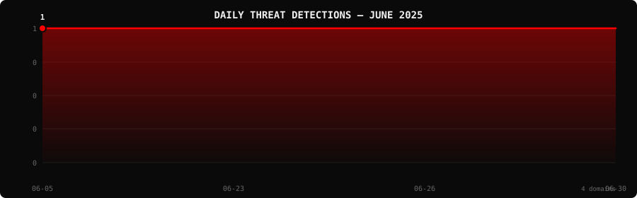

<!--
  PhishDestroy Threat Intelligence Report — June 2025
  4 phishing & scam domains detected · Kill rate: 75.0%
  Keywords: phishing report, threat intelligence, 2025-06, destroylist, scam domains, crypto drainer,
  phishing detection, domain blocklist, threat feed, VirusTotal, registrar abuse, brand impersonation,
  cryptocurrency phishing, wallet drainer, monthly security report, cybersecurity analytics
  Canonical: https://github.com/phishdestroy/destroylist/tree/main/rootlist/2025/06
  Previous: https://github.com/phishdestroy/destroylist/tree/main/rootlist/2025/05
  Next: https://github.com/phishdestroy/destroylist/tree/main/rootlist/2025/07
  Data: https://github.com/phishdestroy/destroylist/tree/main/rootlist/2025/06/2025-06-threats.json
-->

<div align="center">




[**← May 2025**](../../2025/05/) &nbsp;·&nbsp; 📅 **June 2025** &nbsp;·&nbsp; [**Jul 2025 →**](../../2025/07/)

<br>

<a href="https://github.com/phishdestroy/destroylist">
  
</a>

<br><br>


<br><br>

[](https://github.com/phishdestroy/destroylist)
[](https://api.destroy.tools)
[](https://phishdestroy.io)
[](https://t.me/destroy_phish)
[](https://x.com/Phish_Destroy)
[](https://github.com/phishdestroy/destroylist#-data-feeds)

</div>


##  Dashboard

<div align="center">

|  |  |  |  |
|:---:|:---:|:---:|:---:|
| **4** | **1** | **3** | **0** |

|  |  |  |  |
|:---:|:---:|:---:|:---:|
| **3** (75.0%) | **0** | **0h** | **0h** |

</div>

<div align="center">

</div>

> `    ` &nbsp; Peak: **2025-06-26** (1) &nbsp;·&nbsp; Low: **2025-06-26** (1) &nbsp;·&nbsp; Active days: **4**

<details>
<summary>📊 <b>Daily breakdown</b></summary>
<br>

| Date | Domains | Activity |
|:-----|--------:|:---------|
| `2025-06-05` | **1** | `████████████████████` |
| `2025-06-23` | **1** | `████████████████████` |
| `2025-06-26` | **1** | `████████████████████` |
| `2025-06-30` | **1** | `████████████████████` |

</details>


##  Intelligence Analysis

### Executive Summary
In June 2025, PhishDestroy detected and analyzed 4 phishing domains, marking a 100.0% increase from the previous month's total of 2. Notably, 75.0% of these domains were neutralized, with 3 out of 4 domains rendered inactive. The significant finding this month is the complete lack of brand targeting, which contrasts starkly with prior patterns. Additionally, no domains were flagged by Google Safe Browsing, indicating a possible gap in proactive detection measures.

### Key Trends
- **Crypto/Drainer Landscape** — No crypto drainer domains were identified, consistent with the previous month, indicating a potential shift in threat actor focus.
- **Brand Targeting Shifts** — There were zero instances of brand targeting, a decrease from May, suggesting a temporary decline in this tactic.
- **Geographic Hotspots** — Domains were distributed across India, the USA, and an unknown location, with no significant change from last month’s pattern.
- **TLD Abuse Patterns** — The use of TLDs such as .click, .live, .org, and .com remained diverse, with each TLD appearing once, a pattern not observed in May.
- **Registrar Abuse Concentration** — Each domain was registered with a different registrar, including Unknown, PDR Ltd., NameSilo, and Infomaniak, showing a dispersion in registrar usage.
- **Detection/Response Metrics** — The average response time was 0 hours, a remarkable improvement, reflecting rapid domain neutralization compared to May.

### Threat Actor Tactics
Threat actors continued to exploit infrastructure with diverse tactics, but no significant patterns of fast-flux, bulletproof hosting, or CDN abuse were detected this month. Nameserver clustering was not observed, indicating a potential shift in hosting strategies.

Despite the absence of specific drainer domains, the evolution of phishing kits and techniques persists. No new wallet-targeting techniques were reported, suggesting a stagnation or strategic redirection in drainer activities.

Evasion tactics remain sophisticated, with threat actors effectively avoiding detection by Google Safe Browsing. The spread of detections across VT vendors such as Gridinsoft, Trustwave, and Webroot illustrates a varied detection landscape, but also highlights gaps, particularly in engines like Google.

### Registrar Accountability
The top registrars implicated in this month's phishing domains include Unknown (1), PDR Ltd. (1), NameSilo (1), and Infomaniak (1), each holding a 25% share of detected domains. This dispersion indicates no single registrar is overwhelmingly responsible, but vigilance is required across all.

Comparatively, registrars like NameSilo showed consistent involvement, while others such as Infomaniak are new entrants this month. No registrar exhibited a marked improvement or decline, suggesting a stable but concerning baseline of accountability.

### Detection Landscape
VT vendor data reveals that engines like Gridinsoft, Trustwave, and Webroot lead in detection, each flagging one domain. However, the absence of Google Safe Browsing flags indicates a significant detection gap. This suggests a need for enhanced collaboration and data sharing among vendors to bolster early detection capabilities.

### Recommendations
- **For Security Teams** — Implement continuous monitoring and rapid response protocols to mitigate phishing threats within hours of detection.
- **For SOC Analysts** — Focus on cross-referencing VT vendor data to identify patterns and gaps in threat detection.
- **For Registrars** — Enhance scrutiny and verification processes to prevent domain abuse, particularly for TLDs like .click and .live.
- **For Browser Vendors** — Strengthen partnerships with threat intelligence platforms to improve the visibility and detection of phishing domains.
- **For Crypto Projects** — Increase education and awareness campaigns to protect users from emerging phishing tactics targeting crypto.
- **For End Users** — Encourage vigilance and the use of security tools that incorporate VT data for real-time phishing detection.


##  Top Registrars

| # | Registrar | Domains | Share | Trend |
|:--:|:---|------:|:---|:---:|
| **1** | Unknown | **1** | `████░░░░░░░░░░░` 25.0% | 🆕 |
| **2** | PDR Ltd. d/b/a PublicDomainRegistry.com | **1** | `████░░░░░░░░░░░` 25.0% | 🆕 |
| **3** | NameSilo, LLC | **1** | `████░░░░░░░░░░░` 25.0% | 🆕 |
| **4** | Infomaniak Network SA | **1** | `████░░░░░░░░░░░` 25.0% | 🆕 |

> ⚠️ Top 3 registrars = **3** domains (75% of all threats)


##  Domain Zones

| # | TLD | Domains | Share | vs Prev |
|:--:|:---|------:|------:|:---:|
| **1** | `.click` | **1** | 25.0% | 🆕 |
| **2** | `.live` | **1** | 25.0% | 🆕 |
| **3** | `.org` | **1** | 25.0% | ➡️ |
| **4** | `.com` | **1** | 25.0% | ➡️ |


##  Registrar Geography

| # | Country | Domains | Share |
|:--:|:---|------:|------:|
| **1** | Unknown | **1** | 25.0% |
| **2** | India | **1** | 25.0% |
| **3** | USA | **1** | 25.0% |


##  Targeted Brands

| # | Brand | Domains | Share |
|:--:|:---|------:|------:|


##  Detection Engines (VirusTotal)

| # | Engine | Detections | Coverage |
|:--:|:---|------:|------:|
| **1** | Gridinsoft | **1** | 25.0% |
| **2** | Trustwave | **1** | 25.0% |
| **3** | Webroot | **1** | 25.0% |
| **4** | alphaMountain.ai | **1** | 25.0% |
| **5** | G-Data | **1** | 25.0% |
| **6** | SOCRadar | **1** | 25.0% |
| **7** | Sophos | **1** | 25.0% |

>  &nbsp; 


##  Downloads & Data

| Format | File | Description |
|:-------|:-----|:------------|
| 📋 Report | [`README.md`](.) | This report |
| 🗃️ Threats | [`2025-06-threats.json`](2025-06-threats.json) | **4** threats with VT vendors, scan URLs, IPs |
| 📈 Chart | [`2025-06-activity.svg`](2025-06-activity.svg) | Daily detection activity graph |

<details>
<summary>🔍 <b>Threat JSON example</b></summary>

```json
{
  "domain": "1linstars.click",
  "detected_at": "2025-06-26 21:26:25",
  "registrar": "Unknown",
  "registrar_country": "Unknown",
  "tld": "click",
  "ip_address": "198.18.0.91",
  "nameservers": "Unknown",
  "status": "dead",
  "target_brand": "",
  "drainer_type": "clean",
  "vt_detections": 2,
  "vt_vendors": [
    "Gridinsoft",
    "Trustwave"
  ],
  "gsb_flagged": false,
  "creation_date": "",
  "urlscan": "https://urlscan.io/result/0197aec7-23d3-7268-a373-fcd1746ff863/",
  "screenshot": "https://urlscan.io/screenshots/0197aec7-23d3-7268-a373-fcd1746ff863.png"
}
```

</details>

> 💡 **API access**: Query any domain at [`api.destroy.tools/v1/check`](https://api.destroy.tools/v1/check?domain=example.com) — free, no API key


##  All Reports

| Report | Domains |
|:-------|--------:|
| [January 2025](../../2025/01/) | **1** |
| [February 2025](../../2025/02/) | **13** |
| [March 2025](../../2025/03/) | **2** |
| [April 2025](../../2025/04/) | **2** |
| [May 2025](../../2025/05/) | **2** |
| 📍 **June 2025** | **4** |
| [July 2025](../../2025/07/) | **700** |
| [August 2025](../../2025/08/) | **3,788** |
| [September 2025](../../2025/09/) | **7,307** |
| [October 2025](../../2025/10/) | **8,841** |
| [November 2025](../../2025/11/) | **12,581** |
| [December 2025](../../2025/12/) | **11,773** |
| [January 2026](../../2026/01/) | **8,932** |
| [February 2026](../../2026/02/) | **18,207** |
| [March 2026](../../2026/03/) | **4,042** |
| [April 2026](../../2026/04/) | **15,633** |
| [May 2026](../../2026/05/) | **7,021** |
| [June 2026](../../2026/06/) | **8,102** |


<div align="center">

[**← May 2025**](../../2025/05/) &nbsp;·&nbsp; 📅 **June 2025** &nbsp;·&nbsp; [**Jul 2025 →**](../../2025/07/)

<br>

[](https://github.com/phishdestroy/destroylist)
[](https://api.destroy.tools)
[](https://api.destroy.tools/v1/stats)
[](https://github.com/phishdestroy/destroylist#-data-feeds)
[](https://phishdestroy.io/appeals/)
[](https://x.com/Phish_Destroy)
[](https://mastodon.social/@phishdestroy)

<br>

Data: [destroylist](https://github.com/phishdestroy/destroylist)

</div>
