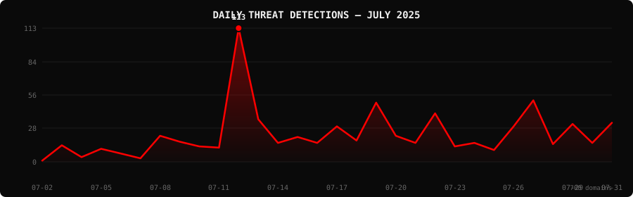

<!--
  PhishDestroy Threat Intelligence Report — July 2025
  700 phishing & scam domains detected · Kill rate: 74.0%
  Keywords: phishing report, threat intelligence, 2025-07, destroylist, scam domains, crypto drainer,
  phishing detection, domain blocklist, threat feed, VirusTotal, registrar abuse, brand impersonation,
  cryptocurrency phishing, wallet drainer, monthly security report, cybersecurity analytics
  Canonical: https://github.com/phishdestroy/destroylist/tree/main/rootlist/2025/07/2025-07.md
  Previous: https://github.com/phishdestroy/destroylist/tree/main/rootlist/2025/06/2025-06.md
  Next: https://github.com/phishdestroy/destroylist/tree/main/rootlist/2025/08/2025-08.md
  Data: https://github.com/phishdestroy/destroylist/tree/main/rootlist/2025/07/2025-07-threats.json
-->

<div align="center">

*← Jun 2025* &nbsp;·&nbsp; 📅 **July 2025** &nbsp;·&nbsp; [**Aug 2025 →**](../../2025/08/2025-08.md)

<br>

<a href="https://github.com/phishdestroy/destroylist">
  
</a>

<br><br>


<br><br>

[](https://github.com/phishdestroy/destroylist)
[](https://api.destroy.tools)
[](https://phishdestroy.io)
[](https://t.me/destroy_phish)
[](https://x.com/Phish_Destroy)
[](https://github.com/phishdestroy/destroylist#-data-feeds)

</div>


##  Dashboard

<div align="center">

|  |  |  |  |
|:---:|:---:|:---:|:---:|
| **700** | **182** | **518** | **0** |

|  |  |  |  |
|:---:|:---:|:---:|:---:|
| **656** (93.7%) | **19** | **4981.9h** | **5121.0h** |

</div>

<div align="center">

</div>

> `      ▁▁  █▂▁▁▁▂▁▃▁▁▂ ▁ ▂▃▁▂▁▂` &nbsp; Peak: **2025-07-12** (113) &nbsp;·&nbsp; Low: **2025-07-02** (1) &nbsp;·&nbsp; Active days: **30**

<details>
<summary>📊 <b>Daily breakdown</b></summary>
<br>

| Date | Domains | Activity |
|:-----|--------:|:---------|
| `2025-07-02` | **1** | `░░░░░░░░░░░░░░░░░░░░` |
| `2025-07-03` | **14** | `██░░░░░░░░░░░░░░░░░░` |
| `2025-07-04` | **4** | `█░░░░░░░░░░░░░░░░░░░` |
| `2025-07-05` | **11** | `██░░░░░░░░░░░░░░░░░░` |
| `2025-07-06` | **7** | `█░░░░░░░░░░░░░░░░░░░` |
| `2025-07-07` | **3** | `█░░░░░░░░░░░░░░░░░░░` |
| `2025-07-08` | **22** | `████░░░░░░░░░░░░░░░░` |
| `2025-07-09` | **17** | `███░░░░░░░░░░░░░░░░░` |
| `2025-07-10` | **13** | `██░░░░░░░░░░░░░░░░░░` |
| `2025-07-11` | **12** | `██░░░░░░░░░░░░░░░░░░` |
| `2025-07-12` | **113** | `████████████████████` |
| `2025-07-13` | **36** | `██████░░░░░░░░░░░░░░` |
| `2025-07-14` | **16** | `███░░░░░░░░░░░░░░░░░` |
| `2025-07-15` | **21** | `████░░░░░░░░░░░░░░░░` |
| `2025-07-16` | **16** | `███░░░░░░░░░░░░░░░░░` |
| `2025-07-17` | **30** | `█████░░░░░░░░░░░░░░░` |
| `2025-07-18` | **18** | `███░░░░░░░░░░░░░░░░░` |
| `2025-07-19` | **50** | `█████████░░░░░░░░░░░` |
| `2025-07-20` | **22** | `████░░░░░░░░░░░░░░░░` |
| `2025-07-21` | **16** | `███░░░░░░░░░░░░░░░░░` |
| `2025-07-22` | **41** | `███████░░░░░░░░░░░░░` |
| `2025-07-23` | **13** | `██░░░░░░░░░░░░░░░░░░` |
| `2025-07-24` | **16** | `███░░░░░░░░░░░░░░░░░` |
| `2025-07-25` | **10** | `██░░░░░░░░░░░░░░░░░░` |
| `2025-07-26` | **30** | `█████░░░░░░░░░░░░░░░` |
| `2025-07-27` | **52** | `█████████░░░░░░░░░░░` |
| `2025-07-28` | **15** | `███░░░░░░░░░░░░░░░░░` |
| `2025-07-29` | **32** | `██████░░░░░░░░░░░░░░` |
| `2025-07-30` | **16** | `███░░░░░░░░░░░░░░░░░` |
| `2025-07-31` | **33** | `██████░░░░░░░░░░░░░░` |

</details>


##  Intelligence Analysis

### Executive Summary
In July 2025, PhishDestroy identified a total of 700 phishing domains, marking a staggering 17,400.0% increase from the previous month, which recorded only 4 domains. Of these, 182 domains remain active while 518 have been taken down, resulting in a kill rate of 74.0%. The most significant finding this month is the unprecedented rise in phishing domains, predominantly targeting crypto-related brands, with a notable concentration of these activities in the USA.

### Key Trends
- **Crypto/Drainer Landscape** — Angel Drainer was the most prolific, responsible for 183 domains. This represents a significant surge compared to no recorded instances last month.
- **Brand Targeting Shifts** — Generic Crypto brands were the primary target, with 29 instances, followed by SushiSwap at 20. This is a shift from last month, where specific brand targeting was minimal.
- **Geographic Hotspots** — The USA led with 295 domains, followed by Malaysia with 85, showing a broader geographic spread compared to last month’s negligible data.
- **TLD Abuse Patterns** — The .com TLD was most abused, with 304 domains, a substantial increase from previous records, indicating a persistent preference among threat actors.
- **Registrar Abuse Concentration** — NameSilo, LLC had the highest registrations at 75, closely followed by PDR Ltd. with 71. These concentrations highlight ongoing registrar vulnerabilities.
- **Detection/Response Metrics** — 656 domains were flagged by VirusTotal, with an average response time of 4981.9 hours, reflecting a need for quicker takedown actions.

### Threat Actor Tactics
Threat actors displayed a preference for fast-flux networks and bulletproof hosting, making detection and takedown efforts challenging. Nameserver clustering was also evident, indicating coordinated infrastructure use to enhance resilience against shutdowns.

Drainer techniques have evolved, with Angel Drainer emerging as a dominant force. The sophistication of these kits has increased, focusing on wallet targeting through advanced social engineering tactics, particularly exploiting the Wallet Connect protocol.

Evasion techniques have advanced, with actors leveraging obfuscation to evade detection by specific antivirus engines. VirusTotal data shows significant gaps in detection, particularly among newer or less established engines, allowing some threats to persist undetected for longer periods.

### Registrar Accountability
The top five registrars by domain count were NameSilo, LLC (75 domains, 10.7%), PDR Ltd. (71 domains, 10.1%), HOSTINGER operations (42 domains, 6.0%), NICENIC INTERNATIONAL GROUP (41 domains, 5.9%), and Web Commerce Communications (40 domains, 5.7%). These figures highlight a concentration of abuse within a few key registrars.

Compared to the previous month, NameSilo and PDR Ltd. have seen a consistent rise in abuse, while HOSTINGER and NICENIC have improved their detection and takedown efforts. Web Commerce Communications is a new entrant to the list, indicating emerging vulnerabilities.

### Detection Landscape
VirusTotal data revealed that alphaMountain.ai led with 360 detections, followed by Fortinet with 294. Detection gaps remain, particularly in engines like Seclookup and Sophos, which flagged fewer threats. This disparity underscores the need for comprehensive multi-engine scanning to enhance threat identification and response.

### Recommendations
- **For Security Teams** — Implement multi-layered detection systems leveraging a variety of engines to cover detection gaps identified in VirusTotal data.
- **For SOC Analysts** — Prioritize monitoring of .com TLDs and registrars like NameSilo and PDR Ltd. for faster identification of potential threats.
- **For Registrars** — Strengthen verification processes to prevent abuse, focusing on high-risk domains and patterns associated with fast-flux and bulletproof hosting.
- **For Browser Vendors** — Enhance phishing protection features to detect and warn users of new and evolving threats, particularly those targeting crypto platforms.
- **For Crypto Projects** — Educate users on identifying phishing attempts, especially those mimicking Wallet Connect and similar protocols.
- **For End Users** — Be vigilant in scrutinizing unexpected communications, particularly those requesting wallet access or credentials, and report suspicious domains promptly.


##  Top Registrars

| # | Registrar | Domains | Share | Trend |
|:--:|:---|------:|:---|:---:|
| **1** | NameSilo, LLC | **75** | `██░░░░░░░░░░░░░` 10.7% | 🔺 |
| **2** | PDR Ltd. d/b/a PublicDomainRegistry.com | **71** | `██░░░░░░░░░░░░░` 10.1% | 🔺 |
| **3** | HOSTINGER operations, UAB | **42** | `█░░░░░░░░░░░░░░` 6.0% | 🆕 |
| **4** | NICENIC INTERNATIONAL GROUP CO., LIMITED | **41** | `█░░░░░░░░░░░░░░` 5.9% | 🆕 |
| **5** | Web Commerce Communications Limited dba WebNic.cc | **40** | `█░░░░░░░░░░░░░░` 5.7% | 🆕 |
| **6** | OwnRegistrar, Inc. | **36** | `█░░░░░░░░░░░░░░` 5.1% | 🆕 |
| **7** | NameCheap, Inc. | **34** | `█░░░░░░░░░░░░░░` 4.9% | 🆕 |
| **8** | Unknown | **28** | `█░░░░░░░░░░░░░░` 4.0% | 🔺 |
| **9** | Cosmotown, Inc. | **27** | `█░░░░░░░░░░░░░░` 3.9% | 🆕 |
| **10** | Tucows Domains Inc. | **24** | `█░░░░░░░░░░░░░░` 3.4% | 🆕 |

> ⚠️ Top 3 registrars = **188** domains (27% of all threats)


##  Domain Zones

| # | TLD | Domains | Share | vs Prev |
|:--:|:---|------:|------:|:---:|
| **1** | `.com` | **304** | 43.4% | 🔺 |
| **2** | `.xyz` | **84** | 12.0% | 🆕 |
| **3** | `.org` | **27** | 3.9% | 🔺 |
| **4** | `.net` | **23** | 3.3% | 🆕 |
| **5** | `.live` | **21** | 3.0% | 🔺 |
| **6** | `.pro` | **20** | 2.9% | 🆕 |
| **7** | `.finance` | **16** | 2.3% | 🆕 |
| **8** | `.site` | **15** | 2.1% | 🆕 |
| **9** | `.website` | **13** | 1.9% | 🆕 |
| **10** | `.world` | **12** | 1.7% | 🆕 |


##  Registrar Geography

| # | Country | Domains | Share |
|:--:|:---|------:|------:|
| **1** | USA | **295** | 42.1% |
| **2** | Malaysia | **85** | 12.1% |
| **3** | India | **72** | 10.3% |
| **4** | Hong Kong | **56** | 8.0% |
| **5** | Lithuania | **42** | 6.0% |
| **6** | Unknown | **28** | 4.0% |
| **7** | Canada | **24** | 3.4% |
| **8** | Vietnam | **15** | 2.1% |
| **9** | Netherlands | **13** | 1.9% |
| **10** | Singapore | **13** | 1.9% |


##  Targeted Brands

| # | Brand | Domains | Share |
|:--:|:---|------:|------:|
| **1** | Generic Crypto | **29** | 4.1% |
| **2** | SushiSwap | **20** | 2.9% |
| **3** | Generic Cloudflare | **11** | 1.6% |
| **4** | Bybit | **9** | 1.3% |
| **5** | PancakeSwap | **7** | 1.0% |
| **6** | Ledger | **5** | 0.7% |
| **7** | Coinbase | **4** | 0.6% |
| **8** | Pump.fun | **3** | 0.4% |
| **9** | Solana | **3** | 0.4% |
| **10** | Pendle | **2** | 0.3% |


##  Crypto Drainers & Kits

| # | Type | Domains |
|:--:|:---|------:|
| **1** | Angel Drainer | **183** |
| **2** | Wallet Connect Abuse | **11** |
| **3** | Inferno Drainer | **1** |
| **4** | Solana Drainer | **1** |


##  Detection Engines (VirusTotal)

| # | Engine | Detections | Coverage |
|:--:|:---|------:|------:|
| **1** | alphaMountain.ai | **360** | 51.4% |
| **2** | Fortinet | **294** | 42.0% |
| **3** | Gridinsoft | **249** | 35.6% |
| **4** | CyRadar | **212** | 30.3% |
| **5** | G-Data | **192** | 27.4% |
| **6** | Forcepoint ThreatSeeker | **184** | 26.3% |
| **7** | Seclookup | **159** | 22.7% |
| **8** | Sophos | **151** | 21.6% |
| **9** | CRDF | **134** | 19.1% |
| **10** | BitDefender | **126** | 18.0% |
| **11** | Webroot | **120** | 17.1% |
| **12** | Lionic | **110** | 15.7% |
| **13** | ADMINUSLabs | **97** | 13.9% |
| **14** | Kaspersky | **79** | 11.3% |
| **15** | SOCRadar | **67** | 9.6% |

>  &nbsp; 


##  Downloads & Data

| Format | File | Description |
|:-------|:-----|:------------|
| 📋 Report | [`2025-07.md`](2025-07.md) | This report |
| 🗃️ Threats | [`2025-07-threats.json`](2025-07-threats.json) | **700** threats with VT vendors, scan URLs, IPs |
| 📈 Chart | [`2025-07-activity.svg`](2025-07-activity.svg) | Daily detection activity graph |

<details>
<summary>🔍 <b>Threat JSON example</b></summary>

```json
{
  "domain": "0xarb.xyz",
  "detected_at": "2025-07-10 07:00:46",
  "registrar": "Unknown",
  "registrar_country": "Unknown",
  "tld": "xyz",
  "ip_address": "198.18.0.79",
  "nameservers": "Unknown",
  "status": "dead",
  "target_brand": "",
  "drainer_type": "clean",
  "vt_detections": 6,
  "vt_vendors": [
    "alphaMountain.ai",
    "CyRadar",
    "Forcepoint ThreatSeeker",
    "Fortinet",
    "Sophos",
    "Webroot"
  ],
  "gsb_flagged": false,
  "creation_date": "",
  "urlscan": "https://urlscan.io/result/0197f3c7-b670-77c9-9948-4a43cd8c2578/",
  "screenshot": "https://urlscan.io/screenshots/0197f3c7-b670-77c9-9948-4a43cd8c2578.png"
}
```

</details>

> 💡 **API access**: Query any domain at [`api.destroy.tools/v1/check`](https://api.destroy.tools/v1/check?domain=example.com) — free, no API key


##  All Reports

| Report | Domains |
|:-------|--------:|
| 📍 **July 2025** | **700** |
| [August 2025](../../2025/08/2025-08.md) | — |
| [September 2025](../../2025/09/2025-09.md) | — |
| [October 2025](../../2025/10/2025-10.md) | — |
| [November 2025](../../2025/11/2025-11.md) | — |
| [December 2025](../../2025/12/2025-12.md) | — |
| [January 2026](../../2026/01/2026-01.md) | — |
| [February 2026](../../2026/02/2026-02.md) | — |
| [March 2026](../../2026/03/2026-03.md) | — |


<div align="center">

*← Jun 2025* &nbsp;·&nbsp; 📅 **July 2025** &nbsp;·&nbsp; [**Aug 2025 →**](../../2025/08/2025-08.md)

<br>

[](https://github.com/phishdestroy/destroylist)
[](https://api.destroy.tools)
[](https://api.destroy.tools/v1/stats)
[](https://github.com/phishdestroy/destroylist#-data-feeds)
[](https://phishdestroy.io/appeals/)
[](https://x.com/Phish_Destroy)
[](https://mastodon.social/@phishdestroy)

<br>

Data: [destroylist](https://github.com/phishdestroy/destroylist)

</div>
