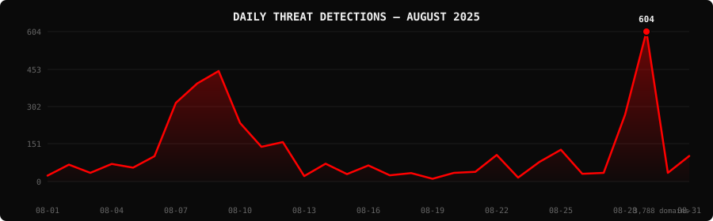

<!--
  PhishDestroy Threat Intelligence Report — August 2025
  3,788 phishing & scam domains detected · Kill rate: 45.9%
  Keywords: phishing report, threat intelligence, 2025-08, destroylist, scam domains, crypto drainer,
  phishing detection, domain blocklist, threat feed, VirusTotal, registrar abuse, brand impersonation,
  cryptocurrency phishing, wallet drainer, monthly security report, cybersecurity analytics
  Canonical: https://github.com/phishdestroy/destroylist/tree/main/rootlist/2025/08
  Previous: https://github.com/phishdestroy/destroylist/tree/main/rootlist/2025/07
  Next: https://github.com/phishdestroy/destroylist/tree/main/rootlist/2025/09
  Data: https://github.com/phishdestroy/destroylist/tree/main/rootlist/2025/08/2025-08-threats.json
-->

<div align="center">




[**← Jul 2025**](../../2025/07/) &nbsp;·&nbsp; 📅 **August 2025** &nbsp;·&nbsp; [**Sep 2025 →**](../../2025/09/)

<br>

<a href="https://github.com/phishdestroy/destroylist">
  
</a>

<br><br>


<br><br>

[](https://github.com/phishdestroy/destroylist)
[](https://api.destroy.tools)
[](https://phishdestroy.io)
[](https://t.me/destroy_phish)
[](https://x.com/Phish_Destroy)
[](https://github.com/phishdestroy/destroylist#-data-feeds)

</div>


##  Dashboard

<div align="center">

|  |  |  |  |
|:---:|:---:|:---:|:---:|
| **3,788** | **2,051** | **1,737** | **0** |

|  |  |  |  |
|:---:|:---:|:---:|:---:|
| **3,515** (92.8%) | **86** | **4426.6h** | **4382.0h** |

</div>

<div align="center">

</div>

> `     ▁▄▅▅▃▁▁         ▁  ▁  ▃█ ▁` &nbsp; Peak: **2025-08-29** (604) &nbsp;·&nbsp; Low: **2025-08-19** (11) &nbsp;·&nbsp; Active days: **31**

<details>
<summary>📊 <b>Daily breakdown</b></summary>
<br>

| Date | Domains | Activity |
|:-----|--------:|:---------|
| `2025-08-01` | **24** | `█░░░░░░░░░░░░░░░░░░░` |
| `2025-08-02` | **68** | `██░░░░░░░░░░░░░░░░░░` |
| `2025-08-03` | **35** | `█░░░░░░░░░░░░░░░░░░░` |
| `2025-08-04` | **71** | `██░░░░░░░░░░░░░░░░░░` |
| `2025-08-05` | **56** | `██░░░░░░░░░░░░░░░░░░` |
| `2025-08-06` | **102** | `███░░░░░░░░░░░░░░░░░` |
| `2025-08-07` | **317** | `██████████░░░░░░░░░░` |
| `2025-08-08` | **395** | `█████████████░░░░░░░` |
| `2025-08-09` | **445** | `███████████████░░░░░` |
| `2025-08-10` | **236** | `████████░░░░░░░░░░░░` |
| `2025-08-11` | **140** | `█████░░░░░░░░░░░░░░░` |
| `2025-08-12` | **159** | `█████░░░░░░░░░░░░░░░` |
| `2025-08-13` | **22** | `█░░░░░░░░░░░░░░░░░░░` |
| `2025-08-14` | **72** | `██░░░░░░░░░░░░░░░░░░` |
| `2025-08-15` | **30** | `█░░░░░░░░░░░░░░░░░░░` |
| `2025-08-16` | **65** | `██░░░░░░░░░░░░░░░░░░` |
| `2025-08-17` | **25** | `█░░░░░░░░░░░░░░░░░░░` |
| `2025-08-18` | **34** | `█░░░░░░░░░░░░░░░░░░░` |
| `2025-08-19` | **11** | `░░░░░░░░░░░░░░░░░░░░` |
| `2025-08-20` | **35** | `█░░░░░░░░░░░░░░░░░░░` |
| `2025-08-21` | **39** | `█░░░░░░░░░░░░░░░░░░░` |
| `2025-08-22` | **107** | `████░░░░░░░░░░░░░░░░` |
| `2025-08-23` | **16** | `█░░░░░░░░░░░░░░░░░░░` |
| `2025-08-24` | **79** | `███░░░░░░░░░░░░░░░░░` |
| `2025-08-25` | **128** | `████░░░░░░░░░░░░░░░░` |
| `2025-08-26` | **31** | `█░░░░░░░░░░░░░░░░░░░` |
| `2025-08-27` | **35** | `█░░░░░░░░░░░░░░░░░░░` |
| `2025-08-28` | **269** | `█████████░░░░░░░░░░░` |
| `2025-08-29` | **604** | `████████████████████` |
| `2025-08-30` | **35** | `█░░░░░░░░░░░░░░░░░░░` |
| `2025-08-31` | **103** | `███░░░░░░░░░░░░░░░░░` |

</details>


##  Intelligence Analysis

### Executive Summary
August 2025 saw a significant surge in phishing domain activity, with a total of 3,788 detected domains, marking a staggering increase of 441.1% from July's 700 domains. Of these, 2,051 domains remain active, while 1,737 have been neutralized, reflecting a kill rate of 45.9%. The most notable finding this month is the continued dominance of the ".com" TLD, accounting for 1,828 of the domains. The average response time for takedowns was 4,426.6 hours, underscoring the need for more rapid intervention.

### Key Trends
- **Crypto/Drainer Landscape** — Angel Drainer topped the list with 220 instances, a significant lead over July's figures, highlighting a shift towards more aggressive crypto-targeting strategies.
- **Brand Targeting Shifts** — Ledger saw the highest targeting with 128 instances, indicating a growing focus on crypto wallet services, surpassing traditional banking targets.
- **Geographic Hotspots** — The USA remains the largest host with 1,663 domains, a notable increase from July, suggesting a persistent concentration in North America.
- **TLD Abuse Patterns** — The ".com" TLD is overwhelmingly preferred, with 1,828 domains, maintaining its lead from the previous month and emphasizing its vulnerability to abuse.
- **Registrar Abuse Concentration** — NameSilo, LLC hosted 228 domains, showing a slight increase in abuse concentration compared to July, requiring enhanced scrutiny.
- **Detection/Response Metrics** — VirusTotal flagged 3,515 domains, indicating robust detection but a need for faster response to achieve higher kill rates.

### Threat Actor Tactics
Threat actors continue to leverage advanced infrastructure and hosting tactics, with fast-flux networks and bulletproof hosting becoming increasingly prevalent. The clustering of nameservers has also been observed, suggesting coordinated efforts to evade takedown actions.

The evolution of drainers and phishing kits is apparent, with the emergence of sophisticated techniques targeting wallet platforms, particularly through Angel Drainer. The use of Wallet Connect abuse and Solana Drainer indicates a diversification in targeting methods, reflecting the broadening scope of crypto-targeted attacks.

Evasion and obfuscation techniques remain a challenge, as evidenced by the spread of detections across VT vendors. Gaps in coverage persist, particularly in less prominent engines, allowing actors to bypass certain detection mechanisms. The variance in detection rates suggests a need for vendors to enhance their engine capabilities to cover emerging tactics effectively.

### Registrar Accountability
The top five registrars by abuse concentration are led by an unidentified registrar with 319 domains, followed by NameSilo, LLC (228), NICENIC INTERNATIONAL GROUP CO., LIMITED (191), WEBCC (163), and OwnRegistrar, Inc. (158). These entities collectively account for a significant portion of the phishing landscape, highlighting the need for stringent oversight and accountability measures.

Compared to July, NameSilo, LLC and NICENIC INTERNATIONAL GROUP CO., LIMITED have seen increased abuse, while new entrants like WEBCC have emerged as notable players. This shift necessitates a reassessment of registrar policies and practices to mitigate abuse effectively.

### Detection Landscape
Analysis of VirusTotal vendor data reveals alphaMountain.ai and Fortinet as leading engines, with 1,667 and 1,610 detections respectively. However, the detection gaps identified, particularly in less prominent engines, indicate a need for improved collaboration and intelligence sharing among vendors to close these gaps and enhance overall detection efficacy.

### Recommendations
- **For Security Teams** — Implement real-time monitoring solutions to detect and respond to phishing domains promptly, reducing average response times.
- **For SOC Analysts** — Focus on threat actor infrastructure patterns, such as fast-flux and nameserver clustering, to anticipate and mitigate attacks.
- **For Registrars** — Strengthen verification processes and monitor for anomalous domain registration patterns to reduce abuse.
- **For Browser Vendors** — Integrate enhanced phishing detection capabilities into browsers to protect end users from accessing malicious domains.
- **For Crypto Projects** — Educate users on identifying phishing attempts and encourage the use of hardware wallets to safeguard assets.
- **For End Users** — Stay informed about the latest phishing tactics and exercise caution when engaging with unsolicited communications or links.


##  Top Registrars

| # | Registrar | Domains | Share | Trend |
|:--:|:---|------:|:---|:---:|
| **1** | N/A | **319** | `█░░░░░░░░░░░░░░` 8.4% | 🆕 |
| **2** | NameSilo, LLC | **228** | `█░░░░░░░░░░░░░░` 6.0% | 🔺 |
| **3** | NICENIC INTERNATIONAL GROUP CO., LIMITED | **191** | `█░░░░░░░░░░░░░░` 5.0% | 🔺 |
| **4** | WEBCC | **163** | `█░░░░░░░░░░░░░░` 4.3% | 🔺 |
| **5** | OwnRegistrar, Inc. | **158** | `█░░░░░░░░░░░░░░` 4.2% | 🔺 |
| **6** | URL Solutions, Inc. | **156** | `█░░░░░░░░░░░░░░` 4.1% | 🆕 |
| **7** | Cosmotown, Inc. | **150** | `█░░░░░░░░░░░░░░` 4.0% | 🔺 |
| **8** | PDR Ltd. d/b/a PublicDomainRegistry.com | **128** | `█░░░░░░░░░░░░░░` 3.4% | 🔺 |
| **9** | Gname.com Pte. Ltd. | **121** | `░░░░░░░░░░░░░░░` 3.2% | 🔺 |
| **10** | GoDaddy.com, LLC | **112** | `░░░░░░░░░░░░░░░` 3.0% | 🔺 |

> ⚠️ Top 3 registrars = **738** domains (19% of all threats)


##  Domain Zones

| # | TLD | Domains | Share | vs Prev |
|:--:|:---|------:|------:|:---:|
| **1** | `.com` | **1,828** | 48.3% | 🔺 |
| **2** | `.xyz` | **177** | 4.7% | 🔺 |
| **3** | `.life` | **165** | 4.4% | 🆕 |
| **4** | `.app` | **153** | 4.0% | 🔺 |
| **5** | `.org` | **143** | 3.8% | 🔺 |
| **6** | `.top` | **133** | 3.5% | 🔺 |
| **7** | `.live` | **109** | 2.9% | 🔺 |
| **8** | `.net` | **102** | 2.7% | 🔺 |
| **9** | `.pro` | **60** | 1.6% | 🔺 |
| **10** | `.io` | **58** | 1.5% | 🆕 |


##  Registrar Geography

| # | Country | Domains | Share |
|:--:|:---|------:|------:|
| **1** | USA | **1,663** | 43.9% |
| **2** | Unknown | **476** | 12.6% |
| **3** | Malaysia | **276** | 7.3% |
| **4** | Hong Kong | **200** | 5.3% |
| **5** | Singapore | **132** | 3.5% |
| **6** | India | **129** | 3.4% |
| **7** | Lithuania | **123** | 3.2% |
| **8** | Turkey | **110** | 2.9% |
| **9** | Germany | **109** | 2.9% |
| **10** | Canada | **78** | 2.1% |


##  Targeted Brands

| # | Brand | Domains | Share |
|:--:|:---|------:|------:|
| **1** | Ledger | **128** | 3.4% |
| **2** | Generic Crypto | **121** | 3.2% |
| **3** | Generic Gambling | **119** | 3.1% |
| **4** | Binance | **52** | 1.4% |
| **5** | Generic Banking | **49** | 1.3% |
| **6** | cats=phishing | **39** | 1.0% |
| **7** | Uniswap | **22** | 0.6% |
| **8** | SushiSwap | **22** | 0.6% |
| **9** | Aave | **21** | 0.6% |
| **10** | Coinbase | **20** | 0.5% |


##  Crypto Drainers & Kits

| # | Type | Domains |
|:--:|:---|------:|
| **1** | Angel Drainer | **220** |
| **2** | Wallet Connect Abuse | **95** |
| **3** | Solana Drainer | **33** |
| **4** | Ice Phishing | **7** |
| **5** | Inferno Drainer | **1** |


##  Detection Engines (VirusTotal)

| # | Engine | Detections | Coverage |
|:--:|:---|------:|------:|
| **1** | alphaMountain.ai | **1,667** | 44.0% |
| **2** | Fortinet | **1,610** | 42.5% |
| **3** | Gridinsoft | **1,249** | 33.0% |
| **4** | CyRadar | **1,071** | 28.3% |
| **5** | G-Data | **911** | 24.0% |
| **6** | Sophos | **817** | 21.6% |
| **7** | BitDefender | **778** | 20.5% |
| **8** | Seclookup | **735** | 19.4% |
| **9** | Lionic | **699** | 18.5% |
| **10** | Forcepoint ThreatSeeker | **677** | 17.9% |
| **11** | Webroot | **619** | 16.3% |
| **12** | ADMINUSLabs | **579** | 15.3% |
| **13** | Kaspersky | **504** | 13.3% |
| **14** | ESET | **504** | 13.3% |
| **15** | CRDF | **497** | 13.1% |

>  &nbsp; 


##  Downloads & Data

| Format | File | Description |
|:-------|:-----|:------------|
| 📋 Report | [`README.md`](.) | This report |
| 🗃️ Threats | [`2025-08-threats.json`](2025-08-threats.json) | **3,788** threats with VT vendors, scan URLs, IPs |
| 📈 Chart | [`2025-08-activity.svg`](2025-08-activity.svg) | Daily detection activity graph |

<details>
<summary>🔍 <b>Threat JSON example</b></summary>

```json
{
  "domain": "mg3forwarddeliveryservices.com.almerafininstitution.com",
  "detected_at": "2025-08-07 16:18:52",
  "registrar": "OwnRegistrar, Inc.",
  "registrar_country": "USA",
  "tld": "com",
  "ip_address": "198.18.0.45",
  "nameservers": "dns1.lytehosting.com dns2.lytehosting.com dns3.lytehosting.com dns4.lytehosting.com",
  "status": "dead",
  "target_brand": "",
  "drainer_type": "clean",
  "vt_detections": 5,
  "vt_vendors": [
    "alphaMountain.ai",
    "CyRadar",
    "Fortinet",
    "Seclookup",
    "Webroot"
  ],
  "gsb_flagged": false,
  "creation_date": "2025-05-25 10:53:42",
  "urlscan": "https://urlscan.io/result/019885f8-b96e-705d-a7a6-3109afd1f809/",
  "screenshot": "https://urlscan.io/screenshots/019885f8-b96e-705d-a7a6-3109afd1f809.png"
}
```

</details>

> 💡 **API access**: Query any domain at [`api.destroy.tools/v1/check`](https://api.destroy.tools/v1/check?domain=example.com) — free, no API key


##  All Reports

| Report | Domains |
|:-------|--------:|
| [January 2025](../../2025/01/) | **1** |
| [February 2025](../../2025/02/) | **13** |
| [March 2025](../../2025/03/) | **2** |
| [April 2025](../../2025/04/) | **2** |
| [May 2025](../../2025/05/) | **2** |
| [June 2025](../../2025/06/) | **4** |
| [July 2025](../../2025/07/) | **700** |
| 📍 **August 2025** | **3,788** |
| [September 2025](../../2025/09/) | **7,307** |
| [October 2025](../../2025/10/) | **8,841** |
| [November 2025](../../2025/11/) | **12,581** |
| [December 2025](../../2025/12/) | **11,773** |
| [January 2026](../../2026/01/) | **8,932** |
| [February 2026](../../2026/02/) | **18,207** |
| [March 2026](../../2026/03/) | **4,042** |
| [April 2026](../../2026/04/) | **15,633** |
| [May 2026](../../2026/05/) | **7,021** |
| [June 2026](../../2026/06/) | **8,102** |


<div align="center">

[**← Jul 2025**](../../2025/07/) &nbsp;·&nbsp; 📅 **August 2025** &nbsp;·&nbsp; [**Sep 2025 →**](../../2025/09/)

<br>

[](https://github.com/phishdestroy/destroylist)
[](https://api.destroy.tools)
[](https://api.destroy.tools/v1/stats)
[](https://github.com/phishdestroy/destroylist#-data-feeds)
[](https://phishdestroy.io/appeals/)
[](https://x.com/Phish_Destroy)
[](https://mastodon.social/@phishdestroy)

<br>

Data: [destroylist](https://github.com/phishdestroy/destroylist)

</div>
