<!--
  PhishDestroy Threat Intelligence Report — November 2025
  12,581 phishing & scam domains detected · Kill rate: 58.9%
  Keywords: phishing report, threat intelligence, 2025-11, destroylist, scam domains, crypto drainer,
  phishing detection, domain blocklist, threat feed, VirusTotal, registrar abuse, brand impersonation,
  cryptocurrency phishing, wallet drainer, monthly security report, cybersecurity analytics
  Canonical: https://github.com/phishdestroy/destroylist/tree/main/rootlist/2025/11
  Previous: https://github.com/phishdestroy/destroylist/tree/main/rootlist/2025/10
  Next: https://github.com/phishdestroy/destroylist/tree/main/rootlist/2025/12
  Data: https://github.com/phishdestroy/destroylist/tree/main/rootlist/2025/11/2025-11-threats.json
-->

<div align="center">




[**← Oct 2025**](../../2025/10/) &nbsp;·&nbsp; 📅 **November 2025** &nbsp;·&nbsp; [**Dec 2025 →**](../../2025/12/)

<br>

<a href="https://github.com/phishdestroy/destroylist">
  
</a>

<br><br>


<br><br>

[](https://github.com/phishdestroy/destroylist)
[](https://api.destroy.tools)
[](https://phishdestroy.io)
[](https://t.me/destroy_phish)
[](https://x.com/Phish_Destroy)
[](https://github.com/phishdestroy/destroylist#-data-feeds)

</div>


##  Dashboard

<div align="center">

|  |  |  |  |
|:---:|:---:|:---:|:---:|
| **12,581** | **5,165** | **7,416** | **0** |

|  |  |  |  |
|:---:|:---:|:---:|:---:|
| **12,215** (97.1%) | **1,442** | **2181.7h** | **2246.0h** |

</div>

<div align="center">

</div>

> `▄▁▂▃▃▂▅▁▂▂▃▂▇▂▆▁█▁▂▇▃ ▂▁▄ ▄▁▂▂` &nbsp; Peak: **2025-11-17** (778) &nbsp;·&nbsp; Low: **2025-11-26** (177) &nbsp;·&nbsp; Active days: **30**

<details>
<summary>📊 <b>Daily breakdown</b></summary>
<br>

| Date | Domains | Activity |
|:-----|--------:|:---------|
| `2025-11-01` | **545** | `██████████████░░░░░░` |
| `2025-11-02` | **294** | `████████░░░░░░░░░░░░` |
| `2025-11-03` | **347** | `█████████░░░░░░░░░░░` |
| `2025-11-04` | **421** | `███████████░░░░░░░░░` |
| `2025-11-05` | **423** | `███████████░░░░░░░░░` |
| `2025-11-06` | **333** | `█████████░░░░░░░░░░░` |
| `2025-11-07` | **598** | `███████████████░░░░░` |
| `2025-11-08` | **283** | `███████░░░░░░░░░░░░░` |
| `2025-11-09` | **397** | `██████████░░░░░░░░░░` |
| `2025-11-10` | **329** | `████████░░░░░░░░░░░░` |
| `2025-11-11` | **457** | `████████████░░░░░░░░` |
| `2025-11-12` | **359** | `█████████░░░░░░░░░░░` |
| `2025-11-13` | **711** | `██████████████████░░` |
| `2025-11-14` | **401** | `██████████░░░░░░░░░░` |
| `2025-11-15` | **677** | `█████████████████░░░` |
| `2025-11-16` | **297** | `████████░░░░░░░░░░░░` |
| `2025-11-17` | **778** | `████████████████████` |
| `2025-11-18` | **262** | `███████░░░░░░░░░░░░░` |
| `2025-11-19` | **376** | `██████████░░░░░░░░░░` |
| `2025-11-20` | **714** | `██████████████████░░` |
| `2025-11-21` | **463** | `████████████░░░░░░░░` |
| `2025-11-22` | **231** | `██████░░░░░░░░░░░░░░` |
| `2025-11-23` | **392** | `██████████░░░░░░░░░░` |
| `2025-11-24` | **289** | `███████░░░░░░░░░░░░░` |
| `2025-11-25` | **504** | `█████████████░░░░░░░` |
| `2025-11-26` | **177** | `█████░░░░░░░░░░░░░░░` |
| `2025-11-27` | **500** | `█████████████░░░░░░░` |
| `2025-11-28` | **318** | `████████░░░░░░░░░░░░` |
| `2025-11-29` | **365** | `█████████░░░░░░░░░░░` |
| `2025-11-30` | **340** | `█████████░░░░░░░░░░░` |

</details>


##  Intelligence Analysis

### Executive Summary
November 2025 saw a significant surge in phishing domain activity, with a total of 12,581 domains detected, marking a 42.3% increase from October's 8,841. The number of live domains was 5,165, while 7,416 were rendered inactive, resulting in a kill rate of 58.9%. A noteworthy finding was the substantial increase in crypto-related phishing, reflecting the evolving landscape of cyber threats. The average response time for takedown was 2181.7 hours, highlighting ongoing challenges in rapid mitigation.

### Key Trends
- **Crypto/Drainer Landscape** — Crypto-related phishing surged this month, with "Crypto Scam" leading at 991 domains. Drainers like "Angel Drainer" were prevalent, with 842 instances noted.
- **Brand Targeting Shifts** — Targeting of major brands such as Coinbase (397 domains) and Kraken (321 domains) remained high, showing a focus on high-profile crypto exchanges.
- **Geographic Hotspots** — The USA continued to be the primary hotspot with 6,894 domains, followed by Hong Kong at 1,533, and Malaysia at 862, indicating a shift in regional focus from the previous month.
- **TLD Abuse Patterns** — The ".com" TLD was the most abused, with 3,945 domains, followed by ".io" (644) and ".xyz" (634), consistent with trends observed last month.
- **Registrar Abuse Concentration** — Cloudflare, Inc. topped the list with 1,421 domains registered, while Dynadot LLC followed closely with 1,086. This represents a significant concentration of abuse within these registrars.
- **Detection/Response Metrics** — VirusTotal flagged 12,215 domains, and Google Safe Browsing flagged 1,442, indicating a need for enhanced detection capabilities. The average response time was 2181.7 hours, slightly improved from the previous month.

### Threat Actor Tactics
Threat actors continue to leverage sophisticated infrastructure, with visible patterns of fast-flux hosting and CDN abuse to obfuscate domain origins. Nameserver clustering remains prevalent, complicating attribution efforts and prolonging the time to takedown.

Drainer and phishing kit evolution has been marked by the emergence of new techniques, such as those employed by "Angel Drainer" and "Wallet Connect Abuse." These kits are increasingly sophisticated, targeting wallets with advanced social engineering tactics to bypass traditional security measures.

Evasion and obfuscation techniques show a diverse spread in VirusTotal vendor detection, with gaps particularly in engines less focused on heuristic analysis. Threat actors are adept at avoiding specific engines, underscoring the need for continuous improvement in detection algorithms.

### Registrar Accountability
The top five registrars, Cloudflare, Inc. (1,421), Dynadot LLC (1,086), NICENIC INTERNATIONAL GROUP CO., LIMITED (1,083), WEBCC (695), and DYNADOT LLC (497), account for a significant portion of phishing domain registrations. This concentration suggests a need for these registrars to enhance their vetting processes and abuse response strategies.

Among registrars, Cloudflare, Inc. and NICENIC INTERNATIONAL GROUP CO., LIMITED showed worsening trends, while Dynadot LLC improved slightly. New entrants in the abuse landscape were minimal, suggesting established players continue to dominate the abuse ecosystem.

### Detection Landscape
CyRadar led the VirusTotal vendor detection with 8,779 flags, followed closely by Fortinet at 8,698. Despite high detection rates, gaps remain, particularly in engines with less emphasis on behavioral analytics. This necessitates a multi-layered defense approach for effective threat mitigation.

### Recommendations
- **For Security Teams** — Implement enhanced monitoring for fast-flux and CDN abuse patterns to improve early detection of phishing domains.
- **For SOC Analysts** — Prioritize response efforts on domains registered with high-abuse registrars and those using ".com" TLDs.
- **For Registrars** — Strengthen vetting procedures and increase collaboration with cybersecurity firms to reduce domain abuse.
- **For Browser Vendors** — Integrate more robust phishing detection algorithms to proactively block malicious domains.
- **For Crypto Projects** — Educate users on recognizing phishing attempts, particularly those leveraging recent drainer techniques.
- **For End Users** — Exercise caution with unsolicited communications, particularly those requesting wallet information or login credentials.


##  Top Registrars

| # | Registrar | Domains | Share | Trend |
|:--:|:---|------:|:---|:---:|
| **1** | Cloudflare, Inc. | **1,421** | `██░░░░░░░░░░░░░` 11.3% | 🔺 |
| **2** | Dynadot LLC | **1,086** | `█░░░░░░░░░░░░░░` 8.6% | 🔺 |
| **3** | NICENIC INTERNATIONAL GROUP CO., LIMITED | **1,083** | `█░░░░░░░░░░░░░░` 8.6% | 📉 |
| **4** | WEBCC | **695** | `█░░░░░░░░░░░░░░` 5.5% | 📈 |
| **5** | DYNADOT LLC | **497** | `█░░░░░░░░░░░░░░` 4.0% | 📈 |
| **6** | MarkMonitor, Inc. | **487** | `█░░░░░░░░░░░░░░` 3.9% | 🔺 |
| **7** | Dominet (HK) Limited | **440** | `█░░░░░░░░░░░░░░` 3.5% | 🔺 |
| **8** | Gname.com Pte. Ltd. | **413** | `░░░░░░░░░░░░░░░` 3.3% | ➡️ |
| **9** | NameSilo, LLC | **410** | `░░░░░░░░░░░░░░░` 3.3% | ➡️ |
| **10** | NAMECHEAP INC | **372** | `░░░░░░░░░░░░░░░` 3.0% | 🔺 |

> ⚠️ Top 3 registrars = **3,590** domains (29% of all threats)


##  Domain Zones

| # | TLD | Domains | Share | vs Prev |
|:--:|:---|------:|------:|:---:|
| **1** | `.com` | **3,945** | 31.4% | 📈 |
| **2** | `.io` | **644** | 5.1% | 🔺 |
| **3** | `.xyz` | **634** | 5.0% | ➡️ |
| **4** | `.app` | **578** | 4.6% | 📈 |
| **5** | `.ru` | **432** | 3.4% | 🔺 |
| **6** | `.sbs` | **419** | 3.3% | 🔺 |
| **7** | `.dev` | **384** | 3.1% | 🔺 |
| **8** | `.cfd` | **363** | 2.9% | 🔺 |
| **9** | `.net` | **311** | 2.5% | 📈 |
| **10** | `.top` | **311** | 2.5% | ➡️ |


##  Registrar Geography

| # | Country | Domains | Share |
|:--:|:---|------:|------:|
| **1** | USA | **6,894** | 54.8% |
| **2** | Hong Kong | **1,533** | 12.2% |
| **3** | Malaysia | **862** | 6.9% |
| **4** | Singapore | **447** | 3.6% |
| **5** | India | **381** | 3.0% |
| **6** | Russia | **358** | 2.8% |
| **7** | Canada | **233** | 1.9% |
| **8** | Germany | **197** | 1.6% |
| **9** | Lithuania | **191** | 1.5% |
| **10** | Vietnam | **172** | 1.4% |


##  Targeted Brands

| # | Brand | Domains | Share |
|:--:|:---|------:|------:|
| **1** | Crypto Scam | **991** | 7.9% |
| **2** | Generic Gambling | **400** | 3.2% |
| **3** | Coinbase | **397** | 3.2% |
| **4** | Generic Crypto | **357** | 2.8% |
| **5** | Kraken | **321** | 2.6% |
| **6** | Generic Cloudflare | **180** | 1.4% |
| **7** | Metamask | **99** | 0.8% |
| **8** | MetaMask | **93** | 0.7% |
| **9** | Ledger | **83** | 0.7% |
| **10** | Jupiter | **76** | 0.6% |


##  Crypto Drainers & Kits

| # | Type | Domains |
|:--:|:---|------:|
| **1** | Angel Drainer | **842** |
| **2** | Wallet Connect Abuse | **453** |
| **3** | Solana Drainer | **359** |
| **4** | Ice Phishing | **6** |
| **5** | Inferno Drainer | **1** |


##  Detection Engines (VirusTotal)

| # | Engine | Detections | Coverage |
|:--:|:---|------:|------:|
| **1** | CyRadar | **8,779** | 69.8% |
| **2** | Fortinet | **8,698** | 69.1% |
| **3** | alphaMountain.ai | **8,489** | 67.5% |
| **4** | SOCRadar | **7,662** | 60.9% |
| **5** | Sophos | **7,176** | 57.0% |
| **6** | Lionic | **6,686** | 53.1% |
| **7** | G-Data | **6,614** | 52.6% |
| **8** | BitDefender | **6,408** | 50.9% |
| **9** | ADMINUSLabs | **5,115** | 40.7% |
| **10** | Webroot | **5,088** | 40.4% |
| **11** | ESET | **5,000** | 39.7% |
| **12** | Forcepoint ThreatSeeker | **4,998** | 39.7% |
| **13** | CRDF | **4,376** | 34.8% |
| **14** | VIPRE | **4,044** | 32.1% |
| **15** | ChainPatrol | **3,877** | 30.8% |

>  &nbsp; 


##  Downloads & Data

| Format | File | Description |
|:-------|:-----|:------------|
| 📋 Report | [`README.md`](.) | This report |
| 🗃️ Threats | [`2025-11-threats.json`](2025-11-threats.json) | **12,581** threats with VT vendors, scan URLs, IPs |
| 📈 Chart | [`2025-11-activity.svg`](2025-11-activity.svg) | Daily detection activity graph |

<details>
<summary>🔍 <b>Threat JSON example</b></summary>

```json
{
  "domain": "www-master.xyz",
  "detected_at": "2025-11-01 07:53:34",
  "registrar": "NameSilo, LLC",
  "registrar_country": "USA",
  "tld": "xyz",
  "ip_address": "188.114.96.3",
  "nameservers": "ezra.ns.cloudflare.com jocelyn.ns.cloudflare.com",
  "status": "dead",
  "target_brand": "",
  "drainer_type": "clean",
  "vt_detections": 8,
  "vt_vendors": [
    "alphaMountain.ai",
    "CRDF",
    "CyRadar",
    "Forcepoint ThreatSeeker",
    "Fortinet",
    "Gridinsoft",
    "SOCRadar",
    "Sophos"
  ],
  "gsb_flagged": false,
  "creation_date": "2025-10-31 17:08:12",
  "urlscan": "https://urlscan.io/result/019a3e67-f8c6-70ad-8a78-c03f1d650e24/",
  "screenshot": "https://urlscan.io/screenshots/019a3e67-f8c6-70ad-8a78-c03f1d650e24.png"
}
```

</details>

> 💡 **API access**: Query any domain at [`api.destroy.tools/v1/check`](https://api.destroy.tools/v1/check?domain=example.com) — free, no API key


##  All Reports

| Report | Domains |
|:-------|--------:|
| [January 2025](../../2025/01/) | **1** |
| [February 2025](../../2025/02/) | **13** |
| [March 2025](../../2025/03/) | **2** |
| [April 2025](../../2025/04/) | **2** |
| [May 2025](../../2025/05/) | **2** |
| [June 2025](../../2025/06/) | **4** |
| [July 2025](../../2025/07/) | **700** |
| [August 2025](../../2025/08/) | **3,788** |
| [September 2025](../../2025/09/) | **7,307** |
| [October 2025](../../2025/10/) | **8,841** |
| 📍 **November 2025** | **12,581** |
| [December 2025](../../2025/12/) | **11,773** |
| [January 2026](../../2026/01/) | **8,932** |
| [February 2026](../../2026/02/) | **18,207** |
| [March 2026](../../2026/03/) | **4,042** |
| [April 2026](../../2026/04/) | **15,633** |
| [May 2026](../../2026/05/) | **7,021** |
| [June 2026](../../2026/06/) | **8,102** |


<div align="center">

[**← Oct 2025**](../../2025/10/) &nbsp;·&nbsp; 📅 **November 2025** &nbsp;·&nbsp; [**Dec 2025 →**](../../2025/12/)

<br>

[](https://github.com/phishdestroy/destroylist)
[](https://api.destroy.tools)
[](https://api.destroy.tools/v1/stats)
[](https://github.com/phishdestroy/destroylist#-data-feeds)
[](https://phishdestroy.io/appeals/)
[](https://x.com/Phish_Destroy)
[](https://mastodon.social/@phishdestroy)

<br>

Data: [destroylist](https://github.com/phishdestroy/destroylist)

</div>
