<!--
  PhishDestroy — 2025 Yearly Threat Overview
  45,014 phishing domains detected across 12 months
  Keywords: phishing 2025, threat intelligence, destroylist, yearly report, scam domains
  https://github.com/phishdestroy/destroylist/tree/main/rootlist/2025
-->

  

-CC0000?style=for-the-badge)

  

## Monthly Reports

| # | Month | Domains | Trend |
|:--:|:------|--------:|:---:|
| 01 | [January 2025](01/) | **1** | — |
| 02 | [February 2025](02/) | **13** | — |
| 03 | [March 2025](03/) | **2** | — |
| 04 | [April 2025](04/) | **2** | — |
| 05 | [May 2025](05/) | **2** | — |
| 06 | [June 2025](06/) | **4** | — |
| 07 | [July 2025](07/) | **700** | `████████████████████` |
| 08 | [August 2025](08/) | **3,788** | `██████░░░░░░░░░░░░░░` |
| 09 | [September 2025](09/) | **7,307** | `████████████░░░░░░░░` |
| 10 | [October 2025](10/) | **8,841** | `██████████████░░░░░░` |
| 11 | [November 2025](11/) | **12,581** | `████████████████████` |
| 12 | [December 2025](12/) | **11,773** | `███████████████████░` |

> Peak: **November 2025** — 12,581 domains

## Year Navigation

| Year | Link |
|:-----|:-----|
| **2025** | 📍 You are here |
| [2026](../2026/) | 31,181 domains (3 months) |

 

Data: [destroylist](https://github.com/phishdestroy/destroylist)

