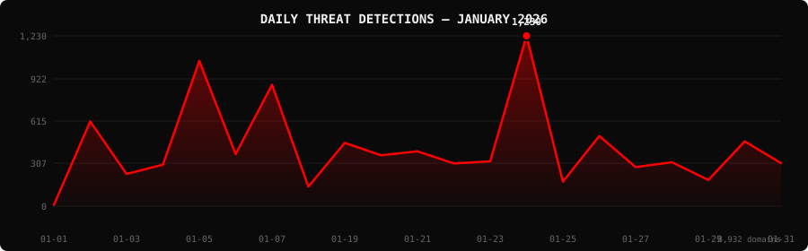

<!--
  PhishDestroy Threat Intelligence Report — January 2026
  8,932 phishing & scam domains detected · Kill rate: 52.4%
  Keywords: phishing report, threat intelligence, 2026-01, destroylist, scam domains, crypto drainer,
  phishing detection, domain blocklist, threat feed, VirusTotal, registrar abuse, brand impersonation,
  cryptocurrency phishing, wallet drainer, monthly security report, cybersecurity analytics
  Canonical: https://github.com/phishdestroy/destroylist/tree/main/rootlist/2026/01
  Previous: https://github.com/phishdestroy/destroylist/tree/main/rootlist/2025/12
  Next: https://github.com/phishdestroy/destroylist/tree/main/rootlist/2026/02
  Data: https://github.com/phishdestroy/destroylist/tree/main/rootlist/2026/01/2026-01-threats.json
-->

<div align="center">


[**← Dec 2025**](../../2025/12/) &nbsp;·&nbsp; 📅 **January 2026** &nbsp;·&nbsp; [**Feb 2026 →**](../../2026/02/)

<br>

<a href="https://github.com/phishdestroy/destroylist">
  
</a>

<br><br>


<br><br>

[](https://github.com/phishdestroy/destroylist)
[](https://api.destroy.tools)
[](https://phishdestroy.io)
[](https://t.me/destroy_phish)
[](https://x.com/Phish_Destroy)
[](https://github.com/phishdestroy/destroylist#-data-feeds)

</div>


##  Dashboard

<div align="center">

|  |  |  |  |
|:---:|:---:|:---:|:---:|
| **8,932** | **4,254** | **4,678** | **0** |

|  |  |  |  |
|:---:|:---:|:---:|:---:|
| **8,896** (99.6%) | **752** | **759.8h** | **698.0h** |

</div>

<div align="center">

</div>

> ` ▃▁▁▆▂▅ ▂▂▂▁▂█▁▃▁▂▁▃▁` &nbsp; Peak: **2026-01-24** (1,230) &nbsp;·&nbsp; Low: **2026-01-01** (9) &nbsp;·&nbsp; Active days: **21**

<details>
<summary>📊 <b>Daily breakdown</b></summary>
<br>

| Date | Domains | Activity |
|:-----|--------:|:---------|
| `2026-01-01` | **9** | `░░░░░░░░░░░░░░░░░░░░` |
| `2026-01-02` | **612** | `██████████░░░░░░░░░░` |
| `2026-01-03` | **233** | `████░░░░░░░░░░░░░░░░` |
| `2026-01-04` | **300** | `█████░░░░░░░░░░░░░░░` |
| `2026-01-05` | **1,049** | `█████████████████░░░` |
| `2026-01-06` | **376** | `██████░░░░░░░░░░░░░░` |
| `2026-01-07` | **877** | `██████████████░░░░░░` |
| `2026-01-18` | **141** | `██░░░░░░░░░░░░░░░░░░` |
| `2026-01-19` | **457** | `███████░░░░░░░░░░░░░` |
| `2026-01-20` | **368** | `██████░░░░░░░░░░░░░░` |
| `2026-01-21` | **396** | `██████░░░░░░░░░░░░░░` |
| `2026-01-22` | **309** | `█████░░░░░░░░░░░░░░░` |
| `2026-01-23` | **324** | `█████░░░░░░░░░░░░░░░` |
| `2026-01-24` | **1,230** | `████████████████████` |
| `2026-01-25` | **177** | `███░░░░░░░░░░░░░░░░░` |
| `2026-01-26` | **507** | `████████░░░░░░░░░░░░` |
| `2026-01-27` | **282** | `█████░░░░░░░░░░░░░░░` |
| `2026-01-28` | **317** | `█████░░░░░░░░░░░░░░░` |
| `2026-01-29` | **189** | `███░░░░░░░░░░░░░░░░░` |
| `2026-01-30` | **468** | `████████░░░░░░░░░░░░` |
| `2026-01-31` | **311** | `█████░░░░░░░░░░░░░░░` |

</details>


##  Intelligence Analysis

### Executive Summary

In January 2026, PhishDestroy identified 8,932 phishing domains, a significant decline of 24.1% from December 2025's total of 11,773. The kill rate improved to 52.4%, with 4,678 domains taken down. VirusTotal flagged 8,896 domains, indicating robust detection efforts. The most significant finding was the surge in targeting of crypto-related brands, particularly with the emergence of the "solana_drainer" tactic.

### Key Trends

- **Crypto/Drainer Landscape** — The "solana_drainer" was the most prevalent, with 213 instances, marking a significant increase in sophistication and focus on Solana wallets.
- **Brand Targeting Shifts** — Crypto scams led brand targeting with 793 domains, a noticeable increase from last month's figures, indicating a shift towards exploiting the crypto sector.
- **Geographic Hotspots** — The USA remains the prime location for phishing operations with 2,715 domains, while Hong Kong experienced a notable increase to 801 domains from its previous position.
- **TLD Abuse Patterns** — The .com TLD dominated with 3,249 domains, maintaining its status as the most abused top-level domain.
- **Registrar Abuse Concentration** — NICENIC INTERNATIONAL GROUP CO., LIMITED saw the highest abuse with 1,304 domains, showing little change in registrar abuse patterns.
- **Detection/Response Metrics** — Average response time improved to 759.8 hours, indicating more efficient takedown operations compared to last month.

### Threat Actor Tactics

Threat actors continue to employ diverse infrastructure and hosting strategies, with a marked increase in fast-flux networks and nameserver clustering. Bulletproof hosting remains prevalent, providing resilience against takedowns. CDN abuse has seen a modest decline, but still presents a challenge in obfuscating phishing infrastructure.

Drainer and phishing kit evolution is evident, with the "solana_drainer" and "Angel Drainer" showing advanced capabilities in targeting Solana and Ethereum wallets. These kits demonstrate increased sophistication, employing multi-layered obfuscation and anti-detection techniques.

Evasion tactics have evolved, with threat actors effectively utilizing gaps in VirusTotal's detection coverage. Despite high detection rates by leading engines, some phishing domains evade initial detection, exploiting specific weaknesses in lesser-known engines to maintain operational longevity.

### Registrar Accountability

NICENIC INTERNATIONAL GROUP CO., LIMITED, with 1,304 domains, leads in registrar abuse, followed by PDR Ltd. with 942 domains. Gname.com and NameSilo also show significant abuse with 771 and 423 domains, respectively. These five registrars account for a substantial portion of phishing activities, underscoring the need for stronger enforcement measures.

Improvements were noted with some registrars reducing their abuse numbers, while others, such as Dynadot Inc, experienced increased abuse, indicating potential lapses in monitoring. New entrants in the abuse landscape were minimal, suggesting stable registrar involvement patterns.

### Detection Landscape

VirusTotal data highlights SOCRadar as the leading engine, detecting 8,120 domains. Detection gaps are evident in engines with lower coverage, allowing some domains to remain active longer. This disparity emphasizes the need for comprehensive detection strategies to ensure consistent protection across all engines.

### Recommendations

- **For Security Teams** — Implement continuous monitoring and threat intelligence integration to stay ahead of evolving phishing tactics.
- **For SOC Analysts** — Focus on enhancing detection capabilities for crypto-targeted phishing attempts, particularly those involving drainers.
- **For Registrars** — Strengthen verification processes and actively monitor for abuse to reduce domain misuse.
- **For Browser Vendors** — Improve built-in anti-phishing features to better detect and block malicious domains.
- **For Crypto Projects** — Educate users on identifying phishing attempts and secure wallet practices to mitigate drainer threats.
- **For End Users** — Remain vigilant against unsolicited communications and verify website authenticity before engaging in transactions.


##  Top Registrars

| # | Registrar | Domains | Share | Trend |
|:--:|:---|------:|:---|:---:|
| **1** | NICENIC INTERNATIONAL GROUP CO., LIMITED | **1,304** | `██░░░░░░░░░░░░░` 14.6% | ➡️ |
| **2** | PDR Ltd. d/b/a PublicDomainRegistry.com | **942** | `██░░░░░░░░░░░░░` 10.5% | 🔺 |
| **3** | Gname.com Pte. Ltd. | **771** | `█░░░░░░░░░░░░░░` 8.6% | 🔺 |
| **4** | NameSilo, LLC | **423** | `█░░░░░░░░░░░░░░` 4.7% | 📈 |
| **5** | Dynadot Inc | **388** | `█░░░░░░░░░░░░░░` 4.3% | 🔺 |
| **6** | NAMECHEAP INC | **366** | `█░░░░░░░░░░░░░░` 4.1% | 📈 |
| **7** | GoDaddy.com, LLC | **317** | `█░░░░░░░░░░░░░░` 3.5% | 🔻 |
| **8** | WEBCC | **305** | `█░░░░░░░░░░░░░░` 3.4% | 📈 |
| **9** | Name SRS AB | **209** | `░░░░░░░░░░░░░░░` 2.3% | 🆕 |
| **10** | HOSTINGER operations, UAB | **193** | `░░░░░░░░░░░░░░░` 2.2% | ➡️ |

> ⚠️ Top 3 registrars = **3,017** domains (34% of all threats)


##  Domain Zones

| # | TLD | Domains | Share | vs Prev |
|:--:|:---|------:|------:|:---:|
| **1** | `.com` | **3,249** | 36.4% | 📉 |
| **2** | `.cc` | **686** | 7.7% | 🔺 |
| **3** | `.net` | **565** | 6.3% | 🔺 |
| **4** | `.xyz` | **429** | 4.8% | 📉 |
| **5** | `.org` | **361** | 4.0% | 📈 |
| **6** | `.top` | **333** | 3.7% | 🔺 |
| **7** | `.app` | **317** | 3.5% | 🔻 |
| **8** | `.live` | **200** | 2.2% | 📈 |
| **9** | `.fun` | **179** | 2.0% | 🔺 |
| **10** | `.dev` | **119** | 1.3% | 🔻 |


##  Registrar Geography

| # | Country | Domains | Share |
|:--:|:---|------:|------:|
| **1** | USA | **2,715** | 30.4% |
| **2** | Unknown | **2,044** | 22.9% |
| **3** | Hong Kong | **801** | 9.0% |
| **4** | India | **324** | 3.6% |
| **5** | SE | **198** | 2.2% |
| **6** | PL | **194** | 2.2% |
| **7** | Malaysia | **181** | 2.0% |
| **8** | IS | **178** | 2.0% |
| **9** | Singapore | **177** | 2.0% |
| **10** | CY | **160** | 1.8% |


##  Targeted Brands

| # | Brand | Domains | Share |
|:--:|:---|------:|------:|
| **1** | Crypto Scam | **793** | 8.9% |
| **2** | Generic Gambling | **348** | 3.9% |
| **3** | Facebook Pixel | **242** | 2.7% |
| **4** | Generic Crypto | **115** | 1.3% |
| **5** | Moonshot | **76** | 0.9% |
| **6** | Generic Cloudflare | **69** | 0.8% |
| **7** | Coinbase | **62** | 0.7% |
| **8** | Bet365 | **58** | 0.6% |
| **9** | Ledger | **47** | 0.5% |
| **10** | Generic Banking | **30** | 0.3% |


##  Crypto Drainers & Kits

| # | Type | Domains |
|:--:|:---|------:|
| **1** | solana_drainer | **213** |
| **2** | Angel Drainer | **138** |
| **3** | Solana Drainer | **44** |
| **4** | Wallet Connect Abuse | **38** |
| **5** | unknown_drainer | **7** |
| **6** | Ice Phishing | **1** |


##  Detection Engines (VirusTotal)

| # | Engine | Detections | Coverage |
|:--:|:---|------:|------:|
| **1** | SOCRadar | **8,120** | 90.9% |
| **2** | Gridinsoft | **6,035** | 67.6% |
| **3** | Fortinet | **5,759** | 64.5% |
| **4** | alphaMountain.ai | **5,739** | 64.3% |
| **5** | CyRadar | **5,373** | 60.2% |
| **6** | CRDF | **4,861** | 54.4% |
| **7** | Sophos | **4,291** | 48.0% |
| **8** | Lionic | **4,039** | 45.2% |
| **9** | Seclookup | **3,721** | 41.7% |
| **10** | ADMINUSLabs | **3,591** | 40.2% |
| **11** | G-Data | **3,588** | 40.2% |
| **12** | Forcepoint ThreatSeeker | **3,534** | 39.6% |
| **13** | BitDefender | **3,512** | 39.3% |
| **14** | Webroot | **2,968** | 33.2% |
| **15** | ESET | **2,916** | 32.6% |

>  &nbsp; 


##  Downloads & Data

| Format | File | Description |
|:-------|:-----|:------------|
| 📋 Report | [`README.md`](.) | This report |
| 🗃️ Threats | [`2026-01-threats.json`](2026-01-threats.json) | **8,932** threats with VT vendors, scan URLs, IPs |
| 📈 Chart | [`2026-01-activity.svg`](2026-01-activity.svg) | Daily detection activity graph |

<details>
<summary>🔍 <b>Threat JSON example</b></summary>

```json
{
  "domain": "frogedrop.top",
  "detected_at": "2026-01-04 23:50:44",
  "registrar": "PDR Ltd. d/b/a PublicDomainRegistry.com",
  "registrar_country": "US",
  "tld": "top",
  "ip_address": "172.67.211.176",
  "nameservers": "amos.ns.cloudflare.com dayana.ns.cloudflare.com",
  "status": "dead",
  "target_brand": "",
  "drainer_type": "Solana Drainer",
  "vt_detections": 3,
  "vt_vendors": [
    "Bfore.Ai PreCrime",
    "Gridinsoft",
    "SOCRadar"
  ],
  "gsb_flagged": false,
  "creation_date": "2025-12-08 18:47:12",
  "urlscan": "https://urlscan.io/result/019b2634-58ca-75fc-a25b-de1fe08beb34/",
  "screenshot": "https://urlscan.io/screenshots/019b2634-58ca-75fc-a25b-de1fe08beb34.png"
}
```

</details>

> 💡 **API access**: Query any domain at [`api.destroy.tools/v1/check`](https://api.destroy.tools/v1/check?domain=example.com) — free, no API key


##  All Reports

| Report | Domains |
|:-------|--------:|
| [January 2025](../../2025/01/) | **1** |
| [February 2025](../../2025/02/) | **13** |
| [March 2025](../../2025/03/) | **2** |
| [April 2025](../../2025/04/) | **2** |
| [May 2025](../../2025/05/) | **2** |
| [June 2025](../../2025/06/) | **4** |
| [July 2025](../../2025/07/) | **700** |
| [August 2025](../../2025/08/) | **3,788** |
| [September 2025](../../2025/09/) | **7,307** |
| [October 2025](../../2025/10/) | **8,841** |
| [November 2025](../../2025/11/) | **12,581** |
| [December 2025](../../2025/12/) | **11,773** |
| 📍 **January 2026** | **8,932** |
| [February 2026](../../2026/02/) | **18,207** |
| [March 2026](../../2026/03/) | **4,042** |
| [April 2026](../../2026/04/) | **15,633** |
| [May 2026](../../2026/05/) | **7,021** |
| [June 2026](../../2026/06/) | **8,102** |


<div align="center">

[**← Dec 2025**](../../2025/12/) &nbsp;·&nbsp; 📅 **January 2026** &nbsp;·&nbsp; [**Feb 2026 →**](../../2026/02/)

<br>

[](https://github.com/phishdestroy/destroylist)
[](https://api.destroy.tools)
[](https://api.destroy.tools/v1/stats)
[](https://github.com/phishdestroy/destroylist#-data-feeds)
[](https://phishdestroy.io/appeals/)
[](https://x.com/Phish_Destroy)
[](https://mastodon.social/@phishdestroy)

<br>

Data: [destroylist](https://github.com/phishdestroy/destroylist)

</div>
