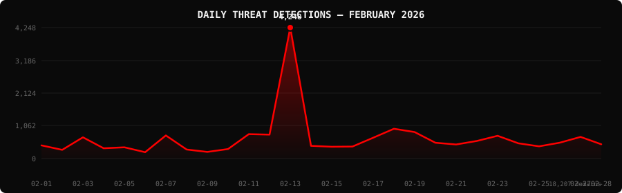

<!--
  PhishDestroy Threat Intelligence Report — February 2026
  18,207 phishing & scam domains detected · Kill rate: 19.0%
  Keywords: phishing report, threat intelligence, 2026-02, destroylist, scam domains, crypto drainer,
  phishing detection, domain blocklist, threat feed, VirusTotal, registrar abuse, brand impersonation,
  cryptocurrency phishing, wallet drainer, monthly security report, cybersecurity analytics
  Canonical: https://github.com/phishdestroy/destroylist/tree/main/rootlist/2026/02
  Previous: https://github.com/phishdestroy/destroylist/tree/main/rootlist/2026/01
  Next: https://github.com/phishdestroy/destroylist/tree/main/rootlist/2026/03
  Data: https://github.com/phishdestroy/destroylist/tree/main/rootlist/2026/02/2026-02-threats.json
-->

<div align="center">

[**← Jan 2026**](../../2026/01/) &nbsp;·&nbsp; 📅 **February 2026** &nbsp;·&nbsp; [**Mar 2026 →**](../../2026/03/)

<br>

<a href="https://github.com/phishdestroy/destroylist">
  
</a>

<br><br>


<br><br>

[](https://github.com/phishdestroy/destroylist)
[](https://api.destroy.tools)
[](https://phishdestroy.io)
[](https://t.me/destroy_phish)
[](https://x.com/Phish_Destroy)
[](https://github.com/phishdestroy/destroylist#-data-feeds)

</div>


##  Dashboard

<div align="center">

|  |  |  |  |
|:---:|:---:|:---:|:---:|
| **18,207** | **12,754** | **3,456** | **1,877** |

|  |  |  |  |
|:---:|:---:|:---:|:---:|
| **17,987** (98.8%) | **1,001** | **273.1h** | **264.0h** |

</div>

<div align="center">

</div>

> `      ▁   ▁▁█    ▁▁   ▁     ` &nbsp; Peak: **2026-02-13** (4,248) &nbsp;·&nbsp; Low: **2026-02-06** (205) &nbsp;·&nbsp; Active days: **28**

<details>
<summary>📊 <b>Daily breakdown</b></summary>
<br>

| Date | Domains | Activity |
|:-----|--------:|:---------|
| `2026-02-01` | **427** | `██░░░░░░░░░░░░░░░░░░` |
| `2026-02-02` | **281** | `█░░░░░░░░░░░░░░░░░░░` |
| `2026-02-03` | **688** | `███░░░░░░░░░░░░░░░░░` |
| `2026-02-04` | **334** | `██░░░░░░░░░░░░░░░░░░` |
| `2026-02-05` | **365** | `██░░░░░░░░░░░░░░░░░░` |
| `2026-02-06` | **205** | `█░░░░░░░░░░░░░░░░░░░` |
| `2026-02-07` | **749** | `████░░░░░░░░░░░░░░░░` |
| `2026-02-08` | **293** | `█░░░░░░░░░░░░░░░░░░░` |
| `2026-02-09` | **214** | `█░░░░░░░░░░░░░░░░░░░` |
| `2026-02-10` | **308** | `█░░░░░░░░░░░░░░░░░░░` |
| `2026-02-11` | **792** | `████░░░░░░░░░░░░░░░░` |
| `2026-02-12` | **776** | `████░░░░░░░░░░░░░░░░` |
| `2026-02-13` | **4,248** | `████████████████████` |
| `2026-02-14` | **411** | `██░░░░░░░░░░░░░░░░░░` |
| `2026-02-15` | **383** | `██░░░░░░░░░░░░░░░░░░` |
| `2026-02-16` | **389** | `██░░░░░░░░░░░░░░░░░░` |
| `2026-02-17` | **675** | `███░░░░░░░░░░░░░░░░░` |
| `2026-02-18` | **966** | `█████░░░░░░░░░░░░░░░` |
| `2026-02-19` | **858** | `████░░░░░░░░░░░░░░░░` |
| `2026-02-20` | **513** | `██░░░░░░░░░░░░░░░░░░` |
| `2026-02-21` | **455** | `██░░░░░░░░░░░░░░░░░░` |
| `2026-02-22` | **571** | `███░░░░░░░░░░░░░░░░░` |
| `2026-02-23` | **737** | `███░░░░░░░░░░░░░░░░░` |
| `2026-02-24` | **493** | `██░░░░░░░░░░░░░░░░░░` |
| `2026-02-25` | **396** | `██░░░░░░░░░░░░░░░░░░` |
| `2026-02-26` | **515** | `██░░░░░░░░░░░░░░░░░░` |
| `2026-02-27` | **702** | `███░░░░░░░░░░░░░░░░░` |
| `2026-02-28` | **463** | `██░░░░░░░░░░░░░░░░░░` |

</details>


##  Intelligence Analysis

### Executive Summary
In February 2026, PhishDestroy identified 18,207 phishing domains, marking a significant 103.8% increase compared to January's total of 8,932. Of these, 12,754 were live, and 3,456 had been taken down, reflecting a kill rate of 19.0%. The most substantial finding was the surge in domains targeting cryptocurrency users, with the "solana_drainer" responsible for 355 instances. The average response time for takedown was 273.1 hours, highlighting room for improvement in response efficiency.

### Key Trends
- **Crypto/Drainer Landscape** — "solana_drainer" was the most prevalent, with 355 instances, compared to 16 for "Solana Drainer" last month, indicating a focus on Solana wallet theft.
- **Brand Targeting Shifts** — Facebook Pixel was the most targeted brand with 778 domains, up from 620 last month, showing growing interest in exploiting social media platforms.
- **Geographic Hotspots** — The USA and Hong Kong remained top hotspots with 3,956 and 2,353 domains, respectively, while domains from unknown locations surged to 5,482.
- **TLD Abuse Patterns** — .com TLDs dominated with 6,427 domains, a 15% increase from last month, followed by .xyz with 1,309, reflecting a preference for generic TLDs.
- **Registrar Abuse Concentration** — NICENIC INTERNATIONAL GROUP CO., LIMITED saw 7,471 domains registered, a 20% increase, indicating ongoing registrar challenges.
- **Detection/Response Metrics** — 17,987 domains were flagged by VirusTotal, a slight increase from 17,456 last month, while Google Safe Browsing flagged 1,001 domains, showing detection consistency.

### Threat Actor Tactics
Infrastructure & hosting tactics showed increased usage of fast-flux techniques and bulletproof hosting, particularly leveraging hosting services with lenient abuse policies. Nameserver clustering was evident, with several domains using the same clusters to obfuscate true hosting locations.

Drainer and kit evolution saw a marked increase in sophistication, particularly with "solana_drainer" kits. These kits demonstrated advanced wallet targeting capabilities, exploiting weaknesses in wallet connect protocols to siphon funds without detection.

Evasion and obfuscation techniques revealed that threat actors are increasingly using complex JavaScript obfuscation to evade detection. VirusTotal vendor analyses showed gaps, particularly in engines not updated for new evasion techniques, allowing actors to bypass specific detection engines effectively.

### Registrar Accountability
The top five registrars for phishing domains were NICENIC INTERNATIONAL GROUP CO., LIMITED (7,471 domains, 41% share), PDR Ltd. d/b/a PublicDomainRegistry.com (787 domains), Cloudflare, Inc. (744 domains), GoDaddy.com, LLC (674 domains), and Dead domain (672 domains). This concentration indicates a persistent issue with registrar accountability and enforcement.

Compared to last month, NICENIC INTERNATIONAL GROUP CO., LIMITED worsened significantly, while Cloudflare showed slight improvement in response times. New entrants like Dead domain highlight emerging registrar challenges.

### Detection Landscape
VirusTotal data showed SOCRadar leading with 15,397 detections, followed by Fortinet with 11,281. Detection gaps remain with newer obfuscation techniques, underscoring the need for continuous updates and intelligence sharing among vendors to adapt to evolving threats.

### Recommendations
- **For Security Teams** — Prioritize monitoring and takedown of domains registered with NICENIC INTERNATIONAL GROUP CO., LIMITED and similar registrars.
- **For SOC Analysts** — Enhance detection capabilities for Solana-based drainer kits and improve response times to threats.
- **For Registrars** — Implement stricter verification processes and rapid abuse response to reduce domain misuse.
- **For Browser Vendors** — Update browser security features to detect and block obfuscated phishing scripts more effectively.
- **For Crypto Projects** — Strengthen wallet connect protocols and educate users on recognizing phishing attempts.
- **For End Users** — Increase awareness of phishing tactics targeting Facebook Pixel and cryptocurrency wallets, urging cautious interaction with unsolicited links.


##  Top Registrars

| # | Registrar | Domains | Share | Trend |
|:--:|:---|------:|:---|:---:|
| **1** | NICENIC INTERNATIONAL GROUP CO., LIMITED | **7,471** | `██████░░░░░░░░░` 41.0% | 🔺 |
| **2** | PDR Ltd. d/b/a PublicDomainRegistry.com | **787** | `█░░░░░░░░░░░░░░` 4.3% | 📉 |
| **3** | Cloudflare, Inc. | **744** | `█░░░░░░░░░░░░░░` 4.1% | 🔺 |
| **4** | GoDaddy.com, LLC | **674** | `█░░░░░░░░░░░░░░` 3.7% | 🔺 |
| **5** | Dead domain | **672** | `█░░░░░░░░░░░░░░` 3.7% | 🔺 |
| **6** | Gname.com Pte. Ltd. | **619** | `█░░░░░░░░░░░░░░` 3.4% | 📉 |
| **7** | NameSilo, LLC | **421** | `░░░░░░░░░░░░░░░` 2.3% | ➡️ |
| **8** | NAMECHEAP INC | **411** | `░░░░░░░░░░░░░░░` 2.3% | 📈 |
| **9** | Global Domain Group LLC | **404** | `░░░░░░░░░░░░░░░` 2.2% | 🆕 |
| **10** | Dynadot Inc | **397** | `░░░░░░░░░░░░░░░` 2.2% | ➡️ |

> ⚠️ Top 3 registrars = **9,002** domains (49% of all threats)


##  Domain Zones

| # | TLD | Domains | Share | vs Prev |
|:--:|:---|------:|------:|:---:|
| **1** | `.com` | **6,427** | 35.3% | 🔺 |
| **2** | `.xyz` | **1,309** | 7.2% | 🔺 |
| **3** | `.app` | **1,161** | 6.4% | 🔺 |
| **4** | `.live` | **758** | 4.2% | 🔺 |
| **5** | `.net` | **749** | 4.1% | 🔺 |
| **6** | `.dev` | **635** | 3.5% | 🔺 |
| **7** | `.org` | **583** | 3.2% | 🔺 |
| **8** | `.io` | **539** | 3.0% | 🔺 |
| **9** | `.cc` | **530** | 2.9% | 📉 |
| **10** | `.fun` | **421** | 2.3% | 🔺 |


##  Registrar Geography

| # | Country | Domains | Share |
|:--:|:---|------:|------:|
| **1** | Unknown | **5,482** | 30.1% |
| **2** | USA | **3,956** | 21.7% |
| **3** | Hong Kong | **2,353** | 12.9% |
| **4** | CY | **1,088** | 6.0% |
| **5** | IS | **411** | 2.3% |
| **6** | RU | **310** | 1.7% |
| **7** | Canada | **290** | 1.6% |
| **8** | HK | **268** | 1.5% |
| **9** | DE | **211** | 1.2% |
| **10** | UA | **188** | 1.0% |


##  Targeted Brands

| # | Brand | Domains | Share |
|:--:|:---|------:|------:|
| **1** | Facebook Pixel | **778** | 4.3% |
| **2** | Generic Crypto | **464** | 2.5% |
| **3** | Crypto Scam | **291** | 1.6% |
| **4** | Moonshot | **213** | 1.2% |
| **5** | Generic | **132** | 0.7% |
| **6** | Generic Cloudflare | **127** | 0.7% |
| **7** | Facebook | **95** | 0.5% |
| **8** | Netflix | **89** | 0.5% |
| **9** | Ledger | **81** | 0.4% |
| **10** | Exodus Wallet | **81** | 0.4% |


##  Crypto Drainers & Kits

| # | Type | Domains |
|:--:|:---|------:|
| **1** | solana_drainer | **355** |
| **2** | Solana Drainer | **16** |
| **3** | unknown_drainer | **1** |
| **4** | Wallet Connect Abuse | **1** |


##  Detection Engines (VirusTotal)

| # | Engine | Detections | Coverage |
|:--:|:---|------:|------:|
| **1** | SOCRadar | **15,397** | 84.6% |
| **2** | Fortinet | **11,281** | 62.0% |
| **3** | Gridinsoft | **10,068** | 55.3% |
| **4** | alphaMountain.ai | **8,114** | 44.6% |
| **5** | CyRadar | **6,818** | 37.4% |
| **6** | Sophos | **5,395** | 29.6% |
| **7** | ADMINUSLabs | **5,381** | 29.6% |
| **8** | G-Data | **5,162** | 28.4% |
| **9** | CRDF | **4,877** | 26.8% |
| **10** | Seclookup | **4,741** | 26.0% |
| **11** | Lionic | **4,338** | 23.8% |
| **12** | Kaspersky | **4,163** | 22.9% |
| **13** | Forcepoint ThreatSeeker | **4,134** | 22.7% |
| **14** | BitDefender | **3,924** | 21.6% |
| **15** | Webroot | **3,494** | 19.2% |

>  &nbsp; 


##  Downloads & Data

| Format | File | Description |
|:-------|:-----|:------------|
| 📋 Report | [`README.md`](.) | This report |
| 🗃️ Threats | [`2026-02-threats.json`](2026-02-threats.json) | **18,207** threats with VT vendors, scan URLs, IPs |
| 📈 Chart | [`2026-02-activity.svg`](2026-02-activity.svg) | Daily detection activity graph |

<details>
<summary>🔍 <b>Threat JSON example</b></summary>

```json
{
  "domain": "bitxlucky.vip",
  "detected_at": "2026-02-01 00:05:13",
  "registrar": "Eranet International Limited",
  "registrar_country": "MY",
  "tld": "vip",
  "ip_address": "188.114.96.3",
  "nameservers": "nancy.ns.cloudflare.com randy.ns.cloudflare.com",
  "status": "dead",
  "target_brand": "",
  "drainer_type": "",
  "vt_detections": 1,
  "vt_vendors": [
    "SOCRadar"
  ],
  "gsb_flagged": false,
  "creation_date": "2026-02-21 07:01:08",
  "urlscan": "https://urlscan.io/result/019c15de-f7ed-730d-b593-9cbe25769620/",
  "screenshot": "https://urlscan.io/screenshots/019c15de-f7ed-730d-b593-9cbe25769620.png"
}
```

</details>

> 💡 **API access**: Query any domain at [`api.destroy.tools/v1/check`](https://api.destroy.tools/v1/check?domain=example.com) — free, no API key


##  All Reports

| Report | Domains |
|:-------|--------:|
| [January 2025](../../2025/01/) | — |
| [February 2025](../../2025/02/) | — |
| [March 2025](../../2025/03/) | — |
| [April 2025](../../2025/04/) | — |
| [May 2025](../../2025/05/) | — |
| [June 2025](../../2025/06/) | — |
| [July 2025](../../2025/07/) | — |
| [August 2025](../../2025/08/) | — |
| [September 2025](../../2025/09/) | — |
| [October 2025](../../2025/10/) | — |
| [November 2025](../../2025/11/) | — |
| [December 2025](../../2025/12/) | — |
| [January 2026](../../2026/01/) | — |
| 📍 **February 2026** | **18,207** |
| [March 2026](../../2026/03/) | — |


<div align="center">

[**← Jan 2026**](../../2026/01/) &nbsp;·&nbsp; 📅 **February 2026** &nbsp;·&nbsp; [**Mar 2026 →**](../../2026/03/)

<br>

[](https://github.com/phishdestroy/destroylist)
[](https://api.destroy.tools)
[](https://api.destroy.tools/v1/stats)
[](https://github.com/phishdestroy/destroylist#-data-feeds)
[](https://phishdestroy.io/appeals/)
[](https://x.com/Phish_Destroy)
[](https://mastodon.social/@phishdestroy)

<br>

Data: [destroylist](https://github.com/phishdestroy/destroylist)

</div>
