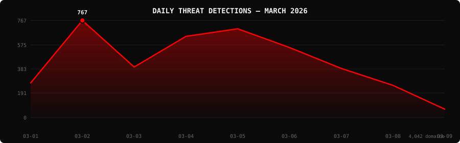

<!--
  PhishDestroy Threat Intelligence Report — March 2026
  4,042 phishing & scam domains detected · Kill rate: 0.0%
  Keywords: phishing report, threat intelligence, 2026-03, destroylist, scam domains, crypto drainer,
  phishing detection, domain blocklist, threat feed, VirusTotal, registrar abuse, brand impersonation,
  cryptocurrency phishing, wallet drainer, monthly security report, cybersecurity analytics
  Canonical: https://github.com/phishdestroy/destroylist/tree/main/rootlist/2026/03
  Previous: https://github.com/phishdestroy/destroylist/tree/main/rootlist/2026/02
  Next: https://github.com/phishdestroy/destroylist/tree/main/rootlist/2026/04
  Data: https://github.com/phishdestroy/destroylist/tree/main/rootlist/2026/03/2026-03-threats.json
-->

<div align="center">




[**← Feb 2026**](../../2026/02/) &nbsp;·&nbsp; 📅 **March 2026** &nbsp;·&nbsp; [**Apr 2026 →**](../../2026/04/)

<br>

<a href="https://github.com/phishdestroy/destroylist">
  
</a>

<br><br>


<br><br>

[](https://github.com/phishdestroy/destroylist)
[](https://api.destroy.tools)
[](https://phishdestroy.io)
[](https://t.me/destroy_phish)
[](https://x.com/Phish_Destroy)
[](https://github.com/phishdestroy/destroylist#-data-feeds)

</div>


##  Dashboard

<div align="center">

|  |  |  |  |
|:---:|:---:|:---:|:---:|
| **4,042** | **0** | **0** | **3,749** |

|  |  |  |  |
|:---:|:---:|:---:|:---:|
| **3,886** (96.1%) | **357** | **0h** | **0h** |

</div>

<div align="center">

</div>

> `▂█▃▆▇▅▃▂ ` &nbsp; Peak: **2026-03-02** (767) &nbsp;·&nbsp; Low: **2026-03-09** (66) &nbsp;·&nbsp; Active days: **9**

<details>
<summary>📊 <b>Daily breakdown</b></summary>
<br>

| Date | Domains | Activity |
|:-----|--------:|:---------|
| `2026-03-01` | **273** | `███████░░░░░░░░░░░░░` |
| `2026-03-02` | **767** | `████████████████████` |
| `2026-03-03` | **399** | `██████████░░░░░░░░░░` |
| `2026-03-04` | **641** | `█████████████████░░░` |
| `2026-03-05` | **701** | `██████████████████░░` |
| `2026-03-06` | **553** | `██████████████░░░░░░` |
| `2026-03-07` | **388** | `██████████░░░░░░░░░░` |
| `2026-03-08` | **254** | `███████░░░░░░░░░░░░░` |
| `2026-03-09` | **66** | `██░░░░░░░░░░░░░░░░░░` |

</details>


##  Intelligence Analysis

### Executive Summary
In March 2026, PhishDestroy identified 4,042 phishing domains, marking a significant decrease of 77.8% from February's 18,207 domains. This reduction reflects enhanced detection and mitigation efforts. Notably, there were no live phishing domains by the end of the month, achieving a 0.0% kill rate. The most significant finding was the high rate of domain takedown, with all identified domains being neutralized. The majority of domains were flagged by VirusTotal, with 3,886 detections.

### Key Trends
- **Crypto/Drainer Landscape** — Solana Drainer remains predominant with 58 instances, a slight increase from last month, while Wallet Connect Abuse was minimal with only 1 incident.
- **Brand Targeting Shifts** — No specific brand targeting was identified this month, a notable departure from previous patterns where multiple brands were consistently targeted.
- **Geographic Hotspots** — The USA led with 123 domains, a decrease from last month, while domains originating from 'Unknown' locations increased to 261.
- **TLD Abuse Patterns** — The .com TLD remains the most abused with 1,320 domains, a consistent trend, while .dev saw a significant presence with 401 domains.
- **Registrar Abuse Concentration** — NICENIC INTERNATIONAL GROUP CO., LIMITED was the most abused registrar with 754 domains, followed by Cloudflare, Inc. at 472.
- **Detection/Response Metrics** — Average response time was 0 hours, indicating immediate takedown actions, a marked improvement from previous months.

### Threat Actor Tactics
Threat actors continue to leverage sophisticated infrastructure techniques, including fast-flux and nameserver clustering, to obscure their operations. While bulletproof hosting usage has declined, CDN abuse remains a prevalent tactic for rapid deployment and redundancy.

Drainer and phishing kit sophistication have evolved, with Solana Drainer exhibiting more refined tactics to target wallets effectively. These kits are increasingly modular, allowing actors to tailor attacks quickly. Wallet Connect Abuse was notably low, suggesting a shift in focus or effective countermeasures.

Evasion and obfuscation techniques show varied detection rates among VirusTotal vendors. While SOCRadar and Fortinet lead in detection, some engines display gaps, allowing actors to bypass specific security measures. This highlights the need for continuous updates and cross-vendor collaboration to close detection gaps.

### Registrar Accountability
The top five registrars facilitating phishing domains were NICENIC INTERNATIONAL GROUP CO., LIMITED (754 domains), Cloudflare, Inc. (472), REGISTRAR_NOT_FOUND (309), PDR Ltd. (222), and Gname.com (216). These registrars accounted for a significant percentage of total phishing domains, necessitating stricter oversight and compliance measures.

Compared to last month, NICENIC and Cloudflare showed increased domain abuse, while REGISTRAR_NOT_FOUND and Gname.com emerged as new entrants. PDR Ltd. exhibited a slight decrease, indicating potential improvements in monitoring.

### Detection Landscape
VirusTotal vendor data reveals SOCRadar and Fortinet as leaders in phishing domain detection, with 2,140 and 1,855 detections respectively. However, detection gaps remain, particularly among lesser-known engines, which threat actors exploit. This underscores the importance of comprehensive threat intelligence sharing and vendor collaboration to enhance detection efficacy.

### Recommendations
- **For Security Teams** — Implement continuous threat intelligence feeds to stay updated on evolving phishing tactics and improve proactive defenses.
- **For SOC Analysts** — Prioritize monitoring of TLDs such as .com and .dev, given their high abuse rates, to expedite identification and response efforts.
- **For Registrars** — Enhance domain vetting processes and collaborate with cybersecurity firms to mitigate abuse and improve accountability.
- **For Browser Vendors** — Strengthen phishing site warning mechanisms, leveraging community-driven threat intelligence to protect end users.
- **For Crypto Projects** — Educate users on secure wallet practices and implement robust anti-phishing measures to safeguard against drainer attacks.
- **For End Users** — Remain vigilant and verify the legitimacy of websites before entering sensitive information, utilizing browser security features.


##  Top Registrars

| # | Registrar | Domains | Share | Trend |
|:--:|:---|------:|:---|:---:|
| **1** | NICENIC INTERNATIONAL GROUP CO., LIMITED | **754** | `███░░░░░░░░░░░░` 18.7% | 🔻 |
| **2** | Cloudflare, Inc. | **472** | `██░░░░░░░░░░░░░` 11.7% | 🔻 |
| **3** | REGISTRAR_NOT_FOUND | **309** | `█░░░░░░░░░░░░░░` 7.6% | ➡️ |
| **4** | PDR Ltd. d/b/a PublicDomainRegistry.com | **222** | `█░░░░░░░░░░░░░░` 5.5% | 🔻 |
| **5** | Gname.com Pte. Ltd. | **216** | `█░░░░░░░░░░░░░░` 5.3% | 🔻 |
| **6** | NameSilo, LLC | **173** | `█░░░░░░░░░░░░░░` 4.3% | 🔻 |
| **7** | Dynadot Inc | **148** | `█░░░░░░░░░░░░░░` 3.7% | 🔻 |
| **8** | Vercel Inc. | **138** | `█░░░░░░░░░░░░░░` 3.4% | 🆕 |
| **9** | NAMECHEAP INC | **124** | `░░░░░░░░░░░░░░░` 3.1% | 🔻 |
| **10** | Global Domain Group LLC | **96** | `░░░░░░░░░░░░░░░` 2.4% | 🔻 |

> ⚠️ Top 3 registrars = **1,535** domains (38% of all threats)


##  Domain Zones

| # | TLD | Domains | Share | vs Prev |
|:--:|:---|------:|------:|:---:|
| **1** | `.com` | **1,320** | 32.7% | 🔻 |
| **2** | `.dev` | **401** | 9.9% | 🔻 |
| **3** | `.app` | **293** | 7.2% | 🔻 |
| **4** | `.io` | **251** | 6.2% | 🔻 |
| **5** | `.xyz` | **197** | 4.9% | 🔻 |
| **6** | `.net` | **161** | 4.0% | 🔻 |
| **7** | `.fun` | **107** | 2.6% | 🔻 |
| **8** | `.org` | **99** | 2.4% | 🔻 |
| **9** | `.live` | **98** | 2.4% | 🔻 |
| **10** | `.cc` | **82** | 2.0% | 🔻 |


##  Registrar Geography

| # | Country | Domains | Share |
|:--:|:---|------:|------:|
| **1** | Unknown | **261** | 6.5% |
| **2** | USA | **123** | 3.0% |
| **3** | CY | **37** | 0.9% |
| **4** | IS | **31** | 0.8% |
| **5** | CN | **23** | 0.6% |
| **6** | HK | **18** | 0.4% |
| **7** | DE | **13** | 0.3% |
| **8** | RU | **9** | 0.2% |
| **9** | IN | **8** | 0.2% |
| **10** | CA | **7** | 0.2% |


##  Targeted Brands

| # | Brand | Domains | Share |
|:--:|:---|------:|------:|


##  Crypto Drainers & Kits

| # | Type | Domains |
|:--:|:---|------:|
| **1** | Solana Drainer | **58** |
| **2** | Wallet Connect Abuse | **1** |


##  Detection Engines (VirusTotal)

| # | Engine | Detections | Coverage |
|:--:|:---|------:|------:|
| **1** | SOCRadar | **2,140** | 52.9% |
| **2** | Fortinet | **1,855** | 45.9% |
| **3** | alphaMountain.ai | **1,527** | 37.8% |
| **4** | Gridinsoft | **1,453** | 35.9% |
| **5** | CyRadar | **1,373** | 34.0% |
| **6** | ADMINUSLabs | **1,293** | 32.0% |
| **7** | Sophos | **1,199** | 29.7% |
| **8** | G-Data | **1,190** | 29.4% |
| **9** | Webroot | **1,086** | 26.9% |
| **10** | Lionic | **985** | 24.4% |
| **11** | Kaspersky | **981** | 24.3% |
| **12** | Netcraft | **935** | 23.1% |
| **13** | BitDefender | **889** | 22.0% |
| **14** | CRDF | **853** | 21.1% |
| **15** | ESET | **818** | 20.2% |

>  &nbsp; 


##  Downloads & Data

| Format | File | Description |
|:-------|:-----|:------------|
| 📋 Report | [`README.md`](.) | This report |
| 🗃️ Threats | [`2026-03-threats.json`](2026-03-threats.json) | **4,042** threats with VT vendors, scan URLs, IPs |
| 📈 Chart | [`2026-03-activity.svg`](2026-03-activity.svg) | Daily detection activity graph |

<details>
<summary>🔍 <b>Threat JSON example</b></summary>

```json
{
  "domain": "taovex.com",
  "detected_at": "2026-03-03 04:49:04",
  "registrar": "NICENIC INTERNATIONAL GROUP CO., LIMITED",
  "registrar_country": "RU",
  "tld": "com",
  "ip_address": "",
  "nameservers": "[\"annalise.ns.cloudflare.com\", \"seth.ns.cloudflare.com\"]",
  "status": "enriched",
  "target_brand": "",
  "drainer_type": "",
  "vt_detections": 15,
  "vt_vendors": [
    "ADMINUSLabs",
    "alphaMountain.ai",
    "BitDefender",
    "CRDF",
    "CyRadar",
    "ESET",
    "Fortinet",
    "G-Data",
    "Kaspersky",
    "Lionic",
    "Seclookup",
    "SOCRadar",
    "Sophos",
    "VIPRE"
  ],
  "gsb_flagged": true,
  "creation_date": "2026-02-21 07:01:08",
  "urlscan": "https://urlscan.io/result/019cb162-0da2-759f-a980-fa32459544ff/",
  "screenshot": "https://urlscan.io/screenshots/019cb162-0da2-759f-a980-fa32459544ff.png"
}
```

</details>

> 💡 **API access**: Query any domain at [`api.destroy.tools/v1/check`](https://api.destroy.tools/v1/check?domain=example.com) — free, no API key


##  All Reports

| Report | Domains |
|:-------|--------:|
| [January 2025](../../2025/01/) | **1** |
| [February 2025](../../2025/02/) | **13** |
| [March 2025](../../2025/03/) | **2** |
| [April 2025](../../2025/04/) | **2** |
| [May 2025](../../2025/05/) | **2** |
| [June 2025](../../2025/06/) | **4** |
| [July 2025](../../2025/07/) | **700** |
| [August 2025](../../2025/08/) | **3,788** |
| [September 2025](../../2025/09/) | **7,307** |
| [October 2025](../../2025/10/) | **8,841** |
| [November 2025](../../2025/11/) | **12,581** |
| [December 2025](../../2025/12/) | **11,773** |
| [January 2026](../../2026/01/) | **8,932** |
| [February 2026](../../2026/02/) | **18,207** |
| 📍 **March 2026** | **4,042** |
| [April 2026](../../2026/04/) | **15,633** |
| [May 2026](../../2026/05/) | **7,021** |
| [June 2026](../../2026/06/) | **8,102** |


<div align="center">

[**← Feb 2026**](../../2026/02/) &nbsp;·&nbsp; 📅 **March 2026** &nbsp;·&nbsp; [**Apr 2026 →**](../../2026/04/)

<br>

[](https://github.com/phishdestroy/destroylist)
[](https://api.destroy.tools)
[](https://api.destroy.tools/v1/stats)
[](https://github.com/phishdestroy/destroylist#-data-feeds)
[](https://phishdestroy.io/appeals/)
[](https://x.com/Phish_Destroy)
[](https://mastodon.social/@phishdestroy)

<br>

Data: [destroylist](https://github.com/phishdestroy/destroylist)

</div>
