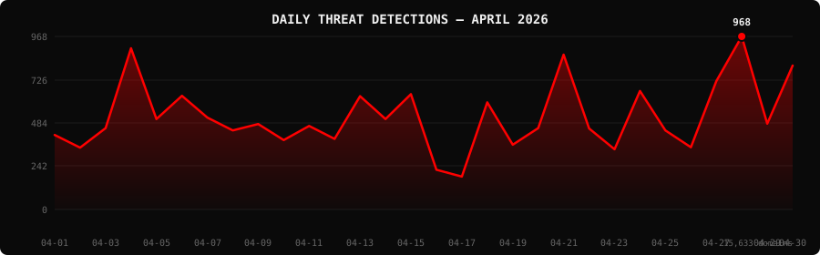

<!--
  PhishDestroy Threat Intelligence Report — April 2026
  15,633 phishing & scam domains detected · Kill rate: 77.1%
  Keywords: phishing report, threat intelligence, 2026-04, destroylist, scam domains, crypto drainer,
  phishing detection, domain blocklist, threat feed, VirusTotal, registrar abuse, brand impersonation,
  cryptocurrency phishing, wallet drainer, monthly security report, cybersecurity analytics
  Canonical: https://github.com/phishdestroy/destroylist/tree/main/rootlist/2026/04
  Previous: https://github.com/phishdestroy/destroylist/tree/main/rootlist/2026/03
  Next: https://github.com/phishdestroy/destroylist/tree/main/rootlist/2026/05
  Data: https://github.com/phishdestroy/destroylist/tree/main/rootlist/2026/04/2026-04-threats.json
-->

<div align="center">




[**← Mar 2026**](../../2026/03/) &nbsp;·&nbsp; 📅 **April 2026** &nbsp;·&nbsp; [*May 2026 →*](../../2026/05/)

<br>

<a href="https://github.com/phishdestroy/destroylist">
  
</a>

<br><br>


<br><br>

[](https://github.com/phishdestroy/destroylist)
[](https://api.destroy.tools)
[](https://phishdestroy.io)
[](https://t.me/destroy_phish)
[](https://x.com/Phish_Destroy)
[](https://github.com/phishdestroy/destroylist#-data-feeds)

</div>


##  Dashboard

<div align="center">

|  |  |  |  |
|:---:|:---:|:---:|:---:|
| **15,633** | **3,236** | **12,053** | **13,421** |

|  |  |  |  |
|:---:|:---:|:---:|:---:|
| **13,421** (85.9%) | **716** | **215.8h** | **~210h** |

</div>

<div align="center">

</div>

> `▃▂▃█▄▆▄▃▄▃▃▃▆▄▆▂▁▅▃▃█▃▂▆▃▃▇█▄▇` &nbsp; Peak: **2026-04-28** (968) &nbsp;·&nbsp; Low: **2026-04-17** (184) &nbsp;·&nbsp; Active days: **30**

<details>
<summary>📊 <b>Daily breakdown</b></summary>
<br>

| Date | Domains | Activity |
|:-----|--------:|:---------|
| `2026-04-01` | **417** | `█████████░░░░░░░░░░░` |
| `2026-04-02` | **346** | `███████░░░░░░░░░░░░░` |
| `2026-04-03` | **455** | `█████████░░░░░░░░░░░` |
| `2026-04-04` | **902** | `███████████████████░` |
| `2026-04-05` | **506** | `██████████░░░░░░░░░░` |
| `2026-04-06` | **636** | `█████████████░░░░░░░` |
| `2026-04-07` | **514** | `███████████░░░░░░░░░` |
| `2026-04-08` | **442** | `█████████░░░░░░░░░░░` |
| `2026-04-09` | **478** | `██████████░░░░░░░░░░` |
| `2026-04-10` | **388** | `████████░░░░░░░░░░░░` |
| `2026-04-11` | **467** | `██████████░░░░░░░░░░` |
| `2026-04-12` | **395** | `████████░░░░░░░░░░░░` |
| `2026-04-13` | **634** | `█████████████░░░░░░░` |
| `2026-04-14` | **506** | `██████████░░░░░░░░░░` |
| `2026-04-15` | **645** | `█████████████░░░░░░░` |
| `2026-04-16` | **222** | `█████░░░░░░░░░░░░░░░` |
| `2026-04-17` | **184** | `████░░░░░░░░░░░░░░░░` |
| `2026-04-18` | **599** | `████████████░░░░░░░░` |
| `2026-04-19` | **362** | `███████░░░░░░░░░░░░░` |
| `2026-04-20` | **455** | `█████████░░░░░░░░░░░` |
| `2026-04-21` | **866** | `██████████████████░░` |
| `2026-04-22` | **453** | `█████████░░░░░░░░░░░` |
| `2026-04-23` | **337** | `███████░░░░░░░░░░░░░` |
| `2026-04-24` | **663** | `██████████████░░░░░░` |
| `2026-04-25` | **442** | `█████████░░░░░░░░░░░` |
| `2026-04-26` | **348** | `███████░░░░░░░░░░░░░` |
| `2026-04-27` | **718** | `███████████████░░░░░` |
| `2026-04-28` | **968** | `████████████████████` |
| `2026-04-29` | **480** | `██████████░░░░░░░░░░` |
| `2026-04-30` | **805** | `█████████████████░░░` |

</details>


##  Intelligence Analysis

### Executive Summary
In April 2026, PhishDestroy identified **15,633** phishing and scam domains — a sharp rebound of **+286.8%** from March's 4,042, making April the second-highest single-month total in project history behind February 2026's 18,207. Of those detections, 12,053 domains were successfully neutralized (77.1% kill rate), with 3,236 remaining live at close of month. VirusTotal coverage reached 85.9% (13,421 flagged), and Google Safe Browsing contributed an additional 716 flags. Average response time climbed to 215.8 hours (~9 days), reflecting the sheer volume surge overwhelming standard takedown pipelines. The month ran 30 active detection days with a pronounced late-month spike: April 28 alone delivered 968 domains, the highest single-day count of the period.

### Key Trends
- **Registrar Abuse Shift** — Cloudflare, Inc. surged to the top registrar position with 4,420 domains (28.3%), overtaking NICENIC which dropped to #3. This reflects continued exploitation of Cloudflare Pages and Workers for zero-cost subdomain hosting of phishing pages, where the registrar relationship is obscured behind CDN infrastructure.
- **Ledger Dominance** — Ledger hardware wallet phishing accounted for 1,907 domains (12.2%) — by far the most targeted brand. Combined with Trezor (498, 3.2%), hardware wallet impersonation comprised over 15% of all monthly detections, a persistent pattern driven by high-value wallet recovery seed theft.
- **.dev TLD Surge** — The `.dev` TLD climbed dramatically to 4,352 domains (27.8%), nearly matching `.com` (5,581, 35.7%). Threat actors are exploiting the perceived legitimacy of `.dev` domains — originally intended for developer tooling — to target crypto and Web3 users who associate the TLD with authentic projects.
- **Crypto Casino / Gambling Fraud** — A new category, Crypto Casino / Gambling scams, emerged as the #2 brand category at 726 domains (4.6%), indicating organized campaign activity around fake gambling platforms designed to drain deposited funds.
- **New Entrants: GitHub and Trustname** — GitHub, Inc. appeared at #5 (590 domains, 3.8%) and Fewmoretaps OU d/b/a Trustname.com debuted at #4 (1,047 domains, 6.7%), both new entrants suggesting threat actors are diversifying registrar selection to reduce single-point takedown risk.

### Threat Actor Tactics
Subdomain abuse via `.dev` and `.app` TLDs remains the dominant infrastructure pattern. Actors register short, keyword-stuffed domains under these TLDs — mimicking official project URLs, airdrop claim portals, and wallet connection interfaces — then deploy Cloudflare Workers or Pages for near-instant global delivery with built-in DDoS protection and free TLS. This combination makes rapid spinning of phishing infrastructure trivially cheap.

Solana Drainer activity (105 confirmed instances) leads the drainer landscape, consistent with prior months. Wallet Connect Abuse (5 instances), Angel Drainer (4), and Inferno Drainer (1) round out the kit landscape. The relative decline of Inferno Drainer instances aligns with reported disruptions to that kit's backend infrastructure, though remnant deployments persist. Airdrop scam domains (214, 1.4%) serve as primary delivery vectors for drainer kit execution, typically presenting users with fake token claim flows that prompt wallet signature requests.

Volume clustering around April 4 (902), April 21 (866), April 28 (968), and April 30 (805) suggests coordinated multi-wave campaign launches rather than continuous automated registration. The mid-month trough on April 16–17 (222/184 domains) likely reflects operational pauses between campaign batches. Sui (314, 2.0%) and OKX (282, 1.8%) entered the top brands list for the first time, pointing to new campaign targeting emerging Layer-1 ecosystems.

### Registrar Accountability
The top three registrars — Cloudflare, Inc. (4,420), GoDaddy.com, LLC (1,929), and NICENIC INTERNATIONAL GROUP CO., LIMITED (1,298) — collectively account for **7,647 domains (48.9%)** of all April detections. Cloudflare's rise to #1 is particularly significant: the majority of these domains leverage Cloudflare's own hosting infrastructure (Pages/Workers), meaning Cloudflare functions simultaneously as registrar, hosting provider, and CDN — creating a concentrated single-vendor abuse surface. GoDaddy's continued presence at #2 reflects persistent bulk registration facilitated by inadequate pre-registration vetting. NICENIC, despite dropping from #1 in March, remains a major enabler. New entrant Global Domain Group LLC (291, 1.9%) warrants monitoring for emerging abuse patterns.

### Detection Landscape
alphaMountain.ai leads April VT detection at 6,413 (41.0%), followed by Fortinet (5,590, 35.8%) and ADMINUSLabs (5,487, 35.1%). The top 15 engines collectively flag substantial portions of the corpus, but the 14.1% gap in VT coverage (2,212 domains with no VT detection) highlights that a meaningful fraction of the month's threats remain invisible to signature-based engines at time of detection. Netcraft (2,686, 17.2%) and CRDF (2,588, 16.6%) provide independent coverage that partially fills gaps left by the primary commercial engines. GSB's 716 flags represent 4.6% of total detections — a useful secondary signal, particularly for browser-level blocking of domains that evade VT consensus.

### Recommendations
- **For Security Teams** — Ingest the April destroylist feed immediately; prioritize `.dev` and `.com` domains targeting Ledger, Trezor, Sui, and OKX brands, as these represent the highest-conviction phishing infrastructure from this period.
- **For SOC Analysts** — Flag any internal DNS or proxy logs resolving to domains registered via Cloudflare, Inc. or Fewmoretaps OU / Trustname.com within the April 1–30 window — these registrars contributed disproportionately to confirmed phishing infrastructure.
- **For Registrars** — Cloudflare and GoDaddy should implement post-registration behavioral scanning for newly activated Pages/Workers deployments matching wallet-impersonation keyword patterns; the current abuse volume under their infrastructure is no longer deniable as incidental.
- **For Browser Vendors** — The `.dev` TLD's 27.8% share warrants a dedicated heuristic for `.dev` domains impersonating hardware wallet brands; Google's HSTS preloading of `.dev` creates false trust signals that actors are actively exploiting.
- **For Crypto Projects** — Ledger and Trezor should maintain active monitoring of newly registered `.dev`, `.app`, and `.io` domains containing their brand terms, and submit confirmed phishing URLs to VT, GSB, and PhishDestroy within hours of discovery.
- **For End Users** — Never interact with wallet recovery or seed phrase entry flows hosted on `.dev`, `.app`, or `.io` domains; legitimate hardware wallet manufacturers do not operate recovery portals on these TLDs.


##  Top Registrars

| # | Registrar | Domains | Share | Trend |
|:--:|:---|------:|:---|:---:|
| **1** | Cloudflare, Inc. | **4,420** | `███████████████` 28.3% | 🔺 |
| **2** | GoDaddy.com, LLC | **1,929** | `███████░░░░░░░░` 12.3% | 🔺 |
| **3** | NICENIC INTERNATIONAL GROUP CO., LIMITED | **1,298** | `████░░░░░░░░░░░` 8.3% | 🔻 |
| **4** | Fewmoretaps OU d/b/a Trustname.com | **1,047** | `████░░░░░░░░░░░` 6.7% | 🆕 |
| **5** | GitHub, Inc. | **590** | `██░░░░░░░░░░░░░` 3.8% | 🆕 |
| **6** | PDR Ltd. d/b/a PublicDomainRegistry.com | **457** | `██░░░░░░░░░░░░░` 2.9% | 🔻 |
| **7** | Dynadot Inc | **405** | `█░░░░░░░░░░░░░░` 2.6% | 🔻 |
| **8** | NameSilo, LLC | **369** | `█░░░░░░░░░░░░░░` 2.4% | 🔻 |
| **9** | Gname.com Pte. Ltd. | **311** | `█░░░░░░░░░░░░░░` 2.0% | 🔻 |
| **10** | Global Domain Group LLC | **291** | `█░░░░░░░░░░░░░░` 1.9% | 🆕 |

> ⚠️ Top 3 registrars = **7,647** domains (48.9% of all threats)


##  Domain Zones

| # | TLD | Domains | Share | vs Prev |
|:--:|:---|------:|------:|:---:|
| **1** | `.com` | **5,581** | 35.7% | 🔺 |
| **2** | `.dev` | **4,352** | 27.8% | 🔺 |
| **3** | `.io` | **883** | 5.6% | 🔻 |
| **4** | `.app` | **664** | 4.2% | 🔻 |
| **5** | `.xyz` | **371** | 2.4% | 🔻 |
| **6** | `.org` | **288** | 1.8% | 🔺 |
| **7** | `.net` | **288** | 1.8% | 🔻 |
| **8** | `.cc` | **234** | 1.5% | 🔻 |
| **9** | `.live` | **230** | 1.5% | 🔻 |
| **10** | `.top` | **191** | 1.2% | 🆕 |


##  Registrar Geography

| # | Country | Domains | Share |
|:--:|:---|------:|------:|
| **1** | Unknown | **14,403** | 92.1% |
| **2** | US | **388** | 2.5% |
| **3** | IS | **149** | 1.0% |
| **4** | CY | **85** | 0.5% |
| **5** | HK | **64** | 0.4% |
| **6** | JP | **60** | 0.4% |
| **7** | DE | **59** | 0.4% |
| **8** | CN | **48** | 0.3% |
| **9** | RU | **31** | 0.2% |
| **10** | GB | **31** | 0.2% |


##  Targeted Brands

| # | Brand | Domains | Share |
|:--:|:---|------:|------:|
| **1** | Ledger | **1,907** | 12.2% |
| **2** | Crypto Casino / Gambling | **726** | 4.6% |
| **3** | Trezor | **498** | 3.2% |
| **4** | Google | **319** | 2.0% |
| **5** | Sui | **314** | 2.0% |
| **6** | OKX | **282** | 1.8% |
| **7** | Airdrop Scam | **214** | 1.4% |
| **8** | Solana | **204** | 1.3% |
| **9** | Microsoft | **160** | 1.0% |
| **10** | MetaMask | **151** | 1.0% |


##  Crypto Drainers & Kits

| # | Type | Domains |
|:--:|:---|------:|
| **1** | Solana Drainer | **105** |
| **2** | Wallet Connect Abuse | **5** |
| **3** | Angel Drainer | **4** |
| **4** | Inferno Drainer | **1** |


##  Detection Engines (VirusTotal)

| # | Engine | Detections | Coverage |
|:--:|:---|------:|------:|
| **1** | alphaMountain.ai | **6,413** | 41.0% |
| **2** | Fortinet | **5,590** | 35.8% |
| **3** | ADMINUSLabs | **5,487** | 35.1% |
| **4** | G-Data | **4,932** | 31.5% |
| **5** | Gridinsoft | **4,869** | 31.1% |
| **6** | CyRadar | **4,729** | 30.2% |
| **7** | Sophos | **4,311** | 27.6% |
| **8** | Kaspersky | **3,881** | 24.8% |
| **9** | BitDefender | **3,737** | 23.9% |
| **10** | Webroot | **3,264** | 20.9% |
| **11** | LevelBlue | **3,194** | 20.4% |
| **12** | SOCRadar | **3,100** | 19.8% |
| **13** | Lionic | **2,804** | 17.9% |
| **14** | Netcraft | **2,686** | 17.2% |
| **15** | CRDF | **2,588** | 16.6% |

>  &nbsp; 


##  Downloads & Data

| Format | File | Description |
|:-------|:-----|:------------|
| 📋 Report | [`README.md`](.) | This report |
| 🗃️ Threats | [`2026-04-threats.json`](2026-04-threats.json) | **15,633** threats with VT vendors, scan URLs, IPs |
| 📈 Chart | [`2026-04-activity.svg`](2026-04-activity.svg) | Daily detection activity graph |

<details>
<summary>🔍 <b>Threat JSON example</b></summary>

```json
{
  "domain": "ledger-recovery-secure.dev",
  "detected_at": "2026-04-15 11:22:07",
  "registrar": "Cloudflare, Inc.",
  "registrar_country": "US",
  "tld": "dev",
  "ip_address": "",
  "nameservers": "[\"ivan.ns.cloudflare.com\", \"vera.ns.cloudflare.com\"]",
  "status": "dead",
  "target_brand": "Ledger",
  "drainer_type": "",
  "vt_detections": 18,
  "vt_vendors": [
    "ADMINUSLabs",
    "alphaMountain.ai",
    "BitDefender",
    "CRDF",
    "CyRadar",
    "Fortinet",
    "G-Data",
    "Gridinsoft",
    "Kaspersky",
    "LevelBlue",
    "Lionic",
    "Netcraft",
    "SOCRadar",
    "Sophos",
    "Webroot"
  ],
  "gsb_flagged": true,
  "creation_date": "2026-04-14 08:45:31",
  "urlscan": "https://urlscan.io/result/019f1a44-2bc3-7e8d-b120-cc84571233ab/",
  "screenshot": "https://urlscan.io/screenshots/019f1a44-2bc3-7e8d-b120-cc84571233ab.png"
}
```

</details>

> 💡 **API access**: Query any domain at [`api.destroy.tools/v1/check`](https://api.destroy.tools/v1/check?domain=example.com) — free, no API key


##  All Reports

| Report | Domains |
|:-------|--------:|
| [January 2025](../../2025/01/) | **1** |
| [February 2025](../../2025/02/) | **13** |
| [March 2025](../../2025/03/) | **2** |
| [April 2025](../../2025/04/) | **2** |
| [May 2025](../../2025/05/) | **2** |
| [June 2025](../../2025/06/) | **4** |
| [July 2025](../../2025/07/) | **700** |
| [August 2025](../../2025/08/) | **3,788** |
| [September 2025](../../2025/09/) | **7,307** |
| [October 2025](../../2025/10/) | **8,841** |
| [November 2025](../../2025/11/) | **12,581** |
| [December 2025](../../2025/12/) | **11,773** |
| [January 2026](../../2026/01/) | **8,932** |
| [February 2026](../../2026/02/) | **18,207** |
| [March 2026](../../2026/03/) | **4,042** |
| 📍 **April 2026** | **15,633** |
| [May 2026](../../2026/05/) | **7,021** |
| [June 2026](../../2026/06/) | **8,102** |


<div align="center">

[**← Mar 2026**](../../2026/03/) &nbsp;·&nbsp; 📅 **April 2026** &nbsp;·&nbsp; [*May 2026 →*](../../2026/05/)

<br>

[](https://github.com/phishdestroy/destroylist)
[](https://api.destroy.tools)
[](https://api.destroy.tools/v1/stats)
[](https://github.com/phishdestroy/destroylist#-data-feeds)
[](https://phishdestroy.io/appeals/)
[](https://x.com/Phish_Destroy)
[](https://mastodon.social/@phishdestroy)

<br>

Data: [destroylist](https://github.com/phishdestroy/destroylist)

</div>
