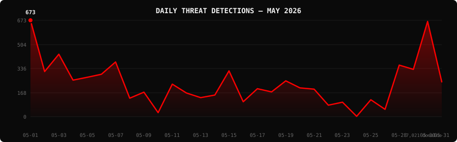

<!--
  PhishDestroy Threat Intelligence Report — May 2026
  7,021 phishing & scam domains detected · Kill rate: 80.3%
  Keywords: phishing report, threat intelligence, 2026-05, destroylist, scam domains, crypto drainer,
  phishing detection, domain blocklist, threat feed, VirusTotal, registrar abuse, brand impersonation,
  cryptocurrency phishing, wallet drainer, monthly security report, cybersecurity analytics
  Canonical: https://github.com/phishdestroy/destroylist/tree/main/rootlist/2026/05
  Previous: https://github.com/phishdestroy/destroylist/tree/main/rootlist/2026/04
  Next: https://github.com/phishdestroy/destroylist/tree/main/rootlist/2026/06
  Data: https://github.com/phishdestroy/destroylist/tree/main/rootlist/2026/05/2026-05-threats.json
-->

[**← Apr 2026**](../../2026/04/) &nbsp;·&nbsp; 📅 **May 2026** &nbsp;·&nbsp; [**Jun 2026 →**](../../2026/06/)

 

  

  

##  Dashboard

|  |  |  |  |
|:---:|:---:|:---:|:---:|
| **7,021** | **1,283** | **5,635** | **6,079** |

|  |  |  |  |
|:---:|:---:|:---:|:---:|
| **6,079** (86.6%) | **531** | **105.5h** | **100h** |

> Peak: **2026-05-01** (673) &nbsp;·&nbsp; Low: **2026-05-24** (2) &nbsp;·&nbsp; Active days: **30**

📊 <b>Daily breakdown</b>

 

| Date | Domains | Activity |
|:-----|--------:|:---------|
| `2026-05-01` | **673** | `████████████████████` |
| `2026-05-02` | **315** | `█████████░░░░░░░░░░░` |
| `2026-05-03` | **436** | `█████████████░░░░░░░` |
| `2026-05-04` | **255** | `███████░░░░░░░░░░░░░` |
| `2026-05-05` | **275** | `████████░░░░░░░░░░░░` |
| `2026-05-06` | **296** | `████████░░░░░░░░░░░░` |
| `2026-05-07` | **382** | `███████████░░░░░░░░░` |
| `2026-05-08` | **129** | `███░░░░░░░░░░░░░░░░░` |
| `2026-05-09` | **171** | `█████░░░░░░░░░░░░░░░` |
| `2026-05-10` | **28** | `░░░░░░░░░░░░░░░░░░░░` |
| `2026-05-11` | **227** | `██████░░░░░░░░░░░░░░` |
| `2026-05-12` | **165** | `████░░░░░░░░░░░░░░░░` |
| `2026-05-13` | **133** | `███░░░░░░░░░░░░░░░░░` |
| `2026-05-14` | **151** | `████░░░░░░░░░░░░░░░░` |
| `2026-05-15` | **320** | `█████████░░░░░░░░░░░` |
| `2026-05-16` | **104** | `███░░░░░░░░░░░░░░░░░` |
| `2026-05-17` | **195** | `█████░░░░░░░░░░░░░░░` |
| `2026-05-18` | **173** | `█████░░░░░░░░░░░░░░░` |
| `2026-05-19` | **250** | `███████░░░░░░░░░░░░░` |
| `2026-05-20` | **201** | `█████░░░░░░░░░░░░░░░` |
| `2026-05-21` | **192** | `█████░░░░░░░░░░░░░░░` |
| `2026-05-22` | **80** | `██░░░░░░░░░░░░░░░░░░` |
| `2026-05-23` | **101** | `███░░░░░░░░░░░░░░░░░` |
| `2026-05-24` | **2** | `░░░░░░░░░░░░░░░░░░░░` |
| `2026-05-25` | **118** | `███░░░░░░░░░░░░░░░░░` |
| `2026-05-27` | **51** | `█░░░░░░░░░░░░░░░░░░░` |
| `2026-05-28` | **360** | `██████████░░░░░░░░░░` |
| `2026-05-29` | **330** | `█████████░░░░░░░░░░░` |
| `2026-05-30` | **665** | `███████████████████░` |
| `2026-05-31` | **243** | `███████░░░░░░░░░░░░░` |

##  Intelligence Analysis

### Executive Summary

May 2026 recorded **7,021** phishing domains — a **55% decrease** from April's 15,633, continuing the oscillating pattern observed throughout 2026. Despite the volume drop, the kill rate improved to **80.3%** (5,635 domains taken down), and average response time dropped sharply to **105.5h** — less than half of April's 215.8h — indicating faster takedown workflows and improved registrar cooperation. GoDaddy.com reclaimed the top registrar position after Cloudflare's April surge. Ledger remained the primary brand target, while Trust Wallet and MetaMask surged as new focal points, suggesting threat actors are diversifying hardware-wallet targeting into software wallets.

### Key Trends

- **Volume Normalization** — The 55% drop from April reflects campaign cycle completion and registrar enforcement actions following high-volume CDN infrastructure abuse in April.
- **Response Time Improvement** — Average response of 105.5h (vs 215.8h in April) signals faster registrar abuse processing and improved automated CDN takedowns.
- **Trust Wallet & MetaMask Rise** — Trust Wallet (114) and MetaMask (132) entered the top brands alongside Ledger (293), confirming a strategy shift from single-brand to multi-wallet targeting.
- **`.top` TLD Surge** — `.top` reached 296 domains (4.2%), up from 1.2% in April — campaigns migrating to cheaper TLDs as CDN hosting faces increased pressure.
- **Gransy & HOSTINGER Appear** — Two new registrars entered the top 10, indicating ongoing rotation across regional providers to evade pattern-based blocking.

### Threat Actor Tactics

May campaigns showed increased brand diversification and mid-month infrastructure rotation. The sharp dip on May 10 (28 domains) followed by recovery suggests coordinated pause-and-resume cycles, consistent with organized phishing-as-a-service operations. The near-zero activity on May 24 and absence of May 26 data point to a possible enforcement action or infrastructure outage on a key distribution channel.

Solana Drainer (30 instances) remained the dominant kit, while Angel Drainer (6) and Inferno Drainer (2) showed low but persistent presence. The emergence of Base protocol as a target (79 domains) signals expansion into Layer-2 crypto ecosystems beyond established wallets.

### Registrar Accountability

GoDaddy.com, LLC led with 928 domains (13.2%), followed by NICENIC at 693 (9.9%) and Cloudflare at 634 (9.0%). Gransy, s.r.o. and HOSTINGER operations, UAB entered the top 10 as new entrants — both budget-tier registrars with growing phishing abuse patterns in the European market. Top 3 registrars account for **2,255 domains** (32.1%), down from April's 48.9%, indicating some infrastructure diversification.

### Detection Landscape

alphaMountain.ai and Fortinet maintained top positions at 2,730 and 2,703 detections. Emsisoft entered the top 15 at 1,446 and ESET climbed to 6th at 1,506, both showing improved coverage for May campaign patterns. GSB flagged 531 domains — consistent with the volume-adjusted rate from prior months.

### Recommendations

- **For Security Teams** — Monitor Trust Wallet and MetaMask phishing surges; implement wallet-brand-specific domain alerting.
- **For SOC Analysts** — The mid-month lull pattern (days 10–16) correlates with campaign rotation; use quiet periods to audit blocklist gaps.
- **For Registrars** — GoDaddy should investigate 928 phishing domains across its platform; Gransy and HOSTINGER require proactive abuse monitoring given new entry into top 10.
- **For Browser Vendors** — Expand `.top` TLD coverage; this month's surge signals a migration trend from premium to budget TLDs.
- **For Crypto Projects** — Base protocol teams should implement real-time domain monitoring given 79 phishing domains in a single month.
- **For End Users** — Be especially wary of wallet "update" and "airdrop" notifications — Ledger, MetaMask, and Trust Wallet are all actively targeted via social engineering.

##  Top Registrars

| # | Registrar | Domains | Share | Trend |
|:--:|:---|------:|:---|:---:|
| **1** | GoDaddy.com, LLC | **928** | `███░░░░░░░░░░░░` 13.2% | 🔺 |
| **2** | NICENIC INTERNATIONAL GROUP CO., LIMITED | **693** | `██░░░░░░░░░░░░░` 9.9% | 🔻 |
| **3** | Cloudflare, Inc. | **634** | `██░░░░░░░░░░░░░` 9.0% | 🔻 |
| **4** | PDR Ltd. d/b/a PublicDomainRegistry.com | **388** | `█░░░░░░░░░░░░░░` 5.5% | 🔻 |
| **5** | Global Domain Group LLC | **290** | `█░░░░░░░░░░░░░░` 4.1% | 🔺 |
| **6** | GitHub, Inc. | **228** | `░░░░░░░░░░░░░░░` 3.2% | 🔻 |
| **7** | NameSilo, LLC | **227** | `░░░░░░░░░░░░░░░` 3.2% | 🔻 |
| **8** | Gransy, s.r.o. | **200** | `░░░░░░░░░░░░░░░` 2.8% | 🆕 |
| **9** | Dynadot Inc | **195** | `░░░░░░░░░░░░░░░` 2.8% | 🔻 |
| **10** | HOSTINGER operations, UAB | **158** | `░░░░░░░░░░░░░░░` 2.2% | 🆕 |

> ⚠️ Top 3 registrars = **2,255** domains (32.1% of all threats)

##  Domain Zones

| # | TLD | Domains | Share | vs Prev |
|:--:|:---|------:|------:|:---:|
| **1** | `.com` | **2,531** | 36.0% | 🔺 |
| **2** | `.dev` | **597** | 8.5% | 🔻 |
| **3** | `.io` | **447** | 6.4% | 🔻 |
| **4** | `.app` | **409** | 5.8% | 🔻 |
| **5** | `.top` | **296** | 4.2% | 🔺 |
| **6** | `.live` | **249** | 3.5% | 🔺 |
| **7** | `.xyz` | **220** | 3.1% | 🔻 |
| **8** | `.org` | **184** | 2.6% | 🔻 |
| **9** | `.info` | **144** | 2.1% | 🆕 |
| **10** | `.net` | **119** | 1.7% | 🔻 |

##  Registrar Geography

| # | Country | Domains | Share |
|:--:|:---|------:|------:|
| **1** | Unknown | **6,380** | 90.9% |
| **2** | US | **232** | 3.3% |
| **3** | IS | **75** | 1.1% |
| **4** | CN | **31** | 0.4% |
| **5** | SC | **27** | 0.4% |
| **6** | CY | **24** | 0.3% |
| **7** | JP | **20** | 0.3% |
| **8** | DE | **17** | 0.2% |
| **9** | HK | **16** | 0.2% |
| **10** | GB | **15** | 0.2% |

##  Targeted Brands

| # | Brand | Domains | Share |
|:--:|:---|------:|------:|
| **1** | Ledger | **293** | 4.2% |
| **2** | Crypto Casino / Gambling | **228** | 3.2% |
| **3** | MetaMask | **132** | 1.9% |
| **4** | Trust Wallet | **114** | 1.6% |
| **5** | Airdrop Scam | **106** | 1.5% |
| **6** | Google | **98** | 1.4% |
| **7** | Microsoft | **96** | 1.4% |
| **8** | OKX | **95** | 1.4% |
| **9** | Solana | **84** | 1.2% |
| **10** | Base | **79** | 1.1% |

##  Crypto Drainers & Kits

| # | Type | Domains |
|:--:|:---|------:|
| **1** | Solana Drainer | **30** |
| **2** | Angel Drainer | **6** |
| **3** | Inferno Drainer | **2** |
| **4** | Wallet Connect Abuse | **2** |

##  Detection Engines (VirusTotal)

| # | Engine | Detections | Coverage |
|:--:|:---|------:|------:|
| **1** | alphaMountain.ai | **2,730** | 38.9% |
| **2** | Fortinet | **2,703** | 38.5% |
| **3** | G-Data | **2,198** | 31.3% |
| **4** | Gridinsoft | **2,190** | 31.2% |
| **5** | ADMINUSLabs | **2,131** | 30.4% |
| **6** | Sophos | **1,846** | 26.3% |
| **7** | Webroot | **1,757** | 25.0% |
| **8** | Netcraft | **1,617** | 23.0% |
| **9** | BitDefender | **1,616** | 23.0% |
| **10** | Kaspersky | **1,609** | 22.9% |
| **11** | ESET | **1,506** | 21.5% |
| **12** | Emsisoft | **1,446** | 20.6% |
| **13** | CRDF | **1,442** | 20.5% |
| **14** | LevelBlue | **1,411** | 20.1% |
| **15** | Lionic | **1,345** | 19.2% |

>  &nbsp; 

##  Downloads & Data

| Format | File | Description |
|:-------|:-----|:------------|
| 📋 Report | [`README.md`](.) | This report |
| 🗃️ Threats | [`2026-05-threats.json`](2026-05-threats.json) | **7,021** threats with VT vendors, scan URLs, IPs |
| 📈 Chart | [`2026-05-activity.svg`](2026-05-activity.svg) | Daily detection activity graph |

> 💡 **API access**: Query any domain at [`api.destroy.tools/v1/check`](https://api.destroy.tools/v1/check?domain=example.com) — free, no API key

##  All Reports

| Report | Domains |
|:-------|--------:|
| [January 2025](../../2025/01/) | **1** |
| [February 2025](../../2025/02/) | **13** |
| [March 2025](../../2025/03/) | **2** |
| [April 2025](../../2025/04/) | **2** |
| [May 2025](../../2025/05/) | **2** |
| [June 2025](../../2025/06/) | **4** |
| [July 2025](../../2025/07/) | **700** |
| [August 2025](../../2025/08/) | **3,788** |
| [September 2025](../../2025/09/) | **7,307** |
| [October 2025](../../2025/10/) | **8,841** |
| [November 2025](../../2025/11/) | **12,581** |
| [December 2025](../../2025/12/) | **11,773** |
| [January 2026](../../2026/01/) | **8,932** |
| [February 2026](../../2026/02/) | **18,207** |
| [March 2026](../../2026/03/) | **4,042** |
| [April 2026](../../2026/04/) | **15,633** |
| 📍 **May 2026** | **7,021** |
| [June 2026](../../2026/06/) | **8,102** |

[**← Apr 2026**](../../2026/04/) &nbsp;·&nbsp; 📅 **May 2026** &nbsp;·&nbsp; [**Jun 2026 →**](../../2026/06/)

 

 

Data: [destroylist](https://github.com/phishdestroy/destroylist)

