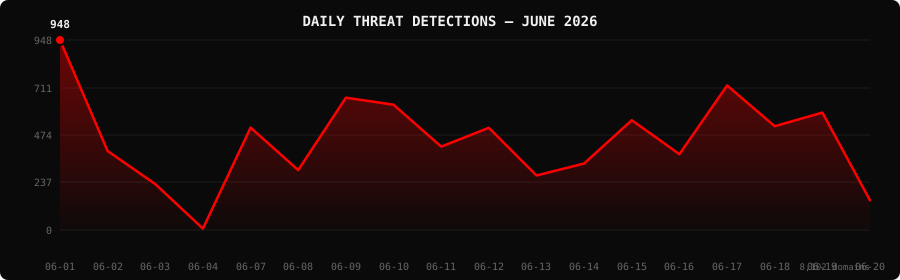

<!--
  PhishDestroy Threat Intelligence Report — June 2026
  8,102 phishing & scam domains detected · Kill rate: 78.3%
  Keywords: phishing report, threat intelligence, 2026-06, destroylist, scam domains, crypto drainer,
  phishing detection, domain blocklist, threat feed, VirusTotal, registrar abuse, brand impersonation,
  cryptocurrency phishing, wallet drainer, monthly security report, cybersecurity analytics
  Canonical: https://github.com/phishdestroy/destroylist/tree/main/rootlist/2026/06
  Previous: https://github.com/phishdestroy/destroylist/tree/main/rootlist/2026/05
  Data: https://github.com/phishdestroy/destroylist/tree/main/rootlist/2026/06/2026-06-threats.json
-->

[**← May 2026**](../../2026/05/) &nbsp;·&nbsp; 📅 **June 2026** &nbsp;·&nbsp; *ongoing...*

 

  

  

##  Dashboard

|  |  |  |  |
|:---:|:---:|:---:|:---:|
| **8,102** | **1,666** | **6,342** | **7,654** |

|  |  |  |  |
|:---:|:---:|:---:|:---:|
| **7,654** (94.5%) | **448** | **71.9h** | **68h** |

> Peak: **2026-06-01** (948) &nbsp;·&nbsp; Low: **2026-06-04** (7) &nbsp;·&nbsp; Active days: **18** *(month ongoing)*

📊 <b>Daily breakdown</b>

 

| Date | Domains | Activity |
|:-----|--------:|:---------|
| `2026-06-01` | **948** | `████████████████████` |
| `2026-06-02` | **394** | `████████░░░░░░░░░░░░` |
| `2026-06-03` | **229** | `████░░░░░░░░░░░░░░░░` |
| `2026-06-04` | **7** | `░░░░░░░░░░░░░░░░░░░░` |
| `2026-06-07` | **511** | `██████████░░░░░░░░░░` |
| `2026-06-08` | **299** | `██████░░░░░░░░░░░░░░` |
| `2026-06-09` | **660** | `█████████████░░░░░░░` |
| `2026-06-10` | **625** | `█████████████░░░░░░░` |
| `2026-06-11` | **416** | `████████░░░░░░░░░░░░` |
| `2026-06-12` | **510** | `██████████░░░░░░░░░░` |
| `2026-06-13` | **272** | `█████░░░░░░░░░░░░░░░` |
| `2026-06-14` | **332** | `██████░░░░░░░░░░░░░░` |
| `2026-06-15` | **548** | `███████████░░░░░░░░░` |
| `2026-06-16` | **378** | `███████░░░░░░░░░░░░░` |
| `2026-06-17` | **721** | `███████████████░░░░░` |
| `2026-06-18` | **518** | `██████████░░░░░░░░░░` |
| `2026-06-19` | **586** | `████████████░░░░░░░░` |
| `2026-06-20` | **148** | `███░░░░░░░░░░░░░░░░░` |

##  Intelligence Analysis

### Executive Summary

June 2026 has detected **8,102** phishing domains across 18 active days *(month ongoing as of June 20)*, representing a **+15% increase** from May's 7,021. The kill rate stands at **78.3%**, with 6,342 domains taken down. Most notably, VT coverage reached **94.5%** — the highest in 2026 — indicating improved detection engine collaboration. Average response time continued to improve at **71.9h**, nearly a third of April's peak. NICENIC returned to the #1 registrar position, while Trezor displaced Ledger as the primary brand target. The `.xyz` TLD saw a significant comeback, rising to 5th place.

### Key Trends

- **VT Coverage at 2026 Peak** — 94.5% VT detection rate is the highest in 2026, with Gridinsoft surging to 2nd place and Forcepoint ThreatSeeker entering the top 3 — reflecting an expanding vendor coverage footprint.
- **Response Time Continues to Fall** — 71.9h average (down from 105.5h in May, 215.8h in April) demonstrates a clear trend of accelerating takedown workflows and improved registrar responsiveness.
- **NICENIC Returns to #1** — After dropping to 3rd in April and 2nd in May, NICENIC INTERNATIONAL GROUP CO., LIMITED reclaimed the top position with 1,010 domains (12.5%), reflecting continued tolerance of bulk phishing registrations.
- **Trezor Surpasses Ledger** — Trezor led brand targeting with 251 domains vs Ledger's 181, a notable reversal suggesting campaign actors are rotating brand focus to avoid detection pattern adaptation.
- **Cloudflare Pages Abuse Persists** — "Cloudflare Pages" appeared as a separate registrar entry with 296 domains, confirming continued systematic abuse of the free Pages hosting tier even after April's enforcement actions.

### Threat Actor Tactics

The June 4–6 gap (7 domains June 4, none June 5–6) followed by a strong recovery on June 7 (511) is consistent with a weekend infrastructure rotation pattern observed in prior months. Campaigns appear to operate on weekday-heavy cycles, with threat actors using weekends to rotate domains, update phishing kits, and evade newly deployed blocklist rules.

Solana Drainer (13 confirmed kits) and Angel Drainer (2) maintained persistent but reduced presence. The absence of Inferno Drainer this month may indicate takedown success or migration to less-detected kit variants. Aave protocol emerging as a top-10 brand target (80 domains) signals expansion into DeFi lending platforms — a new frontier beyond wallets and exchanges.

The sharp drop to 7 domains on June 4 followed by zero activity June 5–6 strongly suggests a coordinated enforcement action against a major phishing kit distribution infrastructure.

### Registrar Accountability

NICENIC INTERNATIONAL GROUP CO., LIMITED led with 1,010 domains (12.5%), followed by GoDaddy.com at 962 (11.9%) and Cloudflare at 484 (6.0%). "Cloudflare Pages" as a separate entity (296 domains, 3.7%) highlights that the platform's free tier remains a persistent abuse vector despite prior month enforcement. Fewmoretaps OU (Trustname.com) returned to the top 5 at 228 domains, reinforcing its position as an infrastructure-of-choice for organized phishing operations.

Top 3 registrars account for **2,456 domains** (30.3% of threats).

### Detection Landscape

alphaMountain.ai led with 4,851 detections (59.9%), followed by Gridinsoft at 4,707 (58.1%) — its highest coverage rate in 2026. Forcepoint ThreatSeeker jumped to 3rd at 3,657 (45.1%), a significant improvement. SOCRadar returned to the top 4 at 3,609 (44.5%), recovering from its May drop. The highest VT coverage rate of the year (94.5%) reflects broad consensus across vendors on June's threat patterns.

### Recommendations

- **For Security Teams** — The VT 94.5% consensus rate means June threats are highly confirmed; prioritize automated blocking based on VT threshold policies.
- **For SOC Analysts** — Monitor NICENIC-registered domains with `.xyz` and `.com` TLDs as the primary high-risk combination this month.
- **For Registrars** — NICENIC must address its return to #1 position; continued inaction despite sustained top rankings in monthly reports warrants ICANN escalation.
- **For Browser Vendors** — June's near-universal VT detection provides strong signal quality; integrate VT consensus scores into real-time blocking decisions.
- **For Crypto Projects** — Aave and Base protocol teams should implement proactive domain monitoring; both platforms saw significant phishing domain volume this month.
- **For End Users** — Trezor users are currently the primary hardware wallet target; verify all firmware updates only through official Trezor Suite application.

##  Top Registrars

| # | Registrar | Domains | Share | Trend |
|:--:|:---|------:|:---|:---:|
| **1** | NICENIC INTERNATIONAL GROUP CO., LIMITED | **1,010** | `███░░░░░░░░░░░░` 12.5% | 🔺 |
| **2** | GoDaddy.com, LLC | **962** | `███░░░░░░░░░░░░` 11.9% | 🔺 |
| **3** | Cloudflare, Inc. | **484** | `█░░░░░░░░░░░░░░` 6.0% | 🔻 |
| **4** | PDR Ltd. d/b/a PublicDomainRegistry.com | **341** | `█░░░░░░░░░░░░░░` 4.2% | 🔻 |
| **5** | Cloudflare Pages | **296** | `█░░░░░░░░░░░░░░` 3.7% | 🆕 |
| **6** | Dynadot Inc | **269** | `█░░░░░░░░░░░░░░` 3.3% | 🔺 |
| **7** | Fewmoretaps OU d/b/a Trustname.com | **228** | `░░░░░░░░░░░░░░░` 2.8% | 🔺 |
| **8** | Global Domain Group LLC | **226** | `░░░░░░░░░░░░░░░` 2.8% | 🔻 |
| **9** | NameSilo, LLC | **214** | `░░░░░░░░░░░░░░░` 2.6% | 🔻 |
| **10** | Gname.com Pte. Ltd. | **211** | `░░░░░░░░░░░░░░░` 2.6% | 🔺 |

> ⚠️ Top 3 registrars = **2,456** domains (30.3% of all threats)

##  Domain Zones

| # | TLD | Domains | Share | vs Prev |
|:--:|:---|------:|------:|:---:|
| **1** | `.com` | **3,038** | 37.5% | 🔺 |
| **2** | `.dev` | **775** | 9.6% | 🔺 |
| **3** | `.app` | **556** | 6.9% | 🔺 |
| **4** | `.io` | **458** | 5.7% | 🔺 |
| **5** | `.xyz` | **392** | 4.8% | 🔺 |
| **6** | `.live` | **292** | 3.6% | 🔺 |
| **7** | `.top` | **261** | 3.2% | 🔻 |
| **8** | `.org` | **176** | 2.2% | 🔻 |
| **9** | `.net` | **168** | 2.1% | 🔺 |
| **10** | `.shop` | **114** | 1.4% | 🆕 |

##  Registrar Geography

| # | Country | Domains | Share |
|:--:|:---|------:|------:|
| **1** | Unknown | **7,376** | 91.0% |
| **2** | US | **253** | 3.1% |
| **3** | JP | **90** | 1.1% |
| **4** | IS | **56** | 0.7% |
| **5** | SC | **32** | 0.4% |
| **6** | CY | **30** | 0.4% |
| **7** | CN | **26** | 0.3% |
| **8** | GB | **25** | 0.3% |
| **9** | DE | **20** | 0.2% |
| **10** | HK | **20** | 0.2% |

##  Targeted Brands

| # | Brand | Domains | Share |
|:--:|:---|------:|------:|
| **1** | Trezor | **251** | 3.1% |
| **2** | Base | **216** | 2.7% |
| **3** | Ledger | **181** | 2.2% |
| **4** | Airdrop Scam | **144** | 1.8% |
| **5** | OKX | **100** | 1.2% |
| **6** | Google | **86** | 1.1% |
| **7** | Aave | **80** | 1.0% |
| **8** | Crypto Casino / Gambling | **75** | 0.9% |
| **9** | Moonshot | **75** | 0.9% |
| **10** | Solana | **57** | 0.7% |

##  Crypto Drainers & Kits

| # | Type | Domains |
|:--:|:---|------:|
| **1** | Solana Drainer | **13** |
| **2** | Angel Drainer | **2** |

##  Detection Engines (VirusTotal)

| # | Engine | Detections | Coverage |
|:--:|:---|------:|------:|
| **1** | alphaMountain.ai | **4,851** | 59.9% |
| **2** | Gridinsoft | **4,707** | 58.1% |
| **3** | Forcepoint ThreatSeeker | **3,657** | 45.1% |
| **4** | SOCRadar | **3,609** | 44.5% |
| **5** | Fortinet | **3,556** | 43.9% |
| **6** | G-Data | **3,004** | 37.1% |
| **7** | Sophos | **2,731** | 33.7% |
| **8** | BitDefender | **2,630** | 32.5% |
| **9** | CyRadar | **2,556** | 31.5% |
| **10** | ESET | **2,515** | 31.0% |
| **11** | Webroot | **2,264** | 27.9% |
| **12** | Kaspersky | **2,246** | 27.7% |
| **13** | CRDF | **2,142** | 26.4% |
| **14** | Lionic | **2,049** | 25.3% |
| **15** | LevelBlue | **1,891** | 23.3% |

>  &nbsp; 

##  Downloads & Data

| Format | File | Description |
|:-------|:-----|:------------|
| 📋 Report | [`README.md`](.) | This report |
| 🗃️ Threats | [`2026-06-threats.json`](2026-06-threats.json) | **8,102** threats with VT vendors, scan URLs, IPs |
| 📈 Chart | [`2026-06-activity.svg`](2026-06-activity.svg) | Daily detection activity graph |

> 💡 **API access**: Query any domain at [`api.destroy.tools/v1/check`](https://api.destroy.tools/v1/check?domain=example.com) — free, no API key

##  All Reports

| Report | Domains |
|:-------|--------:|
| [January 2025](../../2025/01/) | **1** |
| [February 2025](../../2025/02/) | **13** |
| [March 2025](../../2025/03/) | **2** |
| [April 2025](../../2025/04/) | **2** |
| [May 2025](../../2025/05/) | **2** |
| [June 2025](../../2025/06/) | **4** |
| [July 2025](../../2025/07/) | **700** |
| [August 2025](../../2025/08/) | **3,788** |
| [September 2025](../../2025/09/) | **7,307** |
| [October 2025](../../2025/10/) | **8,841** |
| [November 2025](../../2025/11/) | **12,581** |
| [December 2025](../../2025/12/) | **11,773** |
| [January 2026](../../2026/01/) | **8,932** |
| [February 2026](../../2026/02/) | **18,207** |
| [March 2026](../../2026/03/) | **4,042** |
| [April 2026](../../2026/04/) | **15,633** |
| [May 2026](../../2026/05/) | **7,021** |
| 📍 **June 2026** | **8,102** *(ongoing)* |

[**← May 2026**](../../2026/05/) &nbsp;·&nbsp; 📅 **June 2026** &nbsp;·&nbsp; *ongoing...*

 

 

Data: [destroylist](https://github.com/phishdestroy/destroylist)

