<!--
  PhishDestroy — 2026 Yearly Threat Overview
  61,937 phishing domains detected across 6 months (ongoing)
  Keywords: phishing 2026, threat intelligence, destroylist, yearly report, scam domains
  https://github.com/phishdestroy/destroylist/tree/main/rootlist/2026
-->

  

-000000?style=for-the-badge)
-CC0000?style=for-the-badge)

  

## Monthly Reports

| # | Month | Domains | Trend |
|:--:|:------|--------:|:---:|
| 01 | [January 2026](01/) | **8,932** | `█████████░░░░░░░░░░░` |
| 02 | [February 2026](02/) | **18,207** | `████████████████████` |
| 03 | [March 2026](03/) | **4,042** | `████░░░░░░░░░░░░░░░░` |
| 04 | [April 2026](04/) | **15,633** | `█████████████████░░░` |
| 05 | [May 2026](05/) | **7,021** | `███████░░░░░░░░░░░░░` |
| 06 | [June 2026](06/) | **8,102** *(ongoing)* | `████████░░░░░░░░░░░░` |

> Peak: **February 2026** — 18,207 domains &nbsp;·&nbsp; Total 2026: **61,937+**

## Year Navigation

| Year | Link |
|:-----|:-----|
| [2025](../2025/) | 45,014 domains (12 months) |
| **2026** | 📍 You are here |

 

Data: [destroylist](https://github.com/phishdestroy/destroylist)

