# Root Domains

**Minimal, DNS-validated list of registrable root domains for blocking at the domain level**

 

 

---

> [!TIP]
> No subdomains. No hosting providers. Clean data for firewalls and DNS resolvers.

## 📥 Download Links

### 🔴 Primary (Curated)

| List | Description | JSON | TXT |
|:-----|:------------|:----:|:---:|
| Root domains | All validated roots | [⬇️](https://raw.githubusercontent.com/phishdestroy/destroylist/main/rootlist/active_root_domains.json) | [⬇️](https://raw.githubusercontent.com/phishdestroy/destroylist/main/rootlist/active_root_domains.txt) |
| Live only | DNS-verified active | [⬇️](https://raw.githubusercontent.com/phishdestroy/destroylist/main/rootlist/online_root_domains.json) | [⬇️](https://raw.githubusercontent.com/phishdestroy/destroylist/main/rootlist/online_root_domains.txt) |
| Services only | Hosting platform subdomains | [⬇️](https://raw.githubusercontent.com/phishdestroy/destroylist/main/rootlist/services_domains.json) | [⬇️](https://raw.githubusercontent.com/phishdestroy/destroylist/main/rootlist/services_domains.txt) |

### ⚫ Community (Aggregated)

| List | Description | JSON | TXT |
|:-----|:------------|:----:|:---:|
| Root domains | All community roots | [⬇️](https://raw.githubusercontent.com/phishdestroy/destroylist/main/rootlist/community_root_domains.json) | [⬇️](https://raw.githubusercontent.com/phishdestroy/destroylist/main/rootlist/community_root_domains.txt) |
| Live only | DNS-verified active | [⬇️](https://raw.githubusercontent.com/phishdestroy/destroylist/main/rootlist/community_online_root_domains.json) | [⬇️](https://raw.githubusercontent.com/phishdestroy/destroylist/main/rootlist/community_online_root_domains.txt) |
| Services only | Hosting platform subdomains | [⬇️](https://raw.githubusercontent.com/phishdestroy/destroylist/main/rootlist/community_services_domains.json) | [⬇️](https://raw.githubusercontent.com/phishdestroy/destroylist/main/rootlist/community_services_domains.txt) |

### 📊 Provider Analytics

| List | Description | Link |
|:-----|:------------|:----:|
| `providers_root_domains.json` | Primary — breakdown by hosting provider | [⬇️](https://raw.githubusercontent.com/phishdestroy/destroylist/main/rootlist/providers_root_domains.json) |
| `community_providers_root_domains.json` | Community — breakdown by hosting provider | [⬇️](https://raw.githubusercontent.com/phishdestroy/destroylist/main/rootlist/community_providers_root_domains.json) |

---

## 📁 Output Files

### `active_root_domains.json`
- Source: `list.json`
- Converted to registrable roots via `tldextract`
- Infrastructure providers excluded
- Deduplicated and normalized

**Use for:** Global DNS blocking, baseline threat intelligence

### `online_root_domains.json`
- DNS-validated (A/AAAA/CNAME/MX/NS records)
- Only currently responding domains
- Most relevant for active campaigns

**Use for:** Prioritized blocking, SOC feeds

### `community_root_domains.json`
- Aggregated from 13+ security providers
- Filtered and normalized
- Provider roots auto-removed

### `community_online_root_domains.json`
- Subset of community list
- Confirmed via DNS resolution

**Use for:** External threat tracking

### `services_domains.json` / `community_services_domains.json`
- Subdomains on hosting platforms (Vercel, Pages.dev, Netlify, etc.)
- Actual phishing subdomains, not root domains
- Separated to avoid blocking entire platforms

**Use for:** Platform abuse reporting, takedown automation

### `providers_root_domains.json` / `community_providers_root_domains.json`
- Breakdown of phishing count per hosting provider
- Groups: multi-tenant hosting, site builders, Web3 gateways, SaaS

**Use for:** Abuse analytics, registrar/provider engagement

---

## 🚫 Excluded Infrastructure

Root domains that should **never** be blocked globally:

**Multi-tenant hosting:**
`vercel.app` · `netlify.app` · `github.io` · `render.com` · `firebaseapp.com` · `web.app` · `pages.dev` · `workers.dev` · `replit.dev` · `surge.sh`

**Website builders:**
`wixsite.com` · `weebly.com` · `wordpress.com` · `blogspot.com` · `webflow.io` · `square.site` · `godaddysites.com`

**Web3 gateways:**
`ipfs.io` · `cloudflare-ipfs.com` · `dweb.link` · `eth.limo`

**Other:**
`teachable.com` · `gitbook.io` · `duckdns.org`

---

## ⚙️ Generation

Produced by [`scripts/build_rootlist.py`](../scripts/build_rootlist.py):

1. Reduces full lists to registrable roots
2. Removes infrastructure/provider domains
3. Validates DNS records
4. Outputs clean JSON + TXT files

---

