<!--
  PhishDestroy Blocklist Formats
  Pre-built blocklist configs for every major DNS/firewall platform
  https://github.com/phishdestroy/destroylist/tree/main/rootlist/formats
-->

<div align="center">



# Blocklist Formats

**Ready-to-use configs for DNS blockers, firewalls & ad blockers**

<br>


<br>

[](https://github.com/phishdestroy/destroylist)
[](https://api.destroy.tools)

</div>

---

## 📦 Available Lists

| List | Description | Folder |
|:-----|:------------|:------:|
| **Primary** | PhishDestroy curated domains | [`primary/`](primary/) |
| **Primary Active** | Primary — DNS-verified live only | [`primary_active/`](primary_active/) |
| **Community** | Aggregated from 13+ threat feeds | [`community/`](community/) |
| **Community Active** | Community — DNS-verified live only | [`community_active/`](community_active/) |

## 🛠️ Formats

Each list is available in 6 formats:

| Format | File | Compatible With |
|:-------|:-----|:----------------|
| **Plain domains** | `domains.txt` | Any tool, scripts, custom integrations |
| **Hosts file** | `hosts.txt` | Windows, macOS, Linux (`/etc/hosts`) |
| **AdBlock** | `adblock.txt` | uBlock Origin, AdGuard, AdBlock Plus |
| **DNSMasq** | `dnsmasq.conf` | DNSMasq, OpenWrt, Pi-hole |
| **Unbound** | `unbound.conf` | Unbound DNS resolver |
| **RPZ** | `rpz.zone` | BIND, Knot, PowerDNS (Response Policy Zone) |

## 🚀 Quick Setup

### Pi-hole / DNSMasq

```bash
curl -o /etc/dnsmasq.d/destroylist.conf \
  https://raw.githubusercontent.com/phishdestroy/destroylist/main/rootlist/formats/primary_active/dnsmasq.conf
sudo systemctl restart dnsmasq
```

### Unbound

```bash
curl -o /etc/unbound/destroylist.conf \
  https://raw.githubusercontent.com/phishdestroy/destroylist/main/rootlist/formats/primary_active/unbound.conf
# Add to unbound.conf: include: "/etc/unbound/destroylist.conf"
sudo systemctl restart unbound
```

### uBlock Origin / AdGuard

Add as custom filter list:
```
https://raw.githubusercontent.com/phishdestroy/destroylist/main/rootlist/formats/primary_active/adblock.txt
```

### Hosts file

```bash
curl -s https://raw.githubusercontent.com/phishdestroy/destroylist/main/rootlist/formats/primary_active/hosts.txt \
  | sudo tee -a /etc/hosts > /dev/null
```

## ⬇️ Direct Download Links

### Primary Active (Recommended)

| Format | Link |
|:-------|:----:|
| domains.txt | [⬇️](https://raw.githubusercontent.com/phishdestroy/destroylist/main/rootlist/formats/primary_active/domains.txt) |
| hosts.txt | [⬇️](https://raw.githubusercontent.com/phishdestroy/destroylist/main/rootlist/formats/primary_active/hosts.txt) |
| adblock.txt | [⬇️](https://raw.githubusercontent.com/phishdestroy/destroylist/main/rootlist/formats/primary_active/adblock.txt) |
| dnsmasq.conf | [⬇️](https://raw.githubusercontent.com/phishdestroy/destroylist/main/rootlist/formats/primary_active/dnsmasq.conf) |
| unbound.conf | [⬇️](https://raw.githubusercontent.com/phishdestroy/destroylist/main/rootlist/formats/primary_active/unbound.conf) |
| rpz.zone | [⬇️](https://raw.githubusercontent.com/phishdestroy/destroylist/main/rootlist/formats/primary_active/rpz.zone) |

> Generated by [`scripts/json_to_txt.py`](../../scripts/json_to_txt.py) — auto-updated via GitHub Actions

---

<div align="center">

[](https://github.com/phishdestroy/destroylist)
[](https://api.destroy.tools)
[](..)

</div>
