<!--
  PhishDestroy Community Active Blocklist Formats
  https://github.com/phishdestroy/destroylist/tree/main/rootlist/formats/community_active
-->

# Community Active Blocklist

**Aggregated from 13+ sources — DNS-verified live only**

 

 

---

## ⬇️ Downloads

| Format | Description | Link |
|:-------|:------------|:----:|
| `domains.txt` | Plain domain list | [⬇️](https://raw.githubusercontent.com/phishdestroy/destroylist/main/rootlist/formats/community_active/domains.txt) |
| `hosts.txt` | Hosts file (`0.0.0.0 domain`) | [⬇️](https://raw.githubusercontent.com/phishdestroy/destroylist/main/rootlist/formats/community_active/hosts.txt) |
| `adblock.txt` | AdBlock / uBlock Origin filter | [⬇️](https://raw.githubusercontent.com/phishdestroy/destroylist/main/rootlist/formats/community_active/adblock.txt) |
| `dnsmasq.conf` | DNSMasq / Pi-hole config | [⬇️](https://raw.githubusercontent.com/phishdestroy/destroylist/main/rootlist/formats/community_active/dnsmasq.conf) |
| `unbound.conf` | Unbound DNS config | [⬇️](https://raw.githubusercontent.com/phishdestroy/destroylist/main/rootlist/formats/community_active/unbound.conf) |
| `rpz.zone` | Response Policy Zone (BIND) | [⬇️](https://raw.githubusercontent.com/phishdestroy/destroylist/main/rootlist/formats/community_active/rpz.zone) |

> Only aggregated domains that currently resolve via DNS.

---

